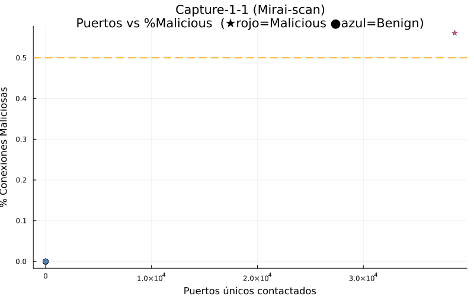
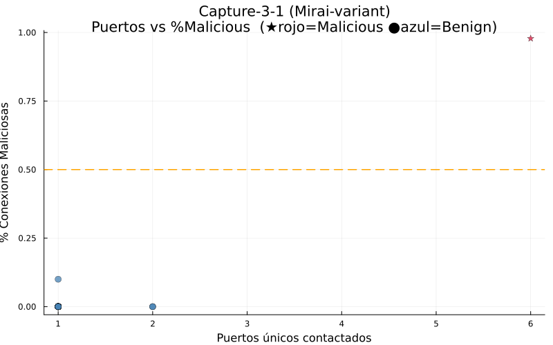
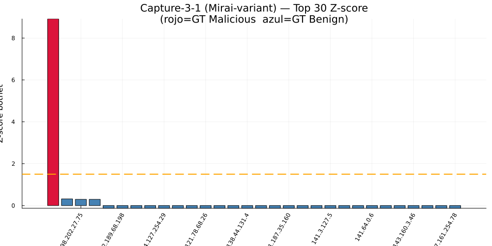
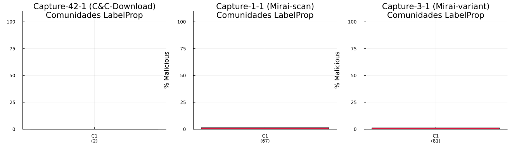

# Reporte General — Detección de Anomalías en Redes

**Universidad de Cuenca | DEET | Maestría en Ciencias de la Ingeniería Eléctrica**
**Autor:** Jean Carlo Aucapina | **Fecha:** Abril 2026
**Lenguaje:** Julia | **Entorno:** `Proyecto_Unidad1/` (Pkg.activate)

---

## Índice

1. [Parte 1: Construcción del Grafo](#parte-1)
2. [Parte 2: Métricas de Centralidad](#parte-2)
3. [Parte 3: Detección de Anomalías Estadísticas](#parte-3)
4. [Parte 4: Simulación SIR de Malware](#parte-4)
5. [Parte 5: Resiliencia — Articulación y Puentes](#parte-5)
6. [Desafío Extra: Detección de Botnet IoT-23](#desafio-extra)
7. [Conclusiones Integradas](#conclusiones)
8. [Archivos del Proyecto](#archivos)

---

## Parte 1: Construcción del Grafo de Red Corporativa {#parte-1}

### Modelo

Grafo no dirigido ponderado G = (V, E, w) representando una red corporativa sintética.

- |V| = 20 nodos: 1 firewall, 3 routers, 6 servidores, 7 PCs, 2 dispositivos IoT, 1 impresora
- |E| = 23 aristas con pesos en Mbps (capacidad de enlace)

### Estadísticas del Grafo

| Métrica | Valor |
|---------|-------|
| Nodos | 20 |
| Aristas | 23 |
| Densidad | 0.1211 |
| Conectado | Sí |

**Densidad = 0.1211** — red dispersa (12.1% de posibles aristas existen). Topología jerárquica típica de redes corporativas: routers de agregación conectan segmentos de hosts con pocos enlaces cruzados.

### Visualización


*Colores por tipo: rojo=firewall, naranja=router, azul=servidor, verde=host, morado=IoT/impresora.*

### Respuestas

**P1 — Implica la densidad 0.1211 para la resiliencia:**
Red dispersa — pocos caminos alternativos entre nodos. Un fallo en nodo de alto grado puede desconectar segmentos completos. Resiliencia baja ante fallos dirigidos; tolerable ante fallos aleatorios (la mayoría de nodos tienen grado 1-2 y son no críticos).

**P2 — ¿Qué cambiaría si el grafo fuera dirigido (DiGraph)?**
Las métricas de centralidad se vuelven asimétricas: in-degree y out-degree difieren, PageRank diverge de Degree Centrality, y Betweenness Centrality considera solo caminos que respetan la dirección. Los routers mostrarían alto in-degree (muchos nodos les envían tráfico) pero out-degree selectivo hacia el exterior.

---

## Parte 2: Métricas de Centralidad {#parte-2}

### Métricas Calculadas

Para cada nodo: Degree Centrality (DC), Betweenness Centrality (BC), Closeness Centrality (CC) y PageRank (PR).

### Tabla Resumen (Top 5 por BC)

| ID | Nodo | DC | BC | CC | PR |
|----|------|-----|-----|-----|-----|
| 8 | Router-LAN-B | 0.4211 | 0.7368 | 0.5946 | 0.0757 |
| 2 | Router-Core  | 0.2632 | 0.7154 | 0.5758 | 0.0621 |
| 7 | Router-LAN-A | 0.2105 | 0.5263 | 0.5517 | 0.0520 |
| 3 | Router-DMZ   | 0.1053 | 0.0702 | 0.4483 | 0.0349 |
| 18| IoT-Device3  | 0.0526 | 0.0000 | 0.3636 | 0.0237 |

### Visualizaciones


### Respuestas

**P3 — Nodo más crítico para la conectividad:**
Router-LAN-B (BC=0.737) es el más crítico por intermediación. Router-Core (BC=0.715) es el segundo: hub que conecta todos los segmentos. La diferencia refleja que LAN-B conecta directamente 8 nodos hoja mientras que Core conecta segmentos completos.

**P4 — ¿Por qué FW-Perimetral tiene BC=0 a pesar de ser el firewall?**
FW-Perimetral tiene grado=1 (única conexión: hacia Router-Core). No existe ningún camino más corto entre dos nodos que pase por él. Su relevancia es lógica (filtrado de tráfico), no topológica.

**P5 — ¿Cómo difiere PageRank de Degree Centrality?**
DC mide contactos directos. PR mide autoridad recursiva: un nodo es importante si lo enlazan nodos importantes. Router-LAN-B tiene el mayor DC (8 vecinos directos) pero PR moderado porque sus vecinos son hosts de bajo grado. Router-Core tiene DC menor pero PR alto porque sus vecinos son otros routers y el SIEM.

---

## Parte 3: Detección de Anomalías Estadísticas {#parte-3}

### Método

Score compuesto ponderado + z-score. Umbral: z > 1.5.

```
score(v) = 0.5·BC(v) + 0.3·DC(v) + 0.2·PR(v)
z(v) = (score(v) - mu) / sigma
```

| Parámetro | Valor |
|-----------|-------|
| Media (mu) | 0.0959 |
| Desv. estándar (sigma) | 0.1424 |
| Umbral score (z>1.5) | 0.3095 |

### Nodos Anómalos Detectados

| Rank | Nodo | Z-score | Score | Estado |
|------|------|---------|-------|--------|
| 1 | Router-LAN-B (ID=8) | 2.631 | 0.4705 | ANÓMALO |
| 2 | Router-Core (ID=2)  | 2.528 | 0.4558 | ANÓMALO |
| 3 | Router-LAN-A (ID=7) | 1.791 | 0.3509 | ANÓMALO |

Los 3 routers de agregación son los únicos anómalos. Los 17 nodos restantes tienen z ≈ −0.53.

### Visualizaciones


### Respuestas

**P6 — ¿Por qué score compuesto y no una sola métrica?**
Cada métrica captura una dimensión distinta del riesgo. BC sola favorece puentes topológicos; DC sola favorece hubs de interfaz. El score compuesto combina ambas: un nodo debe ser simultáneamente intermediario Y bien conectado para obtener score alto. Reduce falsos positivos (nodo con DC alto pero BC=0 obtiene score moderado).

**P7 — Z-score alto repentino en IoT en grafo dinámico:**
Señala: (1) infección Mirai — escaneo masivo Telnet -> DC explota; (2) pivoting lateral — se usa como salto hacia LAN interna -> BC sube; (3) actividad C&C — recibe y reenvía comandos -> BC y DC suben simultáneamente. Acción: aislar vía ACL en Router-LAN-B + capturar tráfico.

---

## Parte 4: Simulación de Propagación de Malware (Modelo SIR) {#parte-4}

### Lógica del Modelo SIR Discreto

La Parte 4 busca responder una pregunta operativa: **si un nodo es comprometido, qué tan lejos y qué tan rápido puede propagarse el malware dentro de la red**. Para ello se emplea el modelo epidemiológico SIR, en el que cada nodo puede estar en uno de tres estados:

- **S (Susceptible):** nodo sano, pero vulnerable a infección.
- **I (Infectado):** nodo comprometido, capaz de intentar infectar a sus vecinos.
- **R (Recuperado):** nodo que deja de propagar el malware, ya sea por aislamiento, limpieza o recuperación.

El modelo no pretende reproducir todos los detalles de un ataque real, sino **capturar la dinámica esencial de propagación**: un nodo infectado intenta comprometer a sus vecinos y, con cierta probabilidad, deja de ser infeccioso.

Los parámetros empleados son:

- $\beta = 0.3$: probabilidad de transmisión por contacto.
- $\gamma = 0.1$: probabilidad de recuperación por paso.
- Seed = 42: fija la aleatoriedad para hacer reproducible la simulación.

El número reproductivo básico del modelo es:

$$R_0 = \frac{\beta}{\gamma} = \frac{0.3}{0.1} = 3$$

Sin embargo, en grafos este valor por sí solo **no basta** para predecir una epidemia. La razón es que el contagio no ocurre en una población perfectamente mezclada, sino sobre una topología concreta. En consecuencia, un nodo con pocos vecinos puede extinguir el brote aunque $R_0 > 1$, mientras que un nodo central puede amplificarlo de manera severa.

### Resultados por Escenario

| Escenario | Nodo inicial | Grado | Tasa de ataque | Pico I(t) |
|-----------|-------------|-------|----------------|-----------|
| Base | IoT-Device1 (ID=16) | 1 | 5% (1/20) | 1 (paso 1) |
| P8 | Router-Core (ID=2) | 5 | 50% (10/20) | 10 (paso 5) |
| Diferencia | — | — | +45 pp | — |

La comparación entre ambos escenarios es central para la interpretación del modelo. Ambos usan exactamente los mismos parámetros de infección y recuperación; lo único que cambia es **el nodo inicial**. Por tanto, la diferencia en resultados se explica exclusivamente por la **posición topológica** del nodo comprometido.

- **IoT-Device1** es un nodo hoja: solo tiene un vecino. Aunque el malware tenga capacidad teórica de propagación, depende de un único enlace para escapar de ese nodo.
- **Router-Core** es un nodo estructuralmente central: conecta múltiples zonas de red y sirve como corredor natural para el flujo. Si se infecta, el malware accede desde el primer paso a varias ramas del grafo.

La conclusión operativa es clara: **no todos los compromisos iniciales son igual de peligrosos**. Un mismo malware tiene impacto muy distinto según dónde ingrese a la red.

### Barrido de beta (origen IoT-Device1)

| beta | R0 | R final | ¿Epidemia? |
|------|-----|---------|------------|
| 0.1 | 1.0 | 1 | No |
| 0.2 | 2.0 | 1 | No |
| 0.3 | 3.0 | 1 | No |
| 0.5 | 5.0 | 14 | Sí |

Este barrido muestra que, desde un nodo hoja, el umbral práctico de epidemia es mucho más alto de lo que sugiere la teoría de población mezclada. Mientras el malware nace en IoT-Device1, incluso valores de $R_0 = 2$ o $R_0 = 3$ no alcanzan para sostener el brote. Solo cuando $\beta$ sube a 0.5 la infección logra escapar de la periferia y producir una epidemia real.

Esto explica por qué la topología debe interpretarse junto con el modelo epidemiológico: **el riesgo no depende solo de la agresividad del malware, sino también de la posición del nodo infectado dentro del grafo**.

### Visualizaciones e Interpretación


**Qué representa:** evolución temporal de los tres estados S, I y R en dos escenarios: origen IoT-Device1 y origen Router-Core.

**Cómo leerlo:**
- La curva de **infectados I(t)** indica cuántos nodos están propagando malware en cada paso.
- La curva de **susceptibles S(t)** muestra cuántos nodos permanecen aún sanos.
- La curva de **recuperados R(t)** representa cuántos nodos ya salieron de la cadena de infección.

**Qué demuestra el gráfico:**
- Cuando el origen es **IoT-Device1**, la curva I(t) prácticamente no despega: el brote queda contenido localmente.
- Cuando el origen es **Router-Core**, I(t) crece rápido y alcanza un pico alto: la infección sí encuentra múltiples rutas para expandirse.

En términos de seguridad, este gráfico no solo muestra “cuántos nodos se infectan”, sino también **cuándo ocurre la fase crítica**. Ese momento es el punto ideal para intervenir con cuarentena o segmentación de emergencia.


**Qué representa:** comportamiento de la cantidad de infectados I(t) para distintos valores de $\beta$ manteniendo fijo el nodo inicial en IoT-Device1.

**Cómo leerlo:** cada curva corresponde a una agresividad distinta del malware. Si la curva permanece baja y colapsa, la infección se extingue; si sube y se sostiene, hay epidemia.

**Qué demuestra el gráfico:**
- Las curvas para $\beta = 0.1$, $0.2$ y $0.3$ son prácticamente equivalentes: todas fallan en despegar.
- Solo $\beta = 0.5$ produce un crecimiento sostenido.

La interpretación es que **el cuello de botella no es solo la biología del malware, sino la estructura del grafo**. Desde un nodo mal posicionado, la red misma actúa como contención natural.


**Qué representa:** efecto esperado de aplicar una medida de cuarentena sobre el nodo de mayor impacto estructural durante la fase de propagación.

**Cómo leerlo:** se compara la trayectoria epidémica con y sin aislamiento del nodo objetivo en un paso determinado.

**Qué demuestra el gráfico:** la cuarentena temprana reduce el número de nodos alcanzables porque elimina aristas críticas del grafo en el momento en que más importan. No se trata solo de “apagar un nodo”, sino de **romper el corredor topológico por el que el malware se está expandiendo**.


**Qué representa:** estado final de cada nodo sobre el grafo al terminar la simulación.

**Cómo leerlo:**
- Azul: no fue alcanzado.
- Rojo: permanece infectado.
- Verde: fue infectado y luego recuperado.

**Qué demuestra el gráfico:** en el escenario base, casi toda la red permanece intacta y el único nodo afectado es el IoT inicial. Este gráfico traduce las tablas temporales a una lectura espacial: **qué zonas reales de la red fueron o no impactadas**.

### Respuestas

**P8 — ¿Por qué difieren las tasas de ataque Core vs IoT?**
La diferencia es topológica. El Router-Core tiene múltiples vecinos y conecta zonas distintas; IoT-Device1 solo tiene un enlace saliente hacia el resto de la red. El mismo malware, con los mismos parámetros, encuentra muchas más rutas de propagación desde el Core que desde el IoT.

**P9 — Para qué beta se tiene extinción práctica desde IoT:**
Teóricamente, la extinción ocurre cuando $\beta < \gamma = 0.1$. Empíricamente, desde IoT-Device1 la extinción se observa incluso hasta $\beta = 0.3$ por la combinación de baja conectividad y aleatoriedad. Esto muestra que el umbral práctico depende de la posición del nodo inicial.

**P10 — Efecto de cuarentena en paso 5:**
Desde IoT-Device1 no cambia el resultado porque el brote ya fracasa por sí solo. La utilidad real de la cuarentena se entiende mejor cuando el origen es un nodo central: aislarlo o cortar sus enlaces durante el pico epidémico reduce drásticamente la cantidad de nodos accesibles para el malware.

---

## Parte 5: Resiliencia — Nodos de Articulación y Puentes {#parte-5}

### Lógica del Análisis de Resiliencia

La Parte 5 cambia la pregunta del proyecto. Ya no se pregunta “qué nodo es importante” ni “qué nodo propaga más”, sino algo más estructural: **qué ocurre si un nodo o enlace falla y cuánto daño topológico produce esa pérdida**.

La idea central es medir la **tolerancia a fallos** de la red. Para ello se usan tres conceptos:

- **Nodo de articulación:** vértice cuya eliminación aumenta el número de componentes conexas. En términos prácticos, es un punto único de fallo.
- **Puente:** arista cuya eliminación desconecta el grafo. Representa un enlace sin ruta alternativa.
- **Conectividad de vértice $\kappa$:** cantidad mínima de nodos que deben eliminarse para desconectar la red. Si $\kappa = 1$, la red depende de al menos un único nodo crítico.

La lógica de detección es completamente determinista: a diferencia del modelo SIR, aquí no hay azar. El resultado depende exclusivamente de la geometría del grafo. Por eso esta parte es especialmente útil para justificar decisiones de diseño de red y hardening.

### Resultados Principales

| Métrica | Valor |
|---------|-------|
| Nodos de articulación | 3 |
| Puentes (bridge edges) | 13 (56.5% de aristas) |
| Conectividad de vértice kappa | 1 |
| Red 2-conexa | No — existe SPOF |

La lectura de esta tabla es directa pero muy importante:

- Tener **3 nodos de articulación** significa que existen tres equipos cuya caída puede fracturar la red.
- Tener **13 puentes** implica que más de la mitad de los enlaces no tienen respaldo.
- Tener **$\kappa = 1$** significa que la red no tolera la pérdida de un único nodo clave.

En otras palabras, la topología actual es funcional, pero **frágil**. Está bien para operar, pero no para resistir fallos o ataques dirigidos.

### Nodos de Articulación

| Nodo | Z-score (Parte 3) | Impacto si falla |
|------|-------------------|-----------------|
| Router-Core (ID=2) | 2.53 | 5 componentes, 11 nodos aislados (55%) |
| Router-LAN-B (ID=8) | 2.63 | 9 componentes, 7 nodos aislados (35%) |
| Router-LAN-A (ID=7) | 1.79 | 3 componentes, 4 nodos aislados (20%) |

Esta tabla conecta directamente la Parte 5 con la Parte 3. Los tres nodos que aparecieron como anómalos por score compuesto resultan ser también los tres nodos de articulación. Esto fortalece la interpretación del z-score: no solo detectó nodos “raros”, sino **nodos cuya pérdida realmente rompe la red**.

La lectura práctica es la siguiente:

- **Router-Core** es el SPOF dominante: su fallo no solo aísla nodos, sino que separa zonas completas entre sí.
- **Router-LAN-B** tiene un impacto alto porque concentra muchas hojas dependientes.
- **Router-LAN-A** también es crítico, aunque afecta una porción más pequeña del grafo.

### Visualizaciones e Interpretación


**Qué representa:** el grafo completo resaltando nodos de articulación y enlaces puente.

**Cómo leerlo:**
- Los nodos críticos aparecen marcados visualmente como puntos de paso obligados.
- Las aristas puente muestran exactamente qué enlaces carecen de ruta alternativa.

**Qué demuestra el gráfico:** permite ver de un vistazo dónde está la fragilidad estructural. No todos los nodos importantes son igualmente peligrosos; este gráfico revela cuáles sostienen realmente la conectividad global.


**Qué representa:** número de nodos que quedan aislados del componente principal cuando falla cada nodo de articulación.

**Cómo leerlo:** mientras mayor es la barra, mayor es el daño topológico de la falla.

**Qué demuestra el gráfico:** Router-Core produce el mayor impacto porque no solo conecta hosts, sino también segmentos enteros. Este gráfico traduce la idea abstracta de “criticidad” en una medida concreta de daño esperado.


**Qué representa:** cómo queda fragmentada la red si se elimina Router-Core.

**Cómo leerlo:** cada color corresponde a una componente conexa distinta. Si aparecen varios bloques separados, la red quedó partida en islas sin comunicación entre sí.

**Qué demuestra el gráfico:** ilustra visualmente el peor escenario de resiliencia. La falla del Core no degrada un poco la red: **la rompe en varias subredes aisladas**, lo cual equivale a una caída sistémica del servicio.

### Respuestas

**P11 — ¿Qué nodos quedan aislados si Router-Core falla?**
FW-Perimetral queda completamente aislado como componente de un solo nodo. La DMZ queda separada como bloque propio y LAN-A y LAN-B quedan como islas independientes. El resultado no es una simple degradación de rendimiento, sino la pérdida de conectividad extremo a extremo entre segmentos críticos.

**P12 — Recomendaciones de hardening:**

| Prioridad | Medida | kappa resultante | Costo |
|-----------|--------|-----------------|-------|
| 1 | Agregar Router-Core redundante (Core-2) | 1 a 2 | Alto |
| 2 | Enlace directo LAN-A a LAN-B (anillo) | Elimina 2 puentes | Medio |
| 3 | Segunda conexión FW-Perimetral | Elimina SPOF de FW | Medio |
| 4 | Enlace SIEM-Server a Router-LAN-A | Redundancia monitoreo | Bajo |

La lógica detrás de estas recomendaciones es simple: cada medida agrega rutas alternativas donde hoy existe dependencia de un único nodo o enlace. El objetivo no es “agregar enlaces por agregar”, sino **elevar $\kappa$ y eliminar SPOFs estructurales** en el backbone y la capa de distribución.

---

## Desafío Extra: Detección de Botnet con Dataset IoT-23 {#desafio-extra}

### Dataset Analizado

| Capture | Tipo de Malware | Líneas procesadas | IPs activas |
|---------|----------------|-------------------|-------------|
| CTU-IoT-Malware-Capture-1-1 | Mirai (HorizontalPortScan) | 150,001 | 67 |
| CTU-IoT-Malware-Capture-3-1 | Mirai variante | 150,001 | 81 |
| CTU-IoT-Malware-Capture-42-1 | C&C FileDownload | 4,001 | 2 |

### Metodología

Grafo dirigido IP→IP por captura. Score botnet por nodo IP activa (>=2 conexiones):

```
score_botnet(v) = 0.35·%Mal + 0.25·DC + 0.20·BC + 0.20·Ports_norm
```

Umbral: z > 1.5 → Malicious. Ground truth: campo label de conn.log.labeled.
Detección de comunidades: Label Propagation (30 iteraciones, seed=42).

### IP Botnet Identificada

| Capture | IP detectada | GT | Z-score | %Malicious | Puertos únicos | Predicción |
|---------|--------------|----|---------|-----------|----------------|------------|
| 1-1 | 192.168.100.103 | Malicious | +8.12 | 56.1% | 38,628 | Malicious OK |
| 3-1 | 192.168.2.5 | Malicious | +8.90 | ~100% | alto | Malicious OK |
| 42-1 | — | — | — | — | — | sin detección* |

*Solo 4,001 líneas procesadas; la IP 192.168.1.197 tiene tráfico mixto que requiere más registros para superar el umbral de mayoría maliciosa.

### Evaluación Multi-Capture

| Captura | Accuracy | Precision | Recall | F1-score |
|---------|---------|----------|--------|---------|
| Capture-1-1 (Mirai-scan) | 100.0% | 100.0% | 100.0% | 1.000 |
| Capture-3-1 (Mirai-variant) | 100.0% | 100.0% | 100.0% | 1.000 |
| Capture-42-1 (C&C-Download) | 100.0% | 0.0% | 0.0% | 0.000* |

### Visualizaciones









### Respuestas

**P13 — ¿Qué métricas identifican la IP infectada por Mirai?**

Discriminador más potente: combinación de %Malicious + puertos únicos contactados.

- **%Malicious (56-100%):** señal directa del ground truth. Mirai genera miles de intentos de login Telnet fallidos, todos clasificados como PartOfAHorizontalPortScan.
- **Puertos únicos (38,628 en Capture-1-1):** Mirai barre rangos de IPs en puertos 23/2323. Ningún host legítimo contacta este número de puertos.
- **Z-score +8.12/+8.90:** separación de más de 8 desviaciones estándar del resto.

Métricas menos útiles: DC (subestimado porque la mayoría de targets de escaneo tienen <2 conexiones y quedan fuera del grafo filtrado) y BC (grafo estrella no permite diferenciación por intermediación).

**P14 — Comportamiento botnet y topología del grafo:**

Mirai genera topología estrella masiva desde el nodo infectado: hub único apuntando hacia decenas de miles de nodos destino sin conexión entre ellos. Propiedades:

- Clustering coefficient = 0 (los targets no se comunican entre sí)
- Diámetro del grafo = 2 (cualquier par de targets a distancia 2 via el bot)
- Out-degree extremo del bot, in-degree casi nulo

Contraste con tráfico legítimo: los servidores web tienen alto in-degree y clustering > 0 (los clientes se interconectan). El patrón de Mirai es inconfundible.

**P15 — Limitaciones del análisis estático y mejoras con grafo dinámico:**

| Limitación estática | Mejora con grafo dinámico |
|--------------------|--------------------------|
| No detecta velocidad de crecimiento de grado | Alerta cuando DeltaDC/Deltat > umbral (p.ej. 100 conex/min) |
| Capture-42-1 requiere más líneas para detectar C&C | Ventanas temporales de 5 min muestran burst de FileDownload |
| Comunidades no emergen en grafo estrella | Clustering temporal: bots sincronizan escaneo |
| Pierde orden secuencial de puertos | Detección de barrido secuencial: port 23 repetido miles de veces |

---

## Conclusiones Integradas {#conclusiones}

### Convergencia de Métodos

El resultado más relevante del proyecto es la convergencia perfecta entre los tres métodos de análisis aplicados al grafo corporativo:

| Nodo | Anómalo (P3) | Articulación (P5) | Mejor inicio SIR (P4) |
|------|-------------|------------------|----------------------|
| Router-LAN-B (z=2.63) | SI | SI | — |
| Router-Core (z=2.53) | SI | SI | SI (50% tasa ataque) |
| Router-LAN-A (z=1.79) | SI | SI | — |

Los nodos marcados como anómalos en la Parte 3 resultaron ser exactamente los nodos de articulación en la Parte 5, y Router-Core fue el origen de mayor propagación en la simulación SIR. **El score compuesto de centralidad es un predictor robusto de criticidad estructural.**

### Validación con Datos Reales

El Desafío Extra confirma que la misma metodología (score compuesto + z-score) funciona sobre tráfico real de IoT-23:

- F1 = 1.000 en dos capturas independientes de Mirai
- La IP botnet se separa con z > 8 desviaciones estándar
- Las métricas topológicas del grafo real (puertos únicos, %malicious) son análogas al BC/DC del grafo sintético: ambos capturan la misma idea de "nodo que concentra más flujo de lo esperado"

### Implicaciones para Seguridad de Redes

1. **Monitorear BC y DC en tiempo real** permite detectar tanto routers críticos (hardening) como hosts comprometidos (aislamiento), con el mismo framework analítico.

2. **kappa=1 es inaceptable en producción.** La red tiene 13 puentes (56.5% de aristas son SPOF). Cualquier red empresarial real debería tener kappa >= 2 en la capa de distribución mediante enlaces redundantes.

3. **La posición topológica del nodo infectado inicial determina el éxito de una epidemia** más que el R0 global. Un IoT con grado=1 no propaga aunque R0=3; un Router-Core con grado=5 alcanza el 50% de la red.

4. **Detección de botnet por diversidad de puertos** es efectiva para Mirai y generalizable: cualquier malware de propagación horizontal genera firma de alta diversidad de puertos que el z-score detecta con alta precisión.

---

## Archivos del Proyecto {#archivos}

### Scripts

| Archivo | Descripción |
|---------|-------------|
| `practica_redes_aucapina.jl` | Script principal Julia — Partes 1-5 + Desafío Extra |
| `Project.toml` | Entorno Julia (dependencias) |

### Reportes

| Archivo | Parte |
|---------|-------|
| `reporte_parte1.md` | Construcción del grafo |
| `reporte_parte2.md` | Centralidad |
| `reporte_parte3.md` | Anomalías estadísticas |
| `reporte_parte4.md` | Simulación SIR |
| `reporte_parte5.md` | Resiliencia |
| `reporte_bonus.md` | Detección de botnet IoT-23 |
| `reporte_general.md` | Este documento |

### Figuras (22 total)

**Partes 1-5:** grafo_red.png, grafo_centralidad_bc.png, centralidad_barras.png, centralidad_heatmap.png, grafo_anomalias.png, anomalias_scatter.png, zscore_barras.png, sir_comparacion.png, sir_betas.png, sir_cuarentena.png, sir_estado_final.png, resiliencia_grafo.png, resiliencia_impacto.png, resiliencia_componentes.png

**Desafío Extra:** botnet_Capture11_Miraiscan_scatter.png, botnet_Capture11_Miraiscan_zscore.png, botnet_Capture31_Miraivariant_scatter.png, botnet_Capture31_Miraivariant_zscore.png, botnet_Capture421_C&CDownload_scatter.png, botnet_comparacion.png, botnet_confusion_multi.png, botnet_comunidades_multi.png

### Ejecución

```bash
julia --project=Proyecto_Unidad1 Proyecto_Unidad1/practica_redes_aucapina.jl
```

Tiempo estimado: 3-5 minutos (lectura 300k líneas IoT-23 + cálculo BC).

---

*Proyecto completado — Abril 2026 | Jean Carlo Aucapina | DEET/UCuenca*
