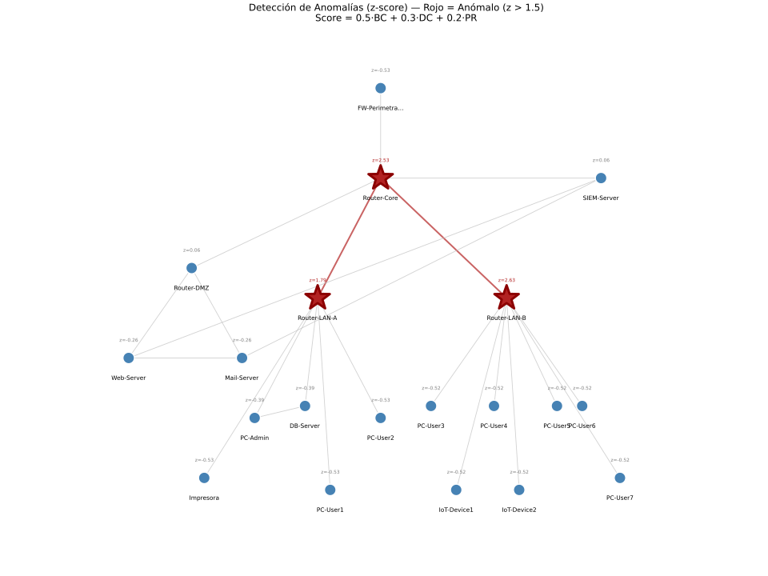
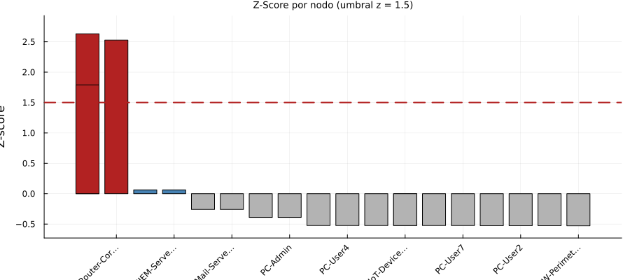
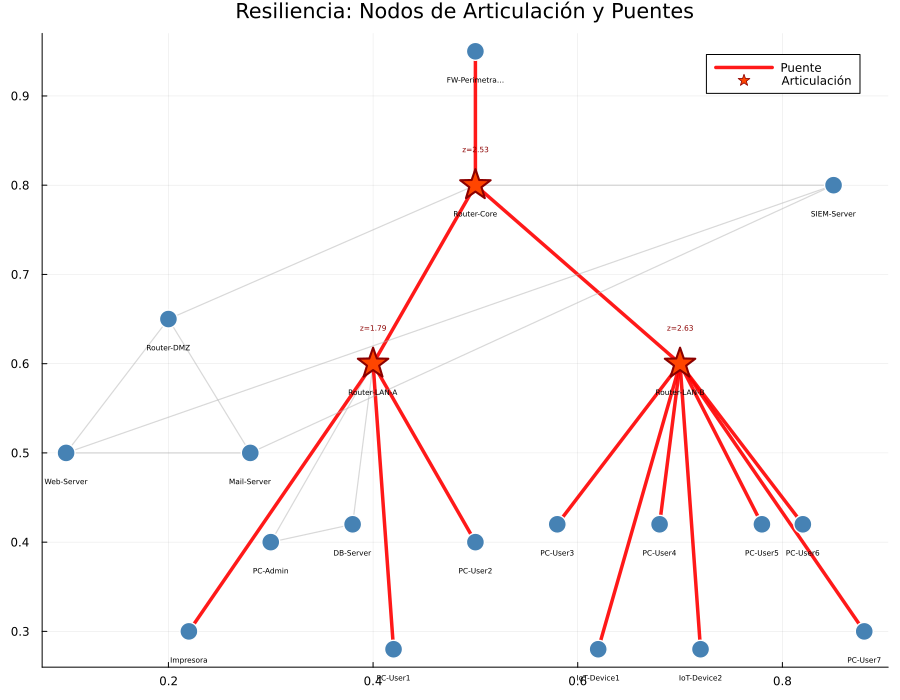
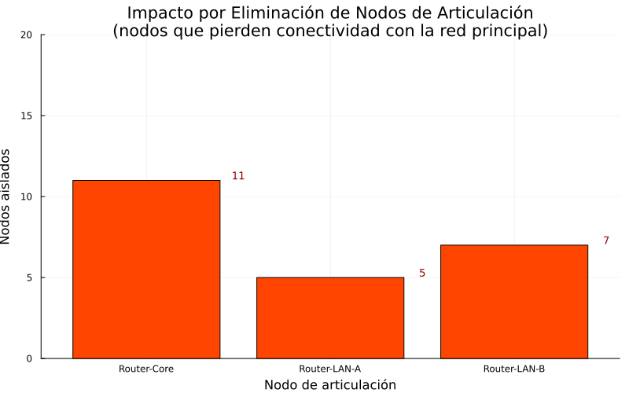
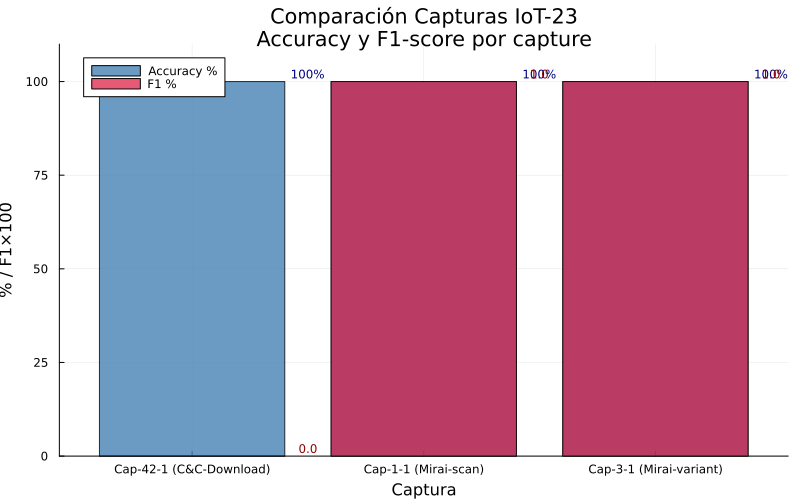
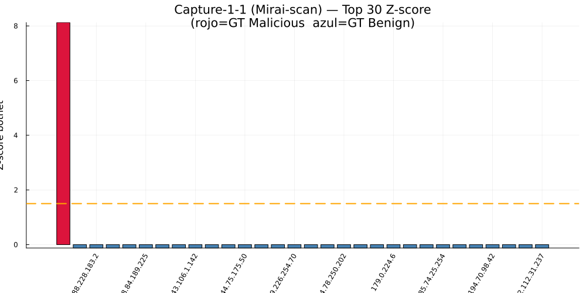
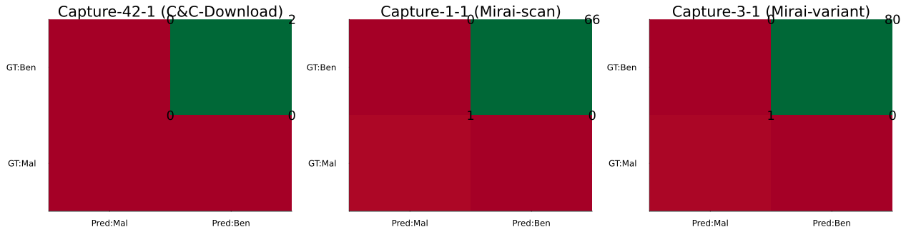

## Contexto y objetivo

### Universidad de Cuenca, DEET, Maestria en Ciencias de la Ingenieria Electrica

Este proyecto aplica teoria de grafos a un problema de ciberseguridad: detectar nodos criticos, modelar propagacion de malware y evaluar resiliencia topologica.

### Objetivo general

- Modelar la red como grafo.
- Calcular metricas de centralidad.
- Detectar anomalias mediante score compuesto y z-score.
- Simular propagacion de malware con SIR.
- Evaluar resiliencia con nodos de articulacion y puentes.
- Validar la metodologia con trafico real del dataset IoT-23.

## Metodologia general

### Como se hizo

1. Se construyo un grafo corporativo sintetico y ponderado.
2. Se calcularon metricas topologicas para cada nodo.
3. Se combino la informacion en un score estadistico para detectar anomalias.
4. Se simulo la propagacion de malware sobre la topologia real del grafo.
5. Se evaluo el dano estructural ante fallos dirigidos.
6. Se replico el enfoque sobre capturas reales de IoT-23.

### Implementacion

- Lenguaje: Julia.
- Script principal: `practica_redes_aucapina.jl`.
- Entorno reproducible con `Project.toml` y `Manifest.toml`.
- Salida: tablas, graficos y reportes en Markdown/PDF.

```bash
julia --project=Proyecto_Unidad1 Proyecto_Unidad1/practica_redes_aucapina.jl
```

## Parte 1: construccion del grafo

### Modelo de red corporativa

- Grafo no dirigido ponderado $G=(V,E,w)$.
- 20 nodos y 23 aristas.
- Pesos interpretados como capacidad de enlace.
- Topologia jerarquica con firewall, routers, servidores, hosts e IoT.

### Resultado clave

- Densidad = 0.1211.
- Red conectada, pero dispersa.
- Existen pocos caminos alternativos entre segmentos.

### Lectura tecnica

Una densidad baja anticipa fragilidad frente a fallos dirigidos sobre nodos estructurales.

{width=68%}

## Parte 2: metricas de centralidad

### Metricas calculadas

- Degree Centrality.
- Betweenness Centrality.
- Closeness Centrality.
- PageRank.

### Hallazgo principal

- Router-LAN-B obtuvo la mayor intermediacion.
- Router-Core quedo segundo, con rol de hub intersegmento.
- FW-Perimetral tuvo relevancia operativa, pero no topologica.

### Interpretacion del riesgo

No basta contar conexiones directas; tambien importa cuantos caminos criticos dependen del nodo.

{width=56%}

{width=56%}

### Como interpretar estas graficas

- En el grafo de betweenness, los nodos de mayor tamano o mayor realce visual concentran rutas minimas entre segmentos.
- Si un nodo aparece dominante en esta vista, su degradacion puede aumentar latencia o desconectar subredes.
- En la grafica de barras, la consistencia de un nodo en varias metricas (DC, BC, CC, PR) indica criticidad transversal y no solo local.

## Parte 3: deteccion de anomalias

### Criterio estadistico

$$
score(v)=0.5\,BC(v)+0.3\,DC(v)+0.2\,PR(v)
$$

$$
z(v)=\frac{score(v)-\mu}{\sigma}
$$

### Umbral de decision

- Nodo anomalo si $z > 1.5$.

### Nodos detectados

- Router-LAN-B: $z=2.631$
- Router-Core: $z=2.528$
- Router-LAN-A: $z=1.791$

El score compuesto redujo falsos positivos al combinar conectividad, intermediacion y relevancia estructural.

{width=52%}

{width=52%}

### Como interpretar la deteccion

- En el grafo, los nodos marcados como anomalos no son necesariamente los de mayor grado, sino los de mayor riesgo estructural compuesto.
- En la grafica de z-score, el criterio operativo es la distancia al umbral ($z=1.5$): a mayor separacion, mayor confianza de deteccion.
- Una brecha amplia entre los primeros nodos y el resto sugiere priorizacion clara para contencion y hardening.

## Parte 4: propagacion de malware con SIR

### Modelo utilizado

- Estados: Susceptible, Infectado y Recuperado.
- Parametros: $\beta=0.3$, $\gamma=0.1$.
- Numero reproductivo base: $R_0=3$.

### Comparacion de escenarios

- Inicio en IoT-Device1: tasa de ataque 5%.
- Inicio en Router-Core: tasa de ataque 50%.

### Interpretacion estructural

La posicion topologica del nodo inicial condiciona mas el dano que el valor global de $R_0$.

{width=62%}

{width=44%}

## Parte 4: sensibilidad y contencion

### Barrido de $\beta$ desde un nodo periferico

- Con origen en IoT-Device1, no hubo epidemia para $\beta=0.1$, $0.2$ y $0.3$.
- Solo con $\beta=0.5$ el brote logro escapar de la periferia.

### Lectura operativa

La topologia actua como barrera natural cuando el compromiso inicial ocurre en un nodo hoja.

{width=62%}

### Efecto de cuarentena

- Aislar temprano un nodo central reduce nodos alcanzables.
- La medida interrumpe corredores topologicos de propagacion.

{width=52%}

## Parte 5: resiliencia de la red

### Metricas estructurales

- 3 nodos de articulacion.
- 13 puentes.
- $\kappa = 1$.

### Interpretacion

- La red no es 2-conexa.
- Existen multiples enlaces sin redundancia.
- Hay puntos unicos de fallo en el backbone y la distribucion.

### Nodo mas critico

Router-Core: su falla fragmenta la red en varias componentes y aisla segmentos completos.

{width=52%}

{width=52%}

## Hardening propuesto

### Recomendaciones priorizadas

| Prioridad | Medida | Efecto esperado |
| --- | --- | --- |
| 1 | Agregar un Router-Core redundante | Elevar $\kappa$ de 1 a 2 |
| 2 | Crear enlace directo LAN-A a LAN-B | Reducir puentes criticos |
| 3 | Agregar segunda conexion al firewall | Eliminar un SPOF perimetral |
| 4 | Enlace SIEM-Server a Router-LAN-A | Mejorar resiliencia de monitoreo |

### Idea central

El objetivo no es agregar enlaces indiscriminadamente, sino incorporar rutas alternativas donde hoy existe dependencia de un unico nodo o arista.

## Desafio extra: validacion con IoT-23

### Datos analizados

- Capture-1-1: Mirai, 150001 lineas.
- Capture-3-1: Mirai variante, 150001 lineas.
- Capture-42-1: C\&C FileDownload, 4001 lineas.

### Metodologia

- Construccion de grafo dirigido IP $\rightarrow$ IP.
- Score botnet por IP activa.
- Umbral por z-score.
- Comparacion con ground truth del campo `label`.

$$
score_{botnet}(v)=0.35\,%Mal+0.25\,DC+0.20\,BC+0.20\,Ports_{norm}
$$

{width=64%}

### Como interpretar la comparacion IoT-23

- Esta grafica compara severidad y separacion estadistica entre capturas; no solo cuenta eventos, sino cuan distinguible es el patron malicioso frente al trafico benigno.
- Capture-1-1 y Capture-3-1 muestran mayor separacion porque Mirai produce escaneo horizontal, alta actividad por puertos y concentracion de conexiones salientes.
- Capture-42-1 presenta menor contraste relativo, por lo que su deteccion depende mas del contexto de etiqueta y volumen disponible.

## Resultados del desafio extra

### IPs detectadas correctamente

- 192.168.100.103 en Capture-1-1.
- 192.168.2.5 en Capture-3-1.

### Desempeno

- F1 = 1.000 en las dos capturas de Mirai.
- La separacion estadistica fue extrema: $z > 8$.

### Variable mas discriminante

La combinacion de porcentaje malicioso y diversidad de puertos contactados identifico con claridad el comportamiento botnet.

{width=50%}

{width=50%}

### Como interpretar las graficas finales del desafio

- Z-score por IP (Mirai):
  - Eje X: IPs evaluadas.
  - Eje Y: distancia estandarizada del score botnet respecto a la media.
  - Lectura: una IP con $z \gg 1.5$ es un outlier operacional; en este caso, la IP infectada se separa de forma extrema ($z>8$), lo que reduce ambiguedad.
- Matriz de confusion multicaptura:
  - Filas: clase real (`label`).
  - Columnas: clase predicha por el modelo.
  - Diagonal principal: aciertos; celdas fuera de la diagonal: errores.
  - Lectura del resultado: la concentracion en la diagonal para capturas Mirai explica el F1=1.0 reportado.
- Implicacion practica: cuando ambas graficas coinciden (outlier extremo + matriz limpia), la deteccion no solo es correcta, sino tambien interpretable para toma de decisiones en SOC.

## Integracion de resultados

### Convergencia entre metodos

- Los nodos anomalos de la Parte 3 coincidieron con los nodos de articulacion de la Parte 5.
- Router-Core fue tambien el mejor punto de inicio para una propagacion severa en la Parte 4.
- La metodologia detecto tanto criticidad estructural como riesgo operativo.

### Lectura final

El score compuesto de centralidad funciona como predictor robusto de criticidad, y su extension a trafico real permite detectar comportamientos botnet con alta precision.

## Conclusiones y cierre

### Conclusiones principales

1. La red corporativa modelada es funcional, pero fragil ante fallos dirigidos.
2. La centralidad permite identificar activos cuya perdida rompe la conectividad.
3. La propagacion de malware depende fuertemente de la posicion del nodo inicial.
4. La resiliencia mejora cuando se eliminan SPOF y se incrementa la redundancia.
5. La metodologia se valido en IoT-23 con resultados solidos para Mirai.

### Mensaje final

La integracion entre teoria de grafos, simulacion epidemiologica y analisis estadistico ofrece un marco coherente para priorizar defensa, deteccion y hardening en redes reales.
