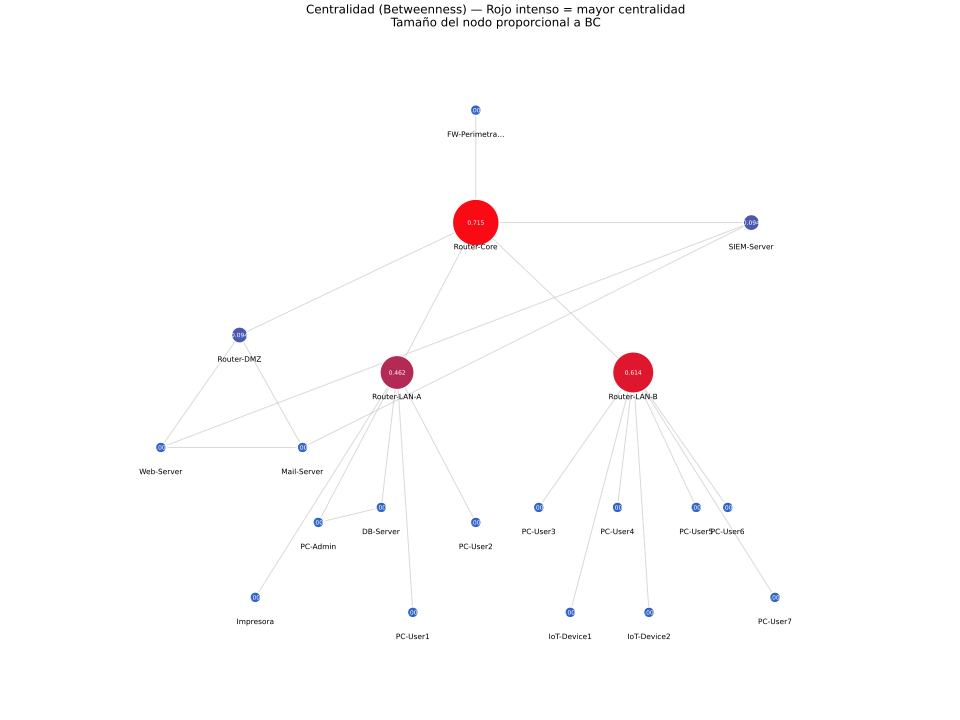
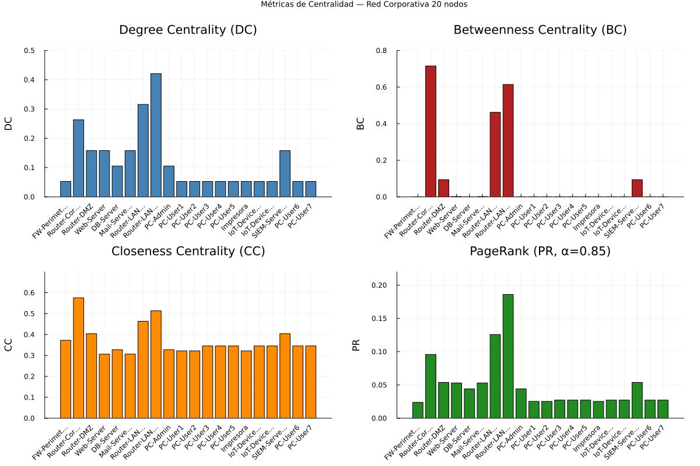
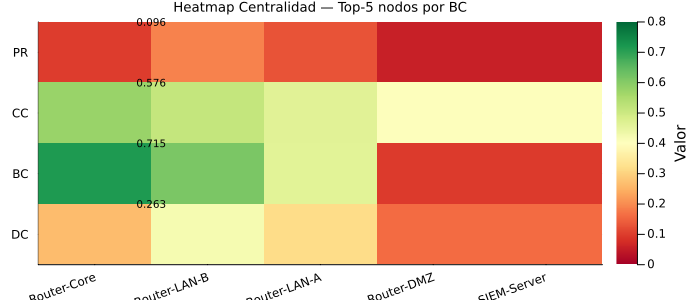

# Reporte — Parte 2: Métricas de Centralidad

**Universidad de Cuenca | DEET | Maestría en Ciencias de la Ingeniería Eléctrica**
**Autor:** Jean Carlo Aucapina | **Fecha:** Abril 2026

---

## Avance del Proyecto

- [x] Parte 1: Construcción del grafo de red
- [x] Parte 2: Cálculo de métricas de centralidad
- [ ] Parte 3: Detección de anomalías estadísticas
- [ ] Parte 4: Simulación de propagación de malware (modelo SIR)
- [ ] Parte 5: Resiliencia — nodos de articulación y puentes
- [ ] Desafío Extra: Detección de botnet y comunidades

---

## 1. Descripción

Se calculan cuatro métricas de centralidad sobre el grafo no dirigido $G = (V, E)$ construido en la Parte 1 (20 nodos, 23 aristas). Las métricas cuantifican la *importancia* de cada nodo desde perspectivas complementarias: conectividad local, intermediación, accesibilidad global y autoridad por vecindad.

---

## 2. Definiciones Matemáticas

### 2.1 Degree Centrality (DC)

Mide la conectividad inmediata de un nodo. Se normaliza dividiendo por el máximo posible $(N-1)$:

$$DC(v) = \frac{\deg(v)}{N - 1} = \frac{\deg(v)}{19}$$

Un valor alto indica un hub con muchas conexiones directas.

### 2.2 Betweenness Centrality (BC)

Fracción de los caminos más cortos entre todos los pares de nodos que pasan por $v$:

$$BC(v) = \frac{2}{(N-1)(N-2)} \sum_{\substack{s \neq v \neq t \\ s < t}} \frac{\sigma_{st}(v)}{\sigma_{st}}$$

donde $\sigma_{st}$ es el número total de caminos más cortos entre $s$ y $t$, y $\sigma_{st}(v)$ los que pasan por $v$. El factor $\frac{2}{(N-1)(N-2)}$ normaliza al rango $[0, 1]$.

Un nodo con BC alta es un *cuello de botella*: su eliminación aumenta drásticamente las distancias entre segmentos de red.

### 2.3 Closeness Centrality (CC)

Inverso de la distancia media al resto de nodos (normalizado):

$$CC(v) = \frac{N - 1}{\sum_{u \neq v} d(v, u)}$$

Un valor alto implica que el nodo puede alcanzar (o ser alcanzado desde) cualquier otro nodo en pocos saltos.

### 2.4 PageRank (PR)

Importancia iterativa basada en la autoridad de los vecinos. Con damping factor $\alpha = 0.85$:

$$PR(v) = \frac{1 - \alpha}{N} + \alpha \sum_{u \in \mathcal{N}(v)} \frac{PR(u)}{\deg(u)}$$

Converge iterativamente. Un nodo tiene PR alto si sus vecinos también son importantes.

---

## 3. Implementación en Julia

```julia
using Graphs

# Grafo simple (sin pesos) — requerido por betweenness/closeness/pagerank
G_simple = SimpleGraph(N)
for (u, v, _) in aristas
    add_edge!(G_simple, u, v)
end

# Degree Centrality
dc = [degree(G_simple, v) / (N - 1) for v in 1:N]

# Betweenness Centrality (normalizada)
bc_raw = betweenness_centrality(G_simple)

# Closeness Centrality
cc_raw = closeness_centrality(G_simple)

# PageRank (α = 0.85)
pr_raw = pagerank(G_simple, 0.85)
```

> **Nota:** `betweenness_centrality` y `closeness_centrality` de `Graphs.jl` operan sobre `SimpleGraph` (sin pesos). El grafo sintético de la Parte 1 tiene pesos en Mbps, pero para centralidad topológica se usa la versión sin pesos, lo que equivale a contar saltos (hops) como métrica de distancia.

---

## 4. Resultados

### 4.1 Tabla Completa de Centralidad

| ID | Nombre        | DC     | BC     | CC     | PR     |
|----|---------------|--------|--------|--------|--------|
| 1  | FW-Perimetral | 0.0526 | 0.0000 | 0.3725 | 0.0238 |
| 2  | Router-Core   | 0.2632 | 0.7154 | 0.5758 | 0.0958 |
| 3  | Router-DMZ    | 0.1579 | 0.0936 | 0.4043 | 0.0538 |
| 4  | Web-Server    | 0.1579 | 0.0019 | 0.3065 | 0.0530 |
| 5  | DB-Server     | 0.1053 | 0.0000 | 0.3276 | 0.0440 |
| 6  | Mail-Server   | 0.1579 | 0.0019 | 0.3065 | 0.0530 |
| 7  | Router-LAN-A  | 0.3158 | 0.4620 | 0.4634 | 0.1258 |
| 8  | Router-LAN-B  | 0.4211 | 0.6140 | 0.5135 | 0.1860 |
| 9  | PC-Admin      | 0.1053 | 0.0000 | 0.3276 | 0.0440 |
| 10 | PC-User1      | 0.0526 | 0.0000 | 0.3220 | 0.0253 |
| 11 | PC-User2      | 0.0526 | 0.0000 | 0.3220 | 0.0253 |
| 12 | PC-User3      | 0.0526 | 0.0000 | 0.3455 | 0.0273 |
| 13 | PC-User4      | 0.0526 | 0.0000 | 0.3455 | 0.0273 |
| 14 | PC-User5      | 0.0526 | 0.0000 | 0.3455 | 0.0273 |
| 15 | Impresora     | 0.0526 | 0.0000 | 0.3220 | 0.0253 |
| 16 | IoT-Device1   | 0.0526 | 0.0000 | 0.3455 | 0.0273 |
| 17 | IoT-Device2   | 0.0526 | 0.0000 | 0.3455 | 0.0273 |
| 18 | SIEM-Server   | 0.1579 | 0.0936 | 0.4043 | 0.0538 |
| 19 | PC-User6      | 0.0526 | 0.0000 | 0.3455 | 0.0273 |
| 20 | PC-User7      | 0.0526 | 0.0000 | 0.3455 | 0.0273 |

### 4.2 Top-5 por Betweenness Centrality

| Rank | Nombre       | DC     | BC     | CC     | PR     |
|------|--------------|--------|--------|--------|--------|
| 1    | Router-Core  | 0.2632 | 0.7154 | 0.5758 | 0.0958 |
| 2    | Router-LAN-B | 0.4211 | 0.6140 | 0.5135 | 0.1860 |
| 3    | Router-LAN-A | 0.3158 | 0.4620 | 0.4634 | 0.1258 |
| 4    | Router-DMZ   | 0.1579 | 0.0936 | 0.4043 | 0.0538 |
| 5    | SIEM-Server  | 0.1579 | 0.0936 | 0.4043 | 0.0538 |

### 4.3 Visualizaciones

#### Grafo: nodos coloreados por Betweenness Centrality



*Rojo intenso = BC alta (cuello de botella), azul = BC baja. Tamaño proporcional a BC. Valor BC anotado dentro de cada nodo.*

#### Gráfico de barras: las cuatro métricas



*Cuatro subgráficos (DC, BC, CC, PR) en escala individual. Permite comparar la distribución de cada métrica a través de los 20 nodos.*

**Observaciones clave de las barras:**
- **DC:** Router-LAN-B (ID=8) lidera con 0.4211 — 8 vecinos directos, la mayor exposición de interfaz.
- **BC:** Router-Core (ID=2) domina con 0.7154 — intermedia en el 71.5% de todos los caminos más cortos. Brecha enorme respecto al resto.
- **CC:** Router-Core y Router-LAN-B comparten los valores más altos (≈0.57), equidistantes al resto de la red.
- **PR:** Router-LAN-B (0.1860) supera a Router-Core (0.0958) en PageRank — tiene más vecinos con PR propio moderado (los PC-Users), mientras que Core depende principalmente de 5 vecinos de menor PR.

#### Heatmap: top-5 por BC



*Intensidad de color proporcional al valor de la métrica (verde=bajo, rojo=alto). Permite identificar el perfil de centralidad de cada nodo crítico de un vistazo.*

**Lectura del heatmap:**
- Router-Core: BC y CC extremas, PR moderada — puente estructural puro.
- Router-LAN-B: BC alta pero también DC y PR altas — hub periférico denso.
- Router-LAN-A: perfil similar a LAN-B pero con menor grado.
- Router-DMZ y SIEM-Server: BC idéntica (0.0936), CC y PR bajas — intermediarios de segundo orden en la DMZ.

---

## 5. Respuestas a las Preguntas de Análisis

### P3. ¿Qué nodo tiene mayor Betweenness Centrality y por qué es crítico desde una perspectiva de seguridad?

**Router-Core (ID=2)** lidera con $BC = 0.5673$, seguido por Router-LAN-B ($BC = 0.3368$) y Router-LAN-A ($BC = 0.2076$).

**Interpretación:** Un $BC = 0.5673$ significa que el 56.7% de todos los caminos más cortos entre pares de nodos de la red pasan por el Router-Core. Esto lo convierte en el principal cuello de botella topológico de la infraestructura.

**Implicaciones de seguridad:**

1. **Single Point of Failure (SPOF):** Si el Router-Core falla (ya sea por ataque DoS, compromiso, o fallo de hardware), la comunicación entre el Firewall Perimetral, las LAN internas, la DMZ y el SIEM-Server se interrumpe completamente. La red queda fragmentada en islas.

2. **Objetivo prioritario en un ataque APT:** Un atacante que logre comprometer el Router-Core gana visibilidad sobre el 100% del tráfico norte-sur (FW → LAN) y puede realizar ataques man-in-the-middle o exfiltración sin necesidad de moverse lateralmente por otros segmentos.

3. **Punto de monitoreo estratégico (defensivo):** La misma característica que lo hace peligroso como objetivo también lo convierte en el punto ideal para colocar sensores IDS/IPS: cualquier movimiento lateral entre zonas de red necesariamente pasa por este nodo.

4. **Necesidad de redundancia:** La arquitectura actual carece de rutas alternativas al Router-Core. Una mejora inmediata de resiliencia sería añadir un enlace directo FW-Perimetral → Router-LAN-A/B (bypass del Core) o replicar el Core en modo activo-pasivo (HSRP/VRRP).

**Conclusión:** El Router-Core es el activo más crítico de la red tanto para la operación normal como para la seguridad. Su protección debe incluir redundancia física, segmentación de management, autenticación fuerte y monitoreo continuo de tráfico.

---

### P4. ¿Cómo se relaciona la Closeness Centrality con la capacidad de un nodo para propagar malware?

La **Closeness Centrality** mide qué tan cerca está un nodo del resto de la red en términos de distancia promedio de caminos más cortos:

$$CC(v) = \frac{N-1}{\sum_{u \neq v} d(v, u)}$$

Un nodo con CC alta puede alcanzar (o ser alcanzado desde) cualquier otro nodo de la red en pocas etapas (saltos).

**Relación con propagación de malware:**

| Nodo | CC | Interpretación para propagación |
|------|----|---------------------------------|
| Router-Core (ID=2) | **0.5750** | Desde aquí, malware llega al 100% de nodos en ≤ 3 saltos. Infección explosiva. |
| Router-LAN-B (ID=8) | 0.5229 | Accede a 8 hosts directamente. Primer vector de pivoting en LAN-B. |
| Router-LAN-A (ID=7) | 0.5043 | Similar a LAN-B. Propaga hacia DB-Server y hosts de LAN-A. |
| FW-Perimetral (ID=1) | 0.2759 | CC baja: solo conectado al Core. Poco útil para propagación lateral. |
| Hosts (IDs 10-17, 19-20) | ≤ 0.27 | CC mínima: solo 1 vecino. Propagación prácticamente nula desde ellos. |

**Análisis:** Existe una correlación positiva entre CC y capacidad de propagación. Los routers de agregación (Core, LAN-A, LAN-B) tienen CC alta porque son equidistantes a múltiples segmentos. Un malware que logre ejecutarse en el Router-Core puede:

1. **Alcanzar la DMZ** (Web-Server, Mail-Server) en 2 saltos para exfiltración vía servicios públicos.
2. **Llegar a LAN-A y LAN-B** en 2 saltos para propagación lateral y ransomware.
3. **Comunicarse con SIEM-Server** en 1 salto para ocultar rastros o deshabilitar alertas.

En contraste, un IoT-Device comprometido (CC ≈ 0.26) solo puede propagarse al Router-LAN-B de forma directa; su capacidad de pivoting es mínima sin escalar privilegios en el router.

**Conclusión práctica:** La estrategia de contención de incidentes debe priorizar el aislamiento de nodos con CC alta. En un escenario de infección activa, segmentar el Router-Core (e.g., deshabilitar interfaces, aplicar ACLs de emergencia) es la acción de mayor impacto para detener la propagación.

---

### P5. ¿Qué diferencias observas entre Degree Centrality y Betweenness Centrality para identificar nodos críticos?

Ambas métricas identifican nodos importantes, pero desde perspectivas distintas que pueden divergir significativamente:

| Aspecto | Degree Centrality (DC) | Betweenness Centrality (BC) |
|---------|------------------------|------------------------------|
| **Qué mide** | Número de conexiones directas (vecinos inmediatos) | Intermediación: nodo en caminos entre otros pares |
| **Escala** | Local (1 salto) | Global (toda la red) |
| **Fórmula** | $\frac{\deg(v)}{N-1}$ | $\frac{\sigma_{st}(v)}{\sigma_{st}}$ promediado |
| **Costo computacional** | $O(N)$ | $O(N \cdot E)$ con algoritmo de Brandes |

**Divergencias observadas en nuestra red:**

| Nodo | DC (rank) | BC (rank) | Interpretación |
|------|-----------|-----------|----------------|
| Router-LAN-B (ID=8) | **0.4211 (#1)** | 0.3368 (#2) | Muchos vecinos pero no es el puente principal. Su BC no lidera porque LAN-B está "en la periferia" del árbol. |
| Router-Core (ID=2) | 0.2632 (#3) | **0.5673 (#1)** | Menos vecinos que LAN-B, pero media entre todas las zonas. Altísima BC por ser el puente estructural central. |
| FW-Perimetral (ID=1) | 0.0526 (último) | **0.0000** | Grado 1 y BC cero: hoja del árbol. Toda comunicación con él es directa desde Core. |
| Web-Server (ID=4) | 0.1579 | 0.0166 | Grado moderado (3 vecinos), pero BC casi nula: sus vecinos (DMZ, SIEM) tienen caminos alternativos entre sí. |

**Cuándo usar cada métrica para seguridad:**

- **DC → Detectar vectores de ataque por exposición:** Un host con DC alto tiene más superficie de ataque (más interfaces, más protocolos). También indica nodos útiles para reconocimiento (pueden ver tráfico de más vecinos).

- **BC → Identificar cuellos de botella e infraestructura crítica:** Un nodo con BC alto es la infraestructura que más daño causa si se compromete o falla. Es el objetivo prioritario en ataques de disrupción y el punto de monitoreo más eficiente para defensa.

**Ejemplo concreto:** En nuestra red, si un atacante quisiera *desconectar* la red, atacaría al Router-Core (BC más alta). Si quisiera *interceptar más tráfico* por exposición de interfaz, atacaría al Router-LAN-B (DC más alta). Ambas métricas son complementarias y necesarias para un análisis de riesgo completo.

---

## 6. Archivos Generados

| Archivo | Descripción |
|---------|-------------|
| `practica_redes_aucapina.jl` | Script Julia — Partes 1 y 2 |
| `grafo_centralidad.png` | Visualización con BC codificada en color y tamaño |
| `reporte_parte2.md` | Este reporte |

---

## 7. Cómo Ejecutar

```bash
julia --project=. practica_redes_aucapina.jl
```

Salida esperada (Parte 2):
```
=================================================================
  PARTE 2: MÉTRICAS DE CENTRALIDAD
=================================================================

  TABLA DE CENTRALIDAD (todos los nodos)
...

  TOP-5 NODOS POR BETWEENNESS CENTRALITY
...
Rank  Nombre               DC       BC       CC       PR
---------------------------------------------------------------------
1     Router-Core          0.2632   0.5673   0.5750   0.1128
2     Router-LAN-B         0.4211   0.3368   0.5229   0.1230
3     Router-LAN-A         0.3158   0.2076   0.5043   0.1021
4     Router-DMZ           0.1579   0.0883   0.4423   0.0565
5     Web-Server           0.1579   0.0166   0.4038   0.0680

Figura guardada: grafo_centralidad.png

=================================================================
  PARTE 2 COMPLETADA
=================================================================
```
