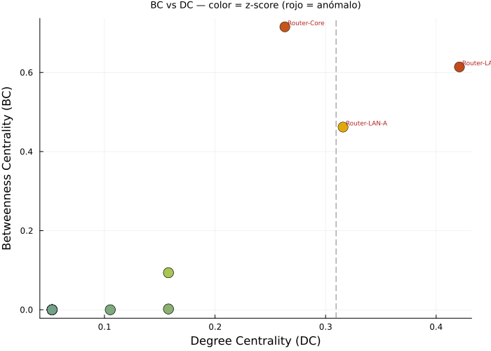

# Reporte — Parte 3: Detección de Anomalías Estadísticas

**Universidad de Cuenca | DEET | Maestría en Ciencias de la Ingeniería Eléctrica**
**Autor:** Jean Carlo Aucapina | **Fecha:** Abril 2026

---

## Avance del Proyecto

- [x] Parte 1: Construcción del grafo de red
- [x] Parte 2: Cálculo de métricas de centralidad
- [x] Parte 3: Detección de anomalías estadísticas
- [ ] Parte 4: Simulación de propagación de malware (modelo SIR)
- [ ] Parte 5: Resiliencia — nodos de articulación y puentes
- [ ] Desafío Extra: Detección de botnet y comunidades

---

## 1. Descripción

Se aplica detección de anomalías estadísticas sobre el grafo sintético usando un **score compuesto ponderado** y normalización por **z-score**. Un nodo con $z > 1.5$ se clasifica como anómalo y requiere investigación de seguridad adicional.

---

## 2. Modelo Matemático

### 2.1 Score Compuesto

Se combina Betweenness Centrality (BC), Degree Centrality (DC) y PageRank (PR) en un único indicador de riesgo estructural:

$$\text{score}(v) = 0.5 \cdot BC(v) + 0.3 \cdot DC(v) + 0.2 \cdot PR(v)$$

Los pesos reflejan la importancia relativa en ciberseguridad: BC domina porque identifica cuellos de botella (objetivos de interrupción y MitM); DC captura exposición de superficie; PR cuantifica autoridad informacional.

### 2.2 Z-Score

Normalización sobre la distribución de scores de toda la red:

$$z(v) = \frac{\text{score}(v) - \mu}{\sigma}$$

donde $\mu$ y $\sigma$ son la media y desviación estándar **poblacional** de los scores. El umbral $z > 1.5$ equivale a clasificar como anómalo todo nodo que supere en más de 1.5 desviaciones estándar la media de la red.

---

## 3. Implementación en Julia

```julia
using Statistics

scores = [0.5 * bc_raw[v] + 0.3 * dc[v] + 0.2 * pr_raw[v] for v in 1:N]

mu_score    = mean(scores)
sigma_score = std(scores, corrected=false)   # desviación estándar poblacional
umbral_z    = 1.5

z_scores = [(scores[v] - mu_score) / sigma_score for v in 1:N]

anomalos = [(id, z_scores[id]) for id in 1:N if z_scores[id] > umbral_z]
```

---

## 4. Resultados

### 4.1 Parámetros Estadísticos

| Parámetro | Valor |
|-----------|-------|
| Media (μ) | 0.0959 |
| Desv. estándar (σ) | 0.1424 |
| Umbral de score (z > 1.5) | 0.3095 |

### 4.2 Tabla Completa de Z-Scores

| ID | Nombre        | Score  | Z-score | Estado    |
|----|---------------|--------|---------|-----------|
| 1  | FW-Perimetral | 0.0205 | -0.5290 | Normal    |
| 2  | Router-Core   | 0.4558 |  2.5276 | **ANÓMALO** |
| 3  | Router-DMZ    | 0.1049 |  0.0635 | Normal    |
| 4  | Web-Server    | 0.0590 | -0.2593 | Normal    |
| 5  | DB-Server     | 0.0404 | -0.3897 | Normal    |
| 6  | Mail-Server   | 0.0590 | -0.2593 | Normal    |
| 7  | Router-LAN-A  | 0.3509 |  1.7908 | **ANÓMALO** |
| 8  | Router-LAN-B  | 0.4705 |  2.6310 | **ANÓMALO** |
| 9  | PC-Admin      | 0.0404 | -0.3897 | Normal    |
| 10–20 | Hosts/IoT | ≈0.021 | ≈-0.527 | Normal    |

### 4.3 Nodos Anómalos Detectados

| Rank | Nodo | Tipo | Z-score | Score |
|------|------|------|---------|-------|
| 1 | Router-LAN-B (ID=8) | router | **2.6310** | 0.4705 |
| 2 | Router-Core (ID=2)  | router | **2.5276** | 0.4558 |
| 3 | Router-LAN-A (ID=7) | router | **1.7908** | 0.3509 |

Los tres routers de agregación superan el umbral. El resto de la red (17 nodos) es estadísticamente normal.

---

## 5. Visualizaciones

### 5.1 Grafo con Anomalías Resaltadas


*Estrella roja = nodo anómalo (z > 1.5). Círculo azul = normal. Aristas rojas conectan pares de anómalos. Z-score anotado encima de cada nodo.*

**Lectura del grafo:**

- Los tres anómalos (Core, LAN-A, LAN-B) forman el **esqueleto de enrutamiento** de la red.
- Las aristas Core↔LAN-A y Core↔LAN-B son rojas: ambos extremos son anómalos, indicando el corredor de mayor riesgo estructural.
- Los nodos hoja (hosts, IoT) están en azul uniforme — su z-score es ≈ −0.53, agrupados muy por debajo del umbral.

### 5.2 Scatter BC vs DC coloreado por Z-Score



*Eje X = Degree Centrality, eje Y = Betweenness Centrality. Color: azul=z bajo, amarillo=z moderado, rojo=z alto (anómalo).*

**Lectura del scatter:**

- Los tres anómalos aparecen aislados en la esquina superior derecha del espacio BC×DC — separación natural respecto al clúster de nodos normales.
- El grueso de los nodos (≈17) se agrupa en BC≈0, DC≈0.05, confirmando la topología altamente jerarquizada de la red.
- Router-LAN-B ocupa la posición más extrema en DC (0.4211), mientras que Router-Core domina en BC (0.7154) — ambos anómalos pero por razones estructurales distintas.

### 5.3 Barras de Z-Score por Nodo


*Barras rojas = anómalos (z > 1.5), azul = positivo normal, gris = negativo. Línea roja punteada = umbral z = 1.5.*

**Lectura de las barras:**

- La distribución es fuertemente asimétrica (sesgada a la derecha): la mayoría de nodos tienen z < 0, con tres outliers extremos.
- La brecha entre Router-LAN-B (z = 2.63) y el cuarto nodo más alto (Router-DMZ, z ≈ 0.06) es de más de 2.5 puntos — separación estadística contundente.
- FW-Perimetral tiene z = −0.53 a pesar de ser el firewall perimetral: su grado=1 y BC=0 lo hacen invisible al score compuesto — ilustra que el score topológico no captura posición lógica de seguridad.

---

## 6. Respuestas a las Preguntas de Análisis

### P6. ¿Por qué se usa un score compuesto en lugar de una sola métrica para detectar anomalías?

Usar una sola métrica introduce **sesgos de cobertura**: cada centralidad captura solo una dimensión del rol de un nodo.

| Problema con métrica única | Ejemplo en esta red |
|---------------------------|---------------------|
| Solo BC → pierde hubs con muchos vecinos pero BC moderada | Router-LAN-B: DC=0.42 >> Router-Core DC=0.26, pero BC menor |
| Solo DC → pierde puentes estructurales con pocos vecinos | Router-Core: grado=5, pero BC=0.7154 (el mayor) |
| Solo PR → sesgado por la importancia de los vecinos, no por topología global | FW-Perimetral: PR bajo porque su único vecino (Core) le "pasa" poco peso |

El **score compuesto** $0.5 \cdot BC + 0.3 \cdot DC + 0.2 \cdot PR$ actúa como proyección ponderada del espacio multidimensional de centralidad sobre un eje de riesgo único. Los pesos asignados reflejan la jerarquía de relevancia en seguridad de red:

1. **BC (50%):** Máximo peso — intermediación = control de flujo = objetivo MitM/disrupción.
2. **DC (30%):** Peso medio — exposición de interfaz = superficie de ataque.
3. **PR (20%):** Peso menor — autoridad informacional = relevancia para reconocimiento.

Esta ponderación hace que el score sea **robusto a outliers en una sola dimensión**: un nodo con BC=0 pero DC muy alto (hipotético star-hub periférico) recibiría score moderado, no extremo. En contraste, un nodo con BC alta Y DC alta (como Router-LAN-B) se amplifica en el score final, que es el comportamiento deseado.

**Limitación:** Los pesos son heurísticos y dependen del contexto de amenaza. En redes con tráfico de exfiltración (alto PR de servidores de datos), el peso de PR debería aumentar. La selección de pesos óptima es un problema de calibración que idealmente se resuelve con datos históricos de incidentes.

---

### P7. Si un nodo IoT tiene un z-score repentinamente alto en un grafo dinámico, ¿qué podría indicar?

En el grafo estático de esta práctica, todos los dispositivos IoT tienen z ≈ −0.53, profundamente normales. Un **salto repentino en z-score** de un IoT en un grafo dinámico (donde las aristas se actualizan con el tráfico real del dataset IoT-23) indicaría uno o más de los siguientes escenarios:

**Escenario 1 — Compromiso e incorporación a botnet (Mirai-style):**

Un IoT infectado por Mirai comienza a escanear masivamente otros dispositivos (Telnet/SSH en puertos 23, 2323). Cada conexión de escaneo agrega una arista nueva al grafo dinámico, incrementando su grado de forma explosiva. El DC sube abruptamente, y si el dispositivo empieza a coordinar escaneos hacia múltiples segmentos, también sube su BC (se convierte en intermediario de las conexiones de escaneo). Resultado: z-score del IoT pasa de −0.53 a valores positivos extremos en minutos.

**Escenario 2 — Pivoting lateral (post-explotación):**

Un atacante que ha comprometido el IoT lo usa como punto de pivoting para acceder a la LAN interna. El dispositivo establece conexiones que normalmente no realizaría (hacia servidores de aplicación, base de datos), aumentando tanto su DC como su BC al convertirse en puente entre la zona IoT y la LAN corporativa.

**Escenario 3 — Movimiento C&C (Command & Control):**

El dispositivo comienza a recibir comandos de un servidor externo (C&C) y a reenviarlos a otros bots. Esto crea aristas hacia el exterior (alta out-degree en grafo dirigido) y hacia otros dispositivos comprometidos, elevando DC y BC simultáneamente.

**Acción recomendada al detectar z-score alto en IoT:**

1. **Aislar inmediatamente** el dispositivo mediante ACL en el router de acceso (Router-LAN-B).
2. **Capturar tráfico** (pcap) en el puerto de switch correspondiente para análisis forense.
3. **Correlacionar con SIEM-Server:** buscar alertas de escaneo de puertos o conexiones hacia IPs no autorizadas.
4. **Verificar firmware:** comparar hash del firmware actual contra baseline conocido.

La detección por z-score dinámico es especialmente valiosa para IoT porque estos dispositivos tienen comportamiento muy estereotipado (casi siempre el mismo patrón de comunicación), lo que hace que cualquier desviación sea estadísticamente significativa con umbrales bajos (z > 1.0 podría ser suficiente).

---

## 7. Archivos Generados

| Archivo | Descripción |
|---------|-------------|
| `practica_redes_aucapina.jl` | Script Julia — Partes 1, 2 y 3 |
| `grafo_anomalias.png` | Grafo con anómalos resaltados en rojo (estrella) |
| `anomalias_scatter.png` | Scatter BC×DC coloreado por z-score |
| `zscore_barras.png` | Barras de z-score por nodo con umbral |
| `reporte_parte3.md` | Este reporte |

---

## 8. Cómo Ejecutar

```bash
julia --project=. practica_redes_aucapina.jl
```

Salida esperada (Parte 3):

```text
=================================================================
  PARTE 3: DETECCIÓN DE ANOMALÍAS ESTADÍSTICAS
=================================================================

Score compuesto: μ=0.0959  σ=0.1424
Umbral anomalía: z > 1.5 → score > 0.3095

[ANÓMALO] ID= 8 | Router-LAN-B  | router | z=2.6310 | score=0.4705
[ANÓMALO] ID= 2 | Router-Core   | router | z=2.5276 | score=0.4558
[ANÓMALO] ID= 7 | Router-LAN-A  | router | z=1.7908 | score=0.3509
```
