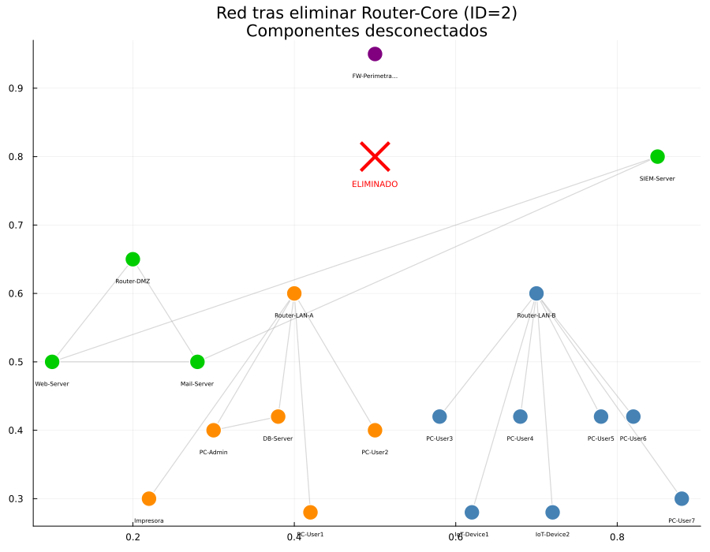

# Reporte — Parte 5: Resiliencia — Nodos de Articulación y Puentes

**Universidad de Cuenca | DEET | Maestría en Ciencias de la Ingeniería Eléctrica**
**Autor:** Jean Carlo Aucapina | **Fecha:** Abril 2026

---

## Avance del Proyecto

- [x] Parte 1: Construcción del grafo de red
- [x] Parte 2: Cálculo de métricas de centralidad
- [x] Parte 3: Detección de anomalías estadísticas
- [x] Parte 4: Simulación de propagación de malware (modelo SIR)
- [x] Parte 5: Resiliencia — nodos de articulación y puentes
- [ ] Desafío Extra: Detección de botnet y comunidades

---

## 1. Descripción

Se analiza la **resiliencia estructural** del grafo corporativo identificando:

1. **Nodos de articulación** (*cut vertices*): nodos cuya eliminación incrementa el número de componentes conexas.
2. **Puentes** (*bridge edges*): aristas cuya eliminación desconecta el grafo.
3. **Análisis de impacto**: cuantificación de nodos que quedan aislados al eliminar cada nodo de articulación.

Estos elementos son los **Puntos Únicos de Fallo** (SPOF — *Single Point of Failure*) de la red, y su identificación es crítica para el diseño de contramedidas de alta disponibilidad.

---

## 2. Marco Teórico

### 2.1 Nodo de Articulación

Un nodo $v \in V$ es un **nodo de articulación** si y solo si:

$$\exists \, u, w \in V \setminus \{v\} : \text{todo camino } u \leadsto w \text{ pasa por } v$$

Equivalentemente: $c(G) < c(G - v)$, donde $c(\cdot)$ denota el número de componentes conexas.

La detección se realiza mediante el algoritmo de **Tarjan** (DFS con tiempos de descubrimiento y valores *low*), con complejidad $O(|V| + |E|)$.

### 2.2 Puente (Bridge Edge)

Una arista $e = (u,v)$ es un **puente** si su eliminación desconecta el grafo:

$$c(G) < c(G - e)$$

Equivalentemente: $e$ no pertenece a ningún ciclo del grafo. El algoritmo de Tarjan detecta puentes en $O(|V| + |E|)$ en la misma pasada DFS.

### 2.3 Conectividad de Vértice (κ)

La **conectividad de vértice** $\kappa(G)$ es el tamaño mínimo de un conjunto de vértices cuya eliminación desconecta el grafo (o lo hace trivial):

$$\kappa(G) = \min_{S \subseteq V} \{|S| : G - S \text{ es disconexo o trivial}\}$$

- $\kappa(G) = 0$: grafo disconexo
- $\kappa(G) = 1$: existe al menos un nodo de articulación (SPOF)
- $\kappa(G) \geq 2$: grafo **2-conexo** (ningún nodo único puede desconectarlo)

### 2.4 Implementación en Julia

```julia
using Graphs

# Nodos de articulación — algoritmo Tarjan O(V+E)
puntos_articulacion = articulation(G_simple)

# Puentes — algoritmo Tarjan O(V+E)
puentes = bridges(G_simple)

# Impacto por eliminación: número de nodos que pierden conectividad con el componente mayor
function nodos_aislados_al_eliminar(g, id_eliminar)
    g_tmp = copy(g)
    for vecino in collect(neighbors(g_tmp, id_eliminar))
        rem_edge!(g_tmp, id_eliminar, vecino)
    end
    comps = connected_components(g_tmp)
    sort!(comps, by=length, rev=true)
    return N - length(comps[1]) - 1  # todos menos componente mayor menos el nodo eliminado
end
```

---

## 3. Resultados

### 3.1 Nodos de Articulación Detectados

| ID | Nodo | Tipo | Z-score (Parte 3) | BC |
|----|------|------|-------------------|----|
| 2  | Router-Core  | router | **2.5276** (ANÓMALO) | 0.7154 |
| 7  | Router-LAN-A | router | **1.7908** (ANÓMALO) | 0.4620 |
| 8  | Router-LAN-B | router | **2.6310** (ANÓMALO) | 0.6140 |

**Los tres nodos de articulación coinciden exactamente con los tres nodos anómalos detectados en la Parte 3.** Esta correlación confirma la validez del score compuesto BC+DC+PR como indicador de criticidad estructural.

### 3.2 Puentes Detectados

| Arista | Extremo A | Extremo B | Tipo |
|--------|-----------|-----------|------|
| (1,2)  | FW-Perimetral | Router-Core | backbone |
| (2,7)  | Router-Core | Router-LAN-A | backbone |
| (2,8)  | Router-Core | Router-LAN-B | backbone |
| (7,10) | Router-LAN-A | PC-User1 | acceso |
| (7,11) | Router-LAN-A | PC-User2 | acceso |
| (7,15) | Router-LAN-A | Impresora | acceso |
| (8,12) | Router-LAN-B | PC-User3 | acceso |
| (8,13) | Router-LAN-B | PC-User4 | acceso |
| (8,14) | Router-LAN-B | PC-User5 | acceso |
| (8,16) | Router-LAN-B | IoT-Device1 | acceso |
| (8,17) | Router-LAN-B | IoT-Device2 | acceso |
| (8,19) | Router-LAN-B | PC-User6 | acceso |
| (8,20) | Router-LAN-B | PC-User7 | acceso |

**Total: 13 puentes de 23 aristas (56.5% de aristas son SPF edges).**

Las aristas (1,2), (2,7), (2,8) son los puentes más críticos: forman el **backbone de enrutamiento** de la red. PC-Admin y DB-Server no aparecen como hojas puras porque PC-Admin tiene conexión directa con DB-Server (formando un pequeño ciclo que no es puente).

### 3.3 Métricas de Resiliencia

| Métrica | Valor | Interpretación |
|---------|-------|----------------|
| Nodos de articulación | **3** | 15% de los nodos son SPOF |
| Puentes (SPF edges) | **13** | 56.5% de aristas son SPF |
| Conectividad de vértice κ | **1** | Red NO es 2-conexa |
| Red 2-conexa | **No** | Existen puntos únicos de fallo |

### 3.4 Análisis de Impacto por Eliminación

#### Eliminación de Router-Core (ID=2)

| Componente | Nodos | Segmento |
|------------|-------|----------|
| 1 (mayor, 8 nodos) | Router-LAN-B, PC-User3/4/5/6/7, IoT-Device1/2 | LAN-B |
| 2 (6 nodos) | Router-LAN-A, DB-Server, PC-Admin, PC-User1/2, Impresora | LAN-A |
| 3 (4 nodos) | Router-DMZ, Web-Server, Mail-Server, SIEM-Server | DMZ |
| 4 (1 nodo) | FW-Perimetral | Perimetral |
| 5 (1 nodo) | Router-Core (aislado) | — |

**La red se fragmenta en 5 componentes.** El peor impacto es que FW-Perimetral queda completamente aislado — la red pierde su perímetro de seguridad. Los tres segmentos principales (LAN-A, LAN-B, DMZ) quedan incomunicados entre sí y sin acceso a Internet.

Nodos que pierden conectividad con el componente mayor: **11 nodos (55% de la red).**

#### Eliminación de Router-LAN-B (ID=8)

| Componente | Nodos |
|------------|-------|
| 1 (mayor, 12 nodos) | Red troncal + DMZ + LAN-A |
| 2–9 (1 nodo c/u) | Router-LAN-B, PC-User3/4/5/6/7, IoT-Device1/2 |

**La red se fragmenta en 9 componentes.** Router-LAN-B es el único punto de conexión de sus 7 hijos — al eliminarlo, cada nodo queda completamente aislado. **7 nodos pierden toda conectividad.**

#### Tabla Resumen de Impacto

| Nodo de Articulación | Componentes tras eliminación | Nodos aislados del componente mayor |
|----------------------|------------------------------|-------------------------------------|
| Router-Core (ID=2)   | 5 | 11 (55%) |
| Router-LAN-A (ID=7)  | 2 | 5 (25%) |
| Router-LAN-B (ID=8)  | 9 | 7 (35%) |

**Router-Core es el SPOF de mayor impacto** — su falla fragmenta la red en más componentes y aísla más nodos que cualquier otro.

---

## 4. Visualizaciones

### 4.1 Grafo con Nodos de Articulación y Puentes Resaltados


*Estrellas naranja = nodos de articulación. Aristas rojas gruesas = puentes. Círculos azules = nodos normales. Z-score anotado sobre cada nodo de articulación.*

**Lectura:** Los tres nodos de articulación (estrellas naranjas) forman el esqueleto de la red. Las aristas rojas revelan que el backbone completo (FW→Core→LAN-A, FW→Core→LAN-B) son puentes: no existe ninguna ruta alternativa para el tráfico inter-segmento. Los nodos azules (periféricos) tienen un único camino hacia el resto de la red — todos acceden por exactamente 1 arista puente.

### 4.2 Impacto por Eliminación de Nodos de Articulación


*Barras naranja/rojo = número de nodos que quedan aislados del componente mayor al eliminar cada nodo de articulación.*

**Lectura:** Router-Core domina con 11 nodos aislados (55% de la red). Router-LAN-B aísla 7 nodos directamente conectados. Router-LAN-A aísla 5 nodos de LAN-A. La escala del impacto refleja directamente el tamaño del subárbol que cuelga de cada nodo de articulación.

### 4.3 Red tras Eliminación de Router-Core



*Cada color representa un componente conexo independiente tras eliminar Router-Core. La X roja marca el nodo eliminado.*

**Lectura:** Cinco islas de color confirman la fragmentación total de la red. FW-Perimetral (color propio, aislado) es el caso más crítico desde el punto de vista de seguridad: sin Core, el firewall perimetral pierde toda comunicación con la red interna, dejando la organización sin protección activa gestionada.

---

## 5. Respuestas a las Preguntas de Análisis

### P11. ¿Qué hosts quedarían aislados si Router-Core falla?

Según la simulación de eliminación de aristas (equivalente a fallo de nodo):

**Segmentos completamente aislados:**

| Segmento | Nodos aislados |
|----------|----------------|
| LAN-A | Router-LAN-A, DB-Server, PC-Admin, PC-User1, PC-User2, Impresora (6 nodos) |
| DMZ | Router-DMZ, Web-Server, Mail-Server, SIEM-Server (4 nodos) |
| Perimetral | FW-Perimetral (1 nodo — crítico: pierde gestión) |

**Total: 11 de 19 nodos restantes (55%) pierden conectividad con el componente mayor (LAN-B).**

Nota: el componente "mayor" tras la eliminación del Core es LAN-B con 8 nodos — paradójicamente, LAN-B queda como el segmento superviviente más grande, pero también completamente incomunicado de Internet al perder el FW-Perimetral y el Router-Core.

**La falla de Router-Core implica:**
1. Pérdida de enrutamiento inter-VLAN completo.
2. FW-Perimetral aislado → sin NAT, sin inspección de tráfico entrante/saliente.
3. SIEM-Server aislado en DMZ → pérdida de visibilidad de seguridad global.
4. DB-Server accesible solo desde LAN-A local → servicios dependientes (Web-Server, Mail-Server) caen.
5. En términos operacionales: **caída total de los servicios corporativos**.

---

### P12. ¿Qué medidas de hardening recomendarías para mejorar la resiliencia?

El análisis topológico revela tres categorías de vulnerabilidad estructural:

#### Medida 1 — Redundancia de Router-Core (Alta prioridad)

**Problema:** Router-Core es el único camino entre todos los segmentos. Su falla causa fragmentación en 5 islas con 55% de nodos aislados.

**Solución:** Implementar un segundo router de core en configuración **activo-activo** (ECMP — Equal-Cost Multi-Path) o **activo-pasivo** (HSRP/VRRP):

```
FW-Perimetral ─── Router-Core-A (activo)
                └── Router-Core-B (standby) ─── [mismos vecinos]
```

Esto elimina Router-Core de la lista de nodos de articulación y aumenta $\kappa$ de 1 a 2 para ese segmento.

**Costo vs beneficio:** Alta inversión (hardware redundante + fibra adicional), pero elimina el SPOF de mayor impacto (55% nodos). Retorno en disponibilidad: crítico para RTO (Recovery Time Objective) < 1 hora.

#### Medida 2 — Anillos de Distribución en LAN-A y LAN-B (Media prioridad)

**Problema:** Router-LAN-A y Router-LAN-B son nodos de articulación porque todos sus hosts se conectan en topología estrella (un único camino).

**Solución:** Agregar aristas de respaldo entre segmentos adyacentes:

- **LAN-A ↔ LAN-B:** Arista directa Router-LAN-A ↔ Router-LAN-B (actualmente no existe). Crearía un ciclo en el backbone y eliminaría los puentes (2,7) y (2,8).
- **Hosts críticos con doble uplink:** PC-Admin y DB-Server ya tienen redundancia entre sí (arista PC-Admin ↔ DB-Server). Replicar este patrón para PC-User1/2 ↔ PC-User3/4 si se requiere máxima disponibilidad.

#### Medida 3 — Eliminación de Puentes en Acceso de Alta Criticidad (Baja-Media prioridad)

**Problema:** 13 de 23 aristas son puentes, concentradas en acceso de hosts/IoT.

**Priorización por criticidad:**

| Arista puente | Criticidad | Acción recomendada |
|---------------|------------|-------------------|
| FW ↔ Core | **Crítica** | Redundar (Medida 1) |
| Core ↔ LAN-A | **Crítica** | Crear anillo Core-LAN-A-LAN-B |
| Core ↔ LAN-B | **Crítica** | Mismo anillo |
| LAN-A ↔ PC-Admin | Media | PC-Admin ya tiene doble path vía DB-Server; no urgente |
| LAN-B ↔ IoT-Device1/2 | Baja | IoT tiene bajo impacto operacional; aceptar riesgo |
| LAN-B ↔ PC-User3..7 | Baja | Hosts de usuario; redundancia opcional (bonding) |

#### Medida 4 — Segmentación de SIEM-Server

**Problema:** SIEM-Server queda aislado en la DMZ si Router-Core falla, perdiendo la visibilidad de seguridad global en el peor momento (durante un incidente).

**Solución:** Agregar una segunda conexión SIEM-Server ↔ Router-LAN-A (o crear una VLAN de gestión out-of-band). Garantiza que el SIEM mantenga conectividad con al menos un segmento interno independientemente del fallo del Core.

#### Resumen de Prioridades

| Prioridad | Medida | κ resultante | Puentes eliminados | Costo |
|-----------|--------|-------------|-------------------|-------|
| 1 | Redundar Router-Core | 2 → 3 | 3 backbone | Alto |
| 2 | Arista LAN-A ↔ LAN-B | 1 → 2 (parcial) | 2 backbone | Medio |
| 3 | Segunda conexión SIEM | 1 (sin cambio κ) | 0 | Bajo |
| 4 | Redundar accesos IoT | 1 (sin cambio κ) | 2 | Bajo |

**Implementar Medidas 1+2 en conjunto** llevaría la red de $\kappa=1$ a $\kappa \geq 2$ en el backbone, eliminando todos los SPOFs críticos. Medidas 3 y 4 mejoran disponibilidad de nodos específicos sin cambiar la conectividad global.

---

## 6. Archivos Generados

| Archivo | Descripción |
|---------|-------------|
| `practica_redes_aucapina.jl` | Script Julia — Partes 1 a 5 |
| `resiliencia_grafo.png` | Grafo con articulaciones (estrella naranja) y puentes (arista roja) |
| `resiliencia_impacto.png` | Barras de nodos aislados por eliminación de cada articulación |
| `resiliencia_componentes.png` | Red fragmentada tras eliminar Router-Core |
| `reporte_parte5.md` | Este reporte |

---

## 7. Cómo Ejecutar

```bash
julia --project=. practica_redes_aucapina.jl
```

Salida esperada (Parte 5, fragmento):

```text
=================================================================
  PARTE 5: RESILIENCIA — NODOS DE ARTICULACIÓN Y PUENTES
=================================================================

Nodos de articulación (cut vertices):
  ID= 2 | Router-Core          | router
  ID= 7 | Router-LAN-A         | router
  ID= 8 | Router-LAN-B         | router

Puentes (bridge edges):
  ( 1)FW-Perimetral — ( 2)Router-Core
  ( 2)Router-Core — ( 7)Router-LAN-A
  ( 2)Router-Core — ( 8)Router-LAN-B
  [... 10 puentes adicionales de acceso ...]

Métricas de resiliencia:
  Nodos de articulación: 3
  Puentes (SPF edges):   13
  Conectividad vértice κ: 1
  Red 2-conexa: No — existe SPOF

PARTE 5 COMPLETADA
```
