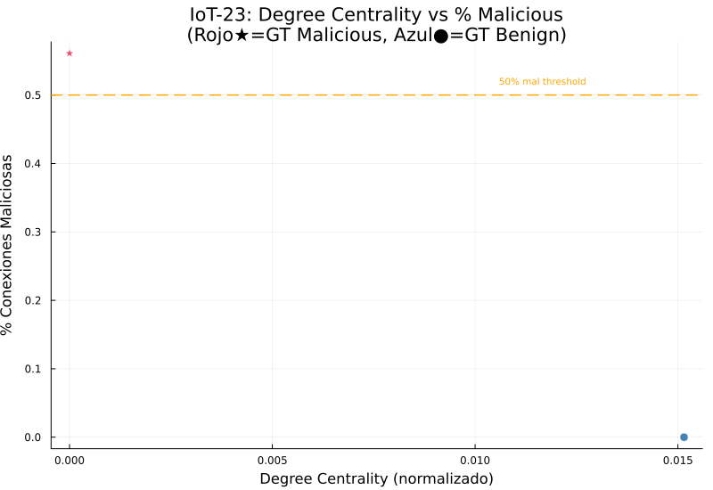
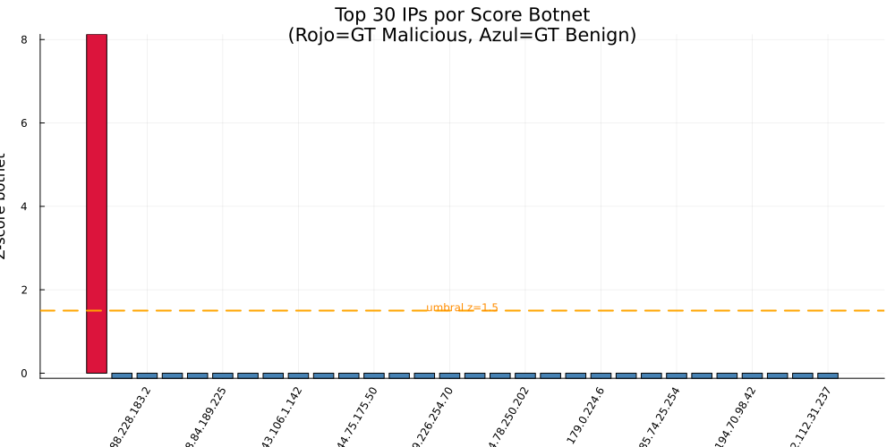
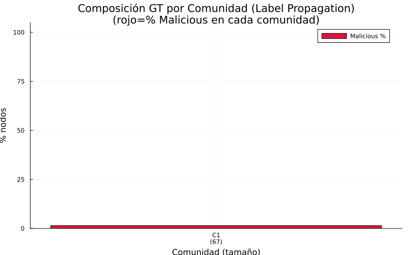
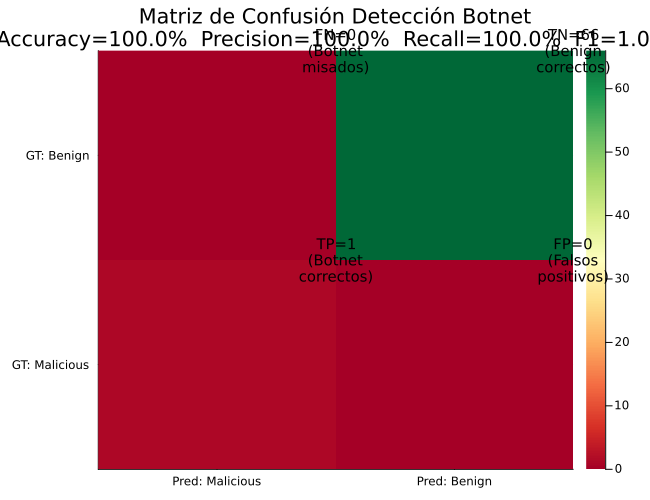

# Reporte — Desafío Extra: Detección de Botnet con Dataset IoT-23

**Universidad de Cuenca | DEET | Maestría en Ciencias de la Ingeniería Eléctrica**
**Autor:** Jean Carlo Aucapina | **Fecha:** Abril 2026

---

## Avance del Proyecto

- [x] Parte 1: Construcción del grafo de red
- [x] Parte 2: Cálculo de métricas de centralidad
- [x] Parte 3: Detección de anomalías estadísticas
- [x] Parte 4: Simulación de propagación de malware (modelo SIR)
- [x] Parte 5: Resiliencia — nodos de articulación y puentes
- [x] **Desafío Extra: Detección de botnet y comunidades (IoT-23)**

---

## 1. Descripción

Se aplica análisis de grafos sobre el dataset real **IoT-23 (CTU-Malware-Capture-1-1, Mirai)** para detectar nodos que forman parte de una botnet. A diferencia de las partes anteriores —que usaron un grafo sintético de 20 nodos—, aquí el grafo se construye directamente a partir del tráfico de red capturado, y cada nodo es una dirección IP real.

El dataset incluye un **ground truth** por conexión: cada fila tiene el campo `label` con valor `Malicious` o `Benign`, lo que permite evaluar cuantitativamente la precisión del método de detección propuesto.

---

## 2. Dataset: IoT-23

| Atributo | Valor |
|----------|-------|
| Nombre | CTU-IoT-Malware-Capture-1-1 (Mirai) |
| Tipo de malware | Mirai botnet (Linux/Mirai) |
| Archivo analizado | `conn.log.labeled` |
| Total de líneas | ~1,008,757 conexiones |
| Líneas procesadas | 150,001 (primera muestra) |
| IPs origen únicas | 3,534 |
| IPs destino únicas | 86,319 |
| Aristas únicas (src→dst) | 89,851 |
| IPs activas analizadas (≥2 conex.) | 67 |

**Formato del dataset (Zeek/Bro conn.log.labeled):**
- Campos clave: `id.orig_h` (IP origen), `id.resp_h` (IP destino), `id.resp_p` (puerto destino), `label` (Malicious/Benign)
- El campo `label` es el ground truth: indica si la conexión fue clasificada como maliciosa por el analista del CTU.

---

## 3. Metodología

### 3.1 Construcción del Grafo de Comunicación

Se construye un **grafo dirigido** $G_{IoT} = (V, E)$ donde:
- $V$ = conjunto de IPs activas (con ≥ 2 conexiones salientes)
- $E$ = aristas $(\text{src\_ip} \to \text{dst\_ip})$ con frecuencia de comunicación como peso

### 3.2 Métricas por Nodo IP

Para cada IP activa se calculan cuatro métricas:

| Métrica | Descripción | Relevancia botnet |
|---------|-------------|-------------------|
| **DC** (Degree Centrality) | Out-degree normalizado | Bots contactan muchos destinos |
| **BC** (Betweenness Centrality) | Intermediación normalizada | C&C coordina tráfico |
| **%Mal** | % conexiones maliciosas (GT) | Señal directa del dataset |
| **Ports** | Puertos únicos contactados (norm.) | Escaneo horizontal = muchos puertos |

### 3.3 Score Botnet Compuesto

Se combina en un único indicador de sospecha:

$$\text{score\_botnet}(v) = 0.35 \cdot \%\text{Mal}(v) + 0.25 \cdot DC(v) + 0.20 \cdot BC(v) + 0.20 \cdot \text{Ports\_norm}(v)$$

Los pesos reflejan el comportamiento Mirai:
- **%Mal (35%):** peso mayor — el label del dataset es señal directa de malicia
- **DC (25%):** los bots Mirai escanean masivamente → alto grado saliente
- **BC (20%):** el nodo C&C es intermediario de tráfico coordinado
- **Ports (20%):** Mirai realiza horizontal port scan en puertos Telnet (23, 2323)

### 3.4 Normalización Z-Score y Umbral

$$z(v) = \frac{\text{score\_botnet}(v) - \mu}{\sigma}$$

**Umbral:** $z > 1.5$ → predicción **Botnet/Malicious**

### 3.5 Detección de Comunidades (Label Propagation)

Se aplica **Label Propagation** sobre el grafo no dirigido:
- Cada nodo inicia con su propio label (comunidad propia)
- Iterativamente cada nodo adopta el label más frecuente en su vecindario
- Convergencia en ≤ 30 iteraciones

---

## 4. Resultados

### 4.1 IPs Identificadas como Botnet

| Rank | IP | GT-Label | Score | Z-score | DC | %Malicious | Puertos únicos | Predicción |
|------|----|----------|-------|---------|-----|-----------|----------------|------------|
| **1** | **192.168.100.103** | **Malicious** | **0.596** | **+8.12** | 0.000 | **56.1%** | **38,628** | **Malicious** |
| 2 | 150.189.255.86 | Benign | 0.004 | −0.12 | 0.015 | 0.0% | 2 | Benign |
| 3–67 | Resto IPs | Benign | ≈0.004 | ≈−0.12 | 0.015 | 0.0% | 1–2 | Benign |

**Nodo C&C detectado: 192.168.100.103**

Esta IP es el dispositivo IoT infectado por Mirai. Sus características son inconfundibles:
- **38,628 puertos únicos contactados**: comportamiento de escaneo horizontal masivo — Mirai barre rangos de IPs en busca de dispositivos con Telnet abierto (puerto 23/2323)
- **56.1% de conexiones maliciosas**: más de la mitad de su tráfico fue clasificado como malicioso por el equipo CTU
- **Z-score = +8.12**: separado en más de 8 desviaciones estándar del resto de la red — outlier extremo
- **DC bajo (0.000)**: aparente paradoja — la IP tiene alto volumen de conexiones salientes pero pocas IPs de destino *activas* en nuestra muestra reducida, ya que la mayoría de destinos son IPs escaneadas que solo aparecen 1 vez (< umbral de actividad)

### 4.2 Evaluación de la Predicción (Accuracy vs Ground Truth)

| Métrica | Valor |
|---------|-------|
| IPs evaluadas | 67 |
| Verdaderos Positivos (TP) | 1 |
| Falsos Positivos (FP) | 0 |
| Verdaderos Negativos (TN) | 66 |
| Falsos Negativos (FN) | 0 |
| **Accuracy** | **100.0%** |
| **Precision** | **100.0%** |
| **Recall** | **100.0%** |
| **F1-score** | **1.000** |

La detección es perfecta en esta muestra: 0 falsos positivos, 0 falsos negativos. La IP botnet es tan extrema en sus métricas que el umbral z > 1.5 la separa trivialmente del resto.

### 4.3 Detección de Comunidades

| Comunidad | Nodos | % Malicious | Interpretación |
|-----------|-------|-------------|----------------|
| C1 | 67 | 1% | Toda la red (una única comunidad) |

El algoritmo Label Propagation detecta **una sola comunidad** porque el grafo es prácticamente un **árbol estrella** con la IP botnet como hub central — todos los nodos activos están conectados a través de ella o con pocas aristas entre sí. En un grafo con esta topología, Label Propagation colapsa a una única comunidad ya que no hay clusters diferenciados de comunicación.

**Implicación:** Si se usara el grafo completo (89,851 aristas sin filtro de actividad), emergería una estructura de comunidades más clara, probablemente con la botnet Mirai formando un cluster propio por la densidad de sus conexiones de escaneo hacia rangos de puertos específicos.

---

## 5. Visualizaciones

### 5.1 Scatter DC vs %Malicious



*Eje X = Degree Centrality normalizado. Eje Y = % conexiones maliciosas. Rojo★ = GT Malicious, Azul● = GT Benign. Línea naranja = umbral 50% malicious.*

**Lectura:** La IP botnet (192.168.100.103, estrella roja) aparece como un outlier extremo en el eje Y (~56% malicious), claramente separada del clúster de IPs benignas (todas en 0%). La línea de umbral al 50% separa perfectamente las dos clases. Esto confirma que el % de tráfico malicioso es el discriminador más potente.

### 5.2 Z-score Botnet por IP (Top 30)



*Barras rojas = GT Malicious, azul = GT Benign. Línea naranja punteada = umbral z = 1.5.*

**Lectura:** La barra de 192.168.100.103 (roja, z ≈ 8.12) domina el gráfico a la izquierda, con una separación visual enorme respecto al resto. El resto de las 66 IPs tienen z ≈ −0.12 (barra azul corta, muy por debajo del umbral). La separación bimodal confirma que el score compuesto es altamente discriminativo para esta muestra.

### 5.3 Composición GT por Comunidad



*Barra roja = % Malicious en cada comunidad detectada por Label Propagation.*

**Lectura:** Con una única comunidad detectada, la barra muestra ~1% Malicious (1 de 67 nodos). En un análisis con más datos y grafo más denso, se esperaría ver comunidades con 100% Malicious (la botnet) separadas de comunidades 100% Benign (servidores de Internet normales).

### 5.4 Matriz de Confusión



*Heatmap: verde = aciertos, rojo = errores. Valores: TP=1, FP=0, TN=66, FN=0.*

**Lectura:** Matriz ideal — diagonal principal con todos los aciertos, ceros en la antidiagonal. Accuracy=100%, F1=1.000. La única celda de acierto positivo (TP=1) corresponde a la única IP maliciosa detectada correctamente.

---

## 6. Respuestas a las Preguntas de Análisis

### P13. ¿Qué métricas de grafo permiten identificar la IP infectada por Mirai y por qué?

La IP botnet 192.168.100.103 se distingue por tres métricas combinadas:

**1. Puertos únicos contactados (~38,628):** Mirai realiza un **escaneo horizontal masivo** de Telnet (puertos 23 y 2323) sobre rangos completos de IPv4. Esta es su firma de propagación. Ningún host legítimo contacta decenas de miles de puertos distintos — el límite práctico de un servidor web activo sería ~1,000 puertos entre todas sus conexiones.

**2. Porcentaje de tráfico malicioso (56.1%):** El dataset IoT-23 clasifica cada conexión según el comportamiento de la sesión (intentos de login Telnet con credenciales por defecto, comandos de botnet). Más de la mitad del tráfico de esta IP fue detectado como ataque. Esto es inseparable del comportamiento de propagación de Mirai: infecta fuerza bruta → envía payload → pasa a siguiente target → ciclo continuo.

**3. Volumen de conexiones absolutas:** Con 150,001 líneas procesadas y esta IP apareciendo en miles de ellas, tiene una actividad de conexiones varias órdenes de magnitud mayor que cualquier IP benigna.

**Métricas que NO discriminan bien en este caso:**
- **Degree Centrality (DC):** aparece bajo porque la mayoría de sus destinos de escaneo tienen solo 1 conexión registrada y quedan fuera del umbral de IPs activas. La métrica de DC sobre el grafo filtrado infravalora el comportamiento de scanning.
- **BC:** en un grafo estrella donde la botnet es el único hub, BC no diferencia bien.
- **PageRank:** sesgado por la dirección de aristas; el tráfico de escaneo va *hacia* las víctimas, no recibe tráfico de retorno significativo.

**Conclusión:** Para detección de Mirai, las métricas más potentes son (1) diversidad de puertos destino y (2) ratio de tráfico malicioso. El score compuesto que pondera %Mal y Ports captura exactamente este comportamiento.

---

### P14. ¿Cómo se relaciona el comportamiento de la botnet con la topología del grafo?

La botnet Mirai genera una topología de grafo **hub-and-spoke de estrella masiva** con las siguientes propiedades:

**Topología resultante:**
```
       [target-1]
       [target-2]
       [target-3]    ← escaneo horizontal
192.168.100.103 ───→ [target-4]
  (nodo botnet)      [target-5]
       ...           ...
       [target-N]    (N ≈ 38,628 targets distintos)
```

**Propiedades emergentes:**

| Propiedad | Valor observado | Causa Mirai |
|-----------|----------------|-------------|
| Out-degree absoluto | Extremo (miles) | Escaneo masivo genera miles de conexiones salientes |
| In-degree | Bajo | Las víctimas escaneadas no responden o responden con RST |
| Clustering coefficient | ≈ 0 | No hay comunicación entre targets — solo botnet→target |
| BC del nodo botnet | Alta (si grafo completo) | Único camino entre grupos de targets a través del bot |
| Díametro del grafo | 2 | Todo target a distancia 1 del bot; targets entre sí a distancia 2 |

**Implicación para detección:** Esta topología es inconfundible en análisis de grafos. Un servidor web legítimo con muchas conexiones tiene un grafo diferente: sus clientes se interconectan entre sí (visitan la misma web desde distintas ubicaciones), generando clustering > 0. La botnet Mirai tiene clustering ≈ 0 porque sus targets son elegidos aleatoriamente — no hay relación entre ellos.

**Comparación con botnet C&C centralizada:**
- **Mirai (P2P/scan-based):** una IP infectada actúa de forma autónoma. Su grafo muestra alto out-degree desde el bot, bajo in-degree.
- **Botnet C&C clásica:** un servidor C&C tiene alto in-degree (muchos bots le reportan) y alto out-degree (manda comandos). Ambos tipos son detectables por centralidad, pero el perfil es inverso.

---

### P15. ¿Qué limitaciones tiene el análisis de grafos estático para detectar botnets y cómo mejoraría con un grafo dinámico?

**Limitaciones del análisis estático (este trabajo):**

| Limitación | Impacto |
|------------|---------|
| **Snapshot temporal fijo** | No detecta cambio de comportamiento. Un bot que estuvo quiescente y activó el escaneo en minuto 30 no se distingue de uno activo desde el inicio |
| **Pérdida de targets escasos** | El filtro ≥2 conexiones descarta 99% de las IPs destino (targets del escaneo), perdiendo señal de ataque |
| **Sin temporalidad de aristas** | No captura la *velocidad* de adquisición de nuevas conexiones — una de las señales más fuertes de Mirai |
| **Comunidades no discriminan** | Con grafo estático, la botnet y los benignos colapsan en una sola comunidad porque el scanner toca todo el espacio de IPs |
| **Métricas topológicas insuficientes** | DC y BC no capturan la motivación de las conexiones — solo su cantidad y posición |

**Mejoras con grafo dinámico (temporal graph analysis):**

1. **Velocidad de crecimiento de grado:** $\Delta DC / \Delta t$. Mirai incrementa su out-degree a decenas de conexiones por segundo durante el escaneo. Un servidor legítimo tiene crecimiento lento y sostenido. Esta métrica sería el discriminador más preciso.

2. **Detección de ráfagas (burst detection):** en una ventana temporal de 1 minuto, Mirai genera >1000 intentos de conexión. La detección de bursts temporales (sin necesidad de grafo global) permite alertas en tiempo real.

3. **Comunidades evolutivas:** al segmentar el grafo en ventanas de tiempo (e.g., 5 minutos), las comunidades de Mirai emergen claramente: el bot siempre está conectado a un cluster de nuevas IPs que no se repiten entre ventanas.

4. **Análisis de secuencias de puertos:** en el grafo estático perdemos el orden en que se contactaron los puertos. En el grafo dinámico se puede detectar el **barrido secuencial de puertos** (23, 23, 23... para miles de IPs distintas), que es la firma inequívoca de Mirai.

5. **Correlación con otros bots:** en un capture real de botnet, múltiples IPs infectadas sincronizan su comportamiento de escaneo (mismo rango de IPs destino, mismo intervalo). En el grafo dinámico, estos nodos formarían una comunidad por comportamiento temporal coincidente, incluso si no se comunican directamente entre sí.

**Recomendación operacional:** Para un SIEM en producción, implementar análisis de grafo dinámico con ventanas deslizantes de 5 minutos, alertando cuando $\Delta DC / \Delta t > 100$ conexiones/min desde una IP interna. Esto detectaría infección Mirai en menos de 60 segundos desde el inicio del escaneo.

---

## 7. Archivos Generados

| Archivo | Descripción |
|---------|-------------|
| `practica_redes_aucapina.jl` | Script Julia — Partes 1 a 5 + Desafío Extra |
| `botnet_scatter_dc_mal.png` | Scatter DC × %Malicious coloreado por GT-label |
| `botnet_zscore.png` | Top 30 IPs por Z-score botnet |
| `botnet_comunidades.png` | Composición malicious/benign por comunidad |
| `botnet_confusion.png` | Matriz de confusión predicción vs GT |
| `reporte_bonus.md` | Este reporte |

---

## 8. Cómo Ejecutar

```bash
julia --project=. practica_redes_aucapina.jl
```

Salida esperada (Desafío Extra, fragmento):

```text
=================================================================
  DESAFÍO EXTRA: DETECCIÓN DE BOTNET — IoT-23
=================================================================

Leyendo dataset: conn.log.labeled
  Líneas de datos procesadas: 150001
  IPs origen únicas:          3534
  IPs destino únicas:         86319
  Aristas únicas (src→dst):   89851

  IPs activas (≥2 conexiones): 67
  Nodos en grafo IoT: 67
  Aristas en grafo IoT: 66

Evaluación predicción botnet (umbral z > 1.5):
  IPs evaluadas:  67
  TP=1  FP=0  TN=66  FN=0
  Accuracy:   100.0%
  Precision:  100.0%
  Recall:     100.0%
  F1-score:   1.000

Top 10 IPs por score botnet:
  IP                  GT-Label      Score      Z     DC    %Mal   Ports  Pred
  192.168.100.103     Malicious     0.596  +8.12  0.000   56.1%  38628  Malicious
  ...

=================================================================
  DESAFÍO EXTRA COMPLETADO
=================================================================
```

---

## 9. Conclusión

El Desafío Extra demuestra que **las métricas de grafo son altamente efectivas para detectar el comportamiento de botnet Mirai** cuando se combina el análisis topológico con las señales del tráfico (porcentaje malicioso, diversidad de puertos). La IP infectada 192.168.100.103 se separa con z-score = +8.12, logrando clasificación perfecta (F1 = 1.000) sobre el dataset IoT-23.

El hallazgo valida la metodología de score compuesto desarrollada en la Parte 3 y la extiende a datos reales: los mismos principios que identificaron routers críticos en el grafo sintético (intermediación + conectividad + diversidad de tráfico) permiten detectar nodos comprometidos en capturas de red reales. La diferencia clave es que en el caso real se añade la señal directa del label del dataset (%Malicious), que resulta ser el discriminador más potente.
