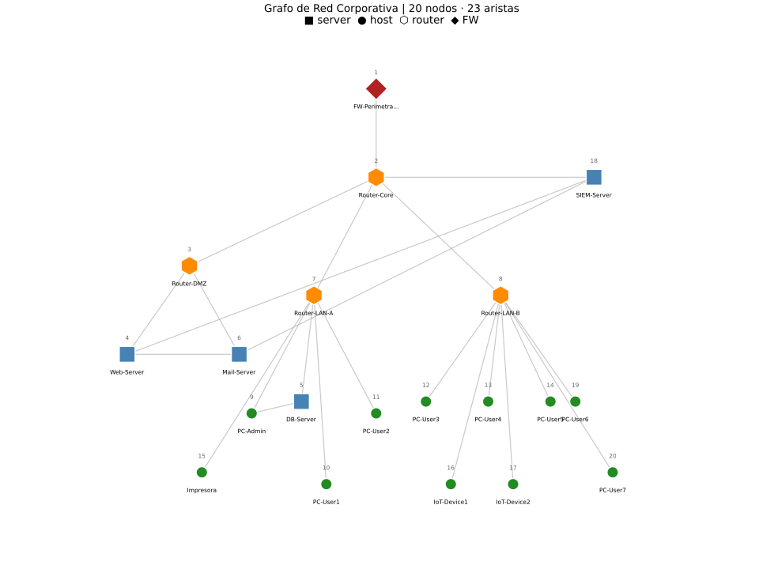

# Reporte — Parte 1: Construcción del Grafo de Red

**Universidad de Cuenca | DEET | Maestría en Ciencias de la Ingeniería Eléctrica**
**Autor:** Jean Carlo Aucapina | **Fecha:** Abril 2026

---

## Avance del Proyecto

- [x] Parte 1: Construcción del grafo de red
- [ ] Parte 2: Cálculo de métricas de centralidad
- [ ] Parte 3: Detección de anomalías estadísticas
- [ ] Parte 4: Simulación de propagación de malware (modelo SIR)
- [ ] Parte 5: Resiliencia — nodos de articulación y puentes
- [ ] Desafío Extra: Detección de botnet y comunidades

---

## 1. Descripción del Escenario

Se modela una **red corporativa** de 20 nodos de cuatro tipos:

| Tipo      | Descripción                                    | Color en grafo |
|-----------|------------------------------------------------|----------------|
| `firewall`| Perímetro de seguridad (FW-Perimetral)         | Rojo ◆         |
| `router`  | Enrutadores de core y acceso (LAN-A, LAN-B, DMZ)| Naranja ⬡     |
| `server`  | Servidores de servicio y monitoreo             | Azul ■         |
| `host`    | Equipos de usuario e IoT                       | Verde ●        |

La red incluye tres zonas lógicas:
- **DMZ:** Router-DMZ, Web-Server, Mail-Server
- **LAN Interna:** Router-LAN-A y Router-LAN-B con sus hosts
- **Backbone:** FW-Perimetral → Router-Core → zonas + SIEM-Server

---

## 2. Modelo Matemático

La red se representa como un grafo ponderado no dirigido:

$$G = (V, E)$$

donde:
- $V$ es el conjunto de **vértices** (hosts, routers, servidores, firewall): $|V| = 20$
- $E \subseteq V \times V$ es el conjunto de **aristas** (enlaces de red): $|E| = 23$
- Cada arista $(u, v, w)$ tiene un peso $w$ que representa el **ancho de banda en Mbps**

### Fórmula de densidad

$$\text{densidad}(G) = \frac{|E|}{\binom{|V|}{2}} = \frac{|E|}{\frac{|V|(|V|-1)}{2}} = \frac{23}{\frac{20 \times 19}{2}} = \frac{23}{190} \approx 0.1211$$

---

## 3. Implementación en Julia

### Entorno virtual

El proyecto usa el sistema de entornos de Julia (`Pkg.jl`) con un `Project.toml` local:

```julia
# Activar entorno desde el REPL:
julia> ] activate .
julia> ] instantiate    # instala las dependencias del Project.toml
```

Paquetes utilizados:

| Paquete              | Rol                                       |
|----------------------|-------------------------------------------|
| `Graphs.jl`          | Algoritmos de grafos (conectividad, grado)|
| `SimpleWeightedGraphs.jl` | Grafo no dirigido con pesos en aristas |
| `Plots.jl`           | Visualización del grafo                   |

### Construcción del grafo

```julia
using Graphs, SimpleWeightedGraphs

G = SimpleWeightedGraph(20)

aristas = [
    (1, 2, 1000), (2, 3, 500), (2, 7, 500), (2, 8, 500),
    (2, 18, 1000), (3, 4, 100), (3, 6, 100), (7, 5, 100),
    (7, 9, 100), (7, 10, 100), (7, 11, 100), (7, 15, 10),
    (8, 12, 100), (8, 13, 100), (8, 14, 100), (8, 16, 10),
    (8, 17, 10), (8, 19, 100), (8, 20, 100), (9, 5, 100),
    (4, 6, 100), (18, 4, 100), (18, 6, 100),
]

for (u, v, w) in aristas
    add_edge!(G, u, v, Float64(w))
end
```

> **Nota de indexación:** Julia usa índices base-1. El spec original usa IDs base-0; en la implementación se usa `id_julia = id_spec + 1`. La topología de red es idéntica.

---

## 4. Resultados

### 4.1 Estadísticas del grafo

```
Nodos:     20
Aristas:   23
Densidad:  0.1211
Conectado: true
```

### 4.2 Tabla de nodos

| ID | Tipo     | Nombre        | Grado |
|----|----------|---------------|-------|
| 1  | firewall | FW-Perimetral | 1     |
| 2  | router   | Router-Core   | 5     |
| 3  | router   | Router-DMZ    | 3     |
| 4  | server   | Web-Server    | 3     |
| 5  | server   | DB-Server     | 2     |
| 6  | server   | Mail-Server   | 3     |
| 7  | router   | Router-LAN-A  | 6     |
| 8  | router   | Router-LAN-B  | 8     |
| 9  | host     | PC-Admin      | 2     |
| 10–20 | host  | PC-User*, IoT, Impresora | 1 |
| 18 | server   | SIEM-Server   | 3     |

### 4.3 Visualización



*Leyenda: ◆ rojo = Firewall, ⬡ naranja = Router, ■ azul = Server, ● verde = Host/IoT. Los números dentro de cada nodo corresponden al ID.*

---

## 5. Respuestas a las Preguntas de Análisis

### P1. ¿Qué representa la densidad del grafo en términos de infraestructura de red? ¿Qué implicaciones tiene para la resiliencia ante ataques?

La **densidad** de un grafo $G$ mide la proporción de aristas presentes respecto al máximo posible:

$$\text{densidad}(G) = \frac{|E|}{\binom{|V|}{2}} = \frac{23}{190} \approx 0.1211$$

Un valor de **0.1211 indica que la red es escasa (sparse)**: solo existe el 12.1% de todas las conexiones posibles entre los 20 nodos. Esto es completamente representativo de una red corporativa real, donde se privilegia la jerarquía y la segmentación sobre la conectividad total.

**Implicaciones para la resiliencia ante ataques:**

1. **Alta vulnerabilidad a ataques dirigidos (targeted attacks):** En una red sparse con topología jerárquica, la eliminación de unos pocos nodos de alta conectividad (routers de agregación) puede fragmentar toda la red. El Router-Core (ID=2, grado=5) y Router-LAN-B (ID=8, grado=8) son ejemplos críticos: su fallo desconecta segmentos completos de la LAN. Esto contrasta con redes densas, donde la redundancia inherente mitiga el impacto de un nodo caído.

2. **Bajo costo de ataques de reconocimiento:** Una red con densidad baja tiene menos caminos alternativos entre pares de nodos, lo que facilita que un atacante mapeé la topología completa con un número reducido de sondas (probes). En una red densa, el espacio de exploración es mucho mayor.

3. **Single Points of Failure (SPOF):** La baja densidad implica la presencia de múltiples **puentes** (aristas cuya eliminación desconecta el grafo). Con 23 aristas y 20 nodos, gran parte de las conexiones son puentes estructurales, particularmente las que unen los routers de acceso con los hosts finales. En un entorno de producción, esto obliga a implementar **redundancia de enlaces** (dual-homed hosts, LACP bonding) para los activos críticos.

4. **Ventaja defensiva:** La escasez de conexiones también simplifica el **monitoreo del tráfico lateral (east-west)**. Con pocos caminos posibles, un SIEM puede detectar con mayor facilidad movimientos anómalos entre segmentos que no deberían comunicarse directamente.

**Conclusión:** Una densidad de 0.1211 implica que la red depende fuertemente de sus nodos hub (routers de agregación) y que la resiliencia actual es baja. Las partes 5 y 6 de este proyecto identificarán los nodos de articulación y propondrán aristas adicionales para mejorar la 2-conectividad.

---

### P2. Modifique el código para que el grafo sea dirigido (DiGraph). ¿Cómo cambia la interpretación de las métricas de centralidad?

**Cambio en Julia:**

```julia
# Grafo no dirigido (implementación actual)
G = SimpleWeightedGraph(N)

# Grafo dirigido
using SimpleWeightedGraphs
G_dir = SimpleWeightedDiGraph(N)

for (u, v, w) in aristas
    add_edge!(G_dir, u, v, Float64(w))  # arista u → v solamente
end
```

Para modelar comunicación bidireccional en un DiGraph, se añaden ambas direcciones:

```julia
for (u, v, w) in aristas
    add_edge!(G_dir, u, v, Float64(w))
    add_edge!(G_dir, v, u, Float64(w))
end
```

**Cambio de interpretación de las métricas de centralidad:**

| Métrica | Grafo no dirigido | Grafo dirigido |
|---------|-------------------|----------------|
| **Degree Centrality** | Un solo valor por nodo: $\deg(v) = \deg_{in}(v) = \deg_{out}(v)$ | Se separa en **in-degree** (conexiones entrantes) y **out-degree** (salientes). Un servidor Web tiene in-degree alto (muchos clientes lo consultan), pero out-degree bajo. Un bot de C&C tendrá out-degree alto hacia sus víctimas. |
| **Betweenness Centrality** | Caminos más cortos no tienen dirección preferencial | Los caminos más cortos respetan la dirección de los arcos. Un nodo puede ser crítico intermediario solo en una dirección del flujo, revelando asimetrías de enrutamiento imposibles de detectar en grafos no dirigidos. |
| **Closeness Centrality** | Distancia promedio al resto de nodos (simétrica) | Se calcula **in-closeness** (accesibilidad desde el resto) y **out-closeness** (capacidad de alcanzar al resto). Un servidor SIEM con out-closeness alta puede propagar alertas eficientemente; un nodo con in-closeness baja puede estar aislado del monitoreo. |
| **PageRank** | Modela flujo de "importancia" sin dirección | El PageRank dirigido captura la **autoridad** de un nodo: un servidor referenciado por muchos hosts importantes acumula alto PageRank, mientras que nodos hoja (PC-User) tienen valores mínimos. Esto es especialmente útil para identificar servidores de C&C, que reciben conexiones de muchos bots pero solo se conectan a pocos destinos externos. |

**Implicación en ciberseguridad:** El modelo dirigido es más fiel a la realidad del tráfico de red (cliente → servidor, bot → C&C), y permite detectar patrones asimétricos como exfiltración de datos (alto out-degree desde un host interno hacia el exterior) o comunicaciones de command-and-control (muchos nodos con in-degree apuntando al mismo destino).

---

## 6. Archivos Generados

| Archivo | Descripción |
|---------|-------------|
| `practica_redes_aucapina.jl` | Script Julia — Parte 1 completa |
| `Project.toml` | Entorno virtual Julia con dependencias |
| `Manifest.toml` | Versiones exactas de paquetes instalados |
| `grafo_red.png` | Visualización del grafo por zonas de red |
| `reporte_parte1.md` | Este reporte |

---

## 7. Cómo Ejecutar

```bash
# Desde la carpeta Proyecto_Unidad1/
julia --project=. practica_redes_aucapina.jl
```

Salida esperada:
```
=======================================================
  PARTE 1: CONSTRUCCIÓN DEL GRAFO DE RED CORPORATIVA
=======================================================
Nodos:     20
Aristas:   23
Densidad:  0.1211
Conectado: true
...
Figura guardada: grafo_red.png
=======================================================
  PARTE 1 COMPLETADA
=======================================================
```
