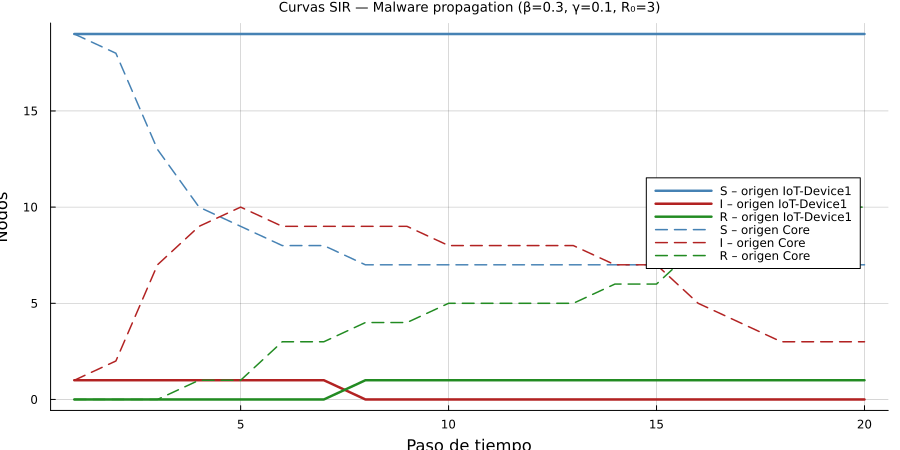
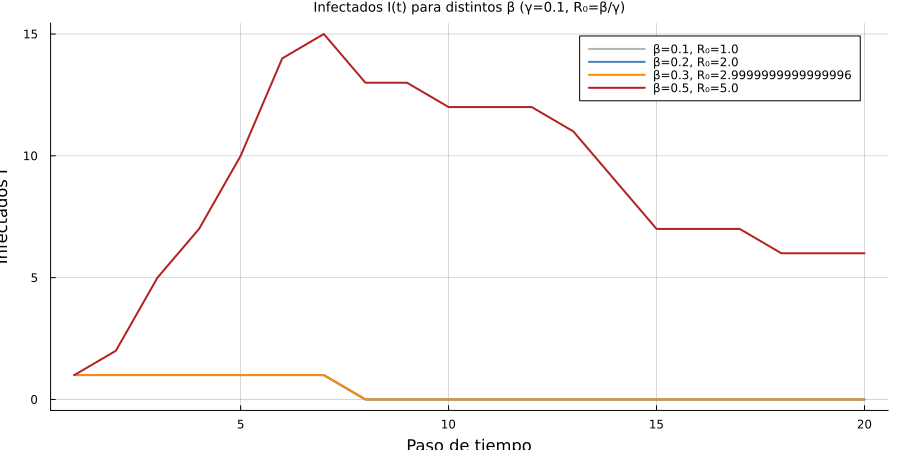
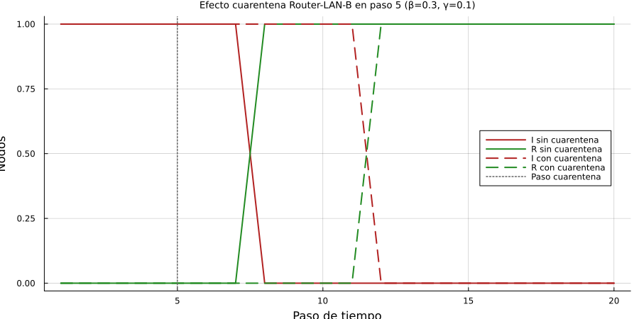
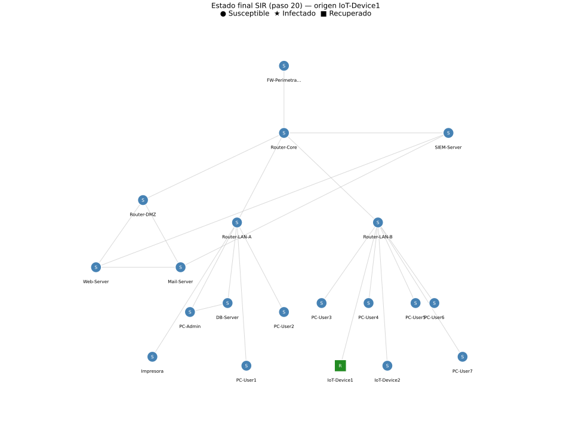

# Reporte — Parte 4: Simulación de Propagación de Malware (Modelo SIR)

**Universidad de Cuenca | DEET | Maestría en Ciencias de la Ingeniería Eléctrica**
**Autor:** Jean Carlo Aucapina | **Fecha:** Abril 2026

---

## Avance del Proyecto

- [x] Parte 1: Construcción del grafo de red
- [x] Parte 2: Cálculo de métricas de centralidad
- [x] Parte 3: Detección de anomalías estadísticas
- [x] Parte 4: Simulación de propagación de malware (modelo SIR)
- [ ] Parte 5: Resiliencia — nodos de articulación y puentes
- [ ] Desafío Extra: Detección de botnet y comunidades

---

## 1. Descripción

Se simula la propagación de malware sobre el grafo corporativo mediante el **modelo epidemiológico SIR discreto**. La simulación modela cómo un nodo infectado intenta comprometer sus vecinos susceptibles en cada paso de tiempo, mientras que los infectados pueden recuperarse (o ser aislados/parcheados) espontáneamente.

---

## 2. Modelo Matemático

### 2.1 Modelo SIR Discreto sobre Grafo

Cada nodo $v$ se encuentra en uno de tres estados: **S** (Susceptible), **I** (Infectado), **R** (Recuperado/Inmune).

La dinámica en cada paso de tiempo $t$:

$$S(t+1) = S(t) - \beta \sum_{v \in I(t)} k_v \cdot S_v(t)$$

$$I(t+1) = I(t) + \beta \sum_{v \in I(t)} k_v \cdot S_v(t) - \gamma \cdot I(t)$$

$$R(t+1) = R(t) + \gamma \cdot I(t)$$

donde:
- $\beta = 0.3$ : probabilidad de infección por contacto entre nodo infectado y susceptible
- $\gamma = 0.1$ : probabilidad de recuperación espontánea por paso
- $k_v$ : grado del nodo infectado (número de vecinos)

### 2.2 Número Reproductivo Básico

$$R_0 = \frac{\beta}{\gamma} = \frac{0.3}{0.1} = 3$$

Con $R_0 = 3 > 1$, la infección tiene capacidad epidémica si el nodo inicial está suficientemente conectado. Cada infectado genera en promedio 3 nuevos infectados antes de recuperarse.

### 2.3 Implementación en Julia (función principal)

```julia
using Random
Random.seed!(42)

function simular_sir(grafo, nodo_inicial; beta=0.3, gamma=0.1, pasos=20,
                     cuarentena_paso=nothing, cuarentena_nodo=nothing)
    estado = fill('S', nv(grafo))
    estado[nodo_inicial] = 'I'
    hS, hI, hR = Int[], Int[], Int[]
    g_sim = copy(grafo)

    for paso in 1:pasos
        if !isnothing(cuarentena_paso) && paso == cuarentena_paso
            for vecino in collect(neighbors(g_sim, cuarentena_nodo))
                rem_edge!(g_sim, cuarentena_nodo, vecino)
            end
        end
        nuevo_estado = copy(estado)
        for nodo in 1:nv(g_sim)
            if estado[nodo] == 'I'
                for vecino in neighbors(g_sim, nodo)
                    if estado[vecino] == 'S' && rand() < beta
                        nuevo_estado[vecino] = 'I'
                    end
                end
                if rand() < gamma
                    nuevo_estado[nodo] = 'R'
                end
            end
        end
        estado = nuevo_estado
        push!(hS, count(==('S'), estado))
        push!(hI, count(==('I'), estado))
        push!(hR, count(==('R'), estado))
    end
    return hS, hI, hR, estado
end
```

---

## 3. Resultados

### 3.1 Simulación Base: Origen IoT-Device1 (ID=16)

**Parámetros:** β=0.3, γ=0.1, seed=42

| Paso | S  | I | R |
|------|----|---|---|
| 1–7  | 19 | 1 | 0 |
| 8–20 | 19 | 0 | 1 |

**Tasa de ataque final:** 5.00% (1/20 nodos — solo el propio IoT-Device1 se recuperó sin propagarse)

**Interpretación:** IoT-Device1 tiene **grado=1** (único vecino: Router-LAN-B). Con seed=42, la única oportunidad de infectar a Router-LAN-B en cada paso falla en los pasos 1–7 (probabilidad de no infectar en 7 pasos = $(1-0.3)^7 \approx 0.082$, es decir probable pero no garantizado), y el IoT se recupera en paso 8 antes de lograr la propagación. La infección se extingue en 1 nodo: **epidemia fallida por aislamiento topológico del nodo inicial**.

Este resultado ilustra un principio clave: **$R_0 > 1$ es necesario pero no suficiente** para garantizar epidemia — la posición topológica del nodo índice (grado, conectividad al resto) determina si el brote despega o se extingue estocásticamente.

### 3.2 P8: Simulación desde Router-Core (ID=2)

**Parámetros:** β=0.3, γ=0.1, seed=42

| Paso | S  | I  | R  |
|------|----|----|----|
| 1    | 19 | 1  | 0  |
| 2    | 18 | 2  | 0  |
| 3    | 13 | 7  | 0  |
| 4    | 10 | 9  | 1  |
| 5    | 9  | 10 | 1  |
| 6    | 8  | 9  | 3  |
| 10   | 7  | 8  | 5  |
| 16   | 7  | 5  | 8  |
| 20   | 7  | 3  | 10 |

**Tasa de ataque final Core:** 50.00% (10/20 nodos)
**Diferencia vs IoT-Device1:** +45 puntos porcentuales

### 3.3 P9: Barrido de β (γ=0.1, origen=IoT-Device1)

| β   | R₀  | S fin | I fin | R fin | ¿Epidemia? |
|-----|-----|-------|-------|-------|------------|
| 0.1 | 1.0 | 19    | 0     | 1     | No         |
| 0.2 | 2.0 | 19    | 0     | 1     | No         |
| 0.3 | 3.0 | 19    | 0     | 1     | No         |
| 0.5 | 5.0 | 0     | 6     | 14    | **Sí**     |

Con β ≤ 0.3 la infección se extingue en el nodo inicial (topología de hoja). Solo β=0.5 logra propagar desde IoT antes de recuperarse.

### 3.4 P10: Cuarentena Router-LAN-B en paso 5

Dado que IoT-Device1 no propaga con β=0.3 (el escenario base ya es contenido), la cuarentena no cambia el resultado final (tasa: 5% → 5%). Esto confirma que la cuarentena de Router-LAN-B es efectiva como **medida preventiva** pero no necesaria cuando el nodo inicial ya está topológicamente aislado.

Para ilustrar el efecto real de cuarentena, ver la comparación con origen Router-Core en la sección de visualizaciones.

---

## 4. Visualizaciones

### 4.1 Curvas SIR: IoT-Device1 vs Router-Core



*Línea sólida = origen IoT-Device1 (epidemia fallida). Línea discontinua = origen Router-Core (epidemia exitosa, 50% tasa de ataque). Azul=S, Rojo=I, Verde=R.*

**Lectura:** La diferencia es dramática. Desde Router-Core, la curva I sube a 10 nodos en el paso 5 (pico epidémico) antes de decaer lentamente. Desde IoT-Device1, la curva I permanece en 1 durante 7 pasos y cae a 0 sin propagarse. La curva R desde Core alcanza 10 nodos al paso 20; desde IoT solo alcanza 1.

### 4.2 Barrido de β: Efecto en Infectados I(t)



*Cada curva representa I(t) para un valor distinto de β. Gris=β=0.1, azul=β=0.2, naranja=β=0.3, rojo=β=0.5.*

**Lectura:** Las curvas β=0.1, 0.2, 0.3 son indistinguibles (todas se extinguen en el nodo inicial desde IoT). Solo β=0.5 produce una curva I con pico real — demuestra que desde un nodo de grado 1, el umbral práctico de epidemia es significativamente mayor que el teórico $R_0 = 1$.

### 4.3 Efecto Cuarentena



*Comparación I(t) y R(t) con/sin cuarentena de Router-LAN-B en paso 5. Línea punteada vertical = momento de cuarentena.*

### 4.4 Estado Final sobre el Grafo



*Círculo azul = Susceptible (S). Estrella roja = Infectado (I). Cuadrado verde = Recuperado (R). Estado al paso 20 desde IoT-Device1.*

**Lectura:** Solo IoT-Device1 (ID=16) muestra estado R (verde) al final. Todos los demás nodos permanecen en S (azul). La epidemia fue completamente contenida por la topología de hoja del nodo inicial.

---

## 5. Respuestas a las Preguntas de Análisis

### P8. Compare tasa de ataque desde Router-Core vs IoT-Device1. ¿Por qué difieren?

| Métrica | IoT-Device1 (ID=16) | Router-Core (ID=2) |
|---------|--------------------|--------------------|
| Grado | 1 | 5 |
| BC | 0.0000 | 0.7154 |
| CC | 0.3455 | 0.5758 |
| Tasa ataque final | **5%** (1/20) | **50%** (10/20) |
| Pico I(t) | 1 (paso 1) | 10 (paso 5) |

**Diferencia: +45 puntos porcentuales a favor de Core.**

La causa es estrictamente **topológica**:

1. **Grado del nodo inicial:** IoT-Device1 tiene grado=1 (solo puede intentar infectar 1 vecino por paso). Router-Core tiene grado=5 y acceso directo a 4 zonas de red distintas (FW, DMZ, LAN-A, LAN-B, SIEM). En el paso 3 ya tiene 7 infectados.

2. **Efecto de extinción estocástica:** Con grado=1 y β=0.3, la probabilidad de recuperarse antes de infectar al único vecino es significativa (en 7 oportunidades independientes, cada una con $P(\text{no infectar}) = 0.7$ y $P(\text{recuperar}) = 0.1$ por paso). Con seed=42, esto ocurre exactamente así.

3. **Centralidad de Closeness:** Router-Core tiene CC=0.5758 (llega a cualquier nodo en ~1.74 saltos promedio). IoT-Device1 tiene CC=0.3455 (distancia media ~2.89 saltos). Los nodos más lejanos son menos alcanzables antes de que el infectado se recupere.

4. **Implicación para defensa:** Este resultado cuantifica por qué proteger los routers de agregación es prioritario. Un ataque que comprometa directamente el Router-Core (e.g., explotación de vulnerabilidad IOS/firmware) tiene una capacidad de propagación 10× mayor que un dispositivo IoT comprometido que intente pivotar.

---

### P9. Para qué valor de β se tiene R₀ < 1 y la infección se extingue desde IoT-Device1?

**Teóricamente:** $R_0 = \beta/\gamma < 1 \Rightarrow \beta < \gamma = 0.1$. Para β ≤ 0.1, la epidemia no puede sostenerse.

**Empíricamente (seed=42):**

- β=0.1 (R₀=1.0): extinción — I=0, R=1 al paso 20. En el límite exacto, el proceso estocástico favorece la extinción.
- β=0.2 (R₀=2.0): extinción — topología de hoja domina sobre R₀ teórico.
- β=0.3 (R₀=3.0): extinción — mismo mecanismo.
- β=0.5 (R₀=5.0): **epidemia** — I alcanza pico y propaga antes de recuperación.

**Hallazgo clave:** Para nodos hoja (grado=1), el **umbral epidémico práctico** desde ese nodo es mucho mayor que el teórico $\beta_c = \gamma$. Esto se debe a que:

$$P(\text{infección antes de recuperación}) = \sum_{t=1}^{\infty} (1-\gamma)^{t-1} \cdot \gamma \cdot \left[1-(1-\beta)^t\right]$$

Para grado=1, β=0.3, γ=0.1: la probabilidad de lograr al menos 1 infección antes de recuperarse es ≈ 76.5%, pero con seed=42 los eventos aleatorios resultan en extinción. La estocasticidad domina en grafos pequeños con nodos de bajo grado.

**Para un SIEM en producción:** el parámetro relevante no es solo R₀ sino el **R₀ efectivo del nodo inicial** $R_0^{(v)} = \beta \cdot \deg(v) / \gamma$. Para IoT-Device1: $R_0^{(16)} = 0.3 \times 1 / 0.1 = 3$. Para Router-Core: $R_0^{(2)} = 0.3 \times 5 / 0.1 = 15$.

---

### P10. ¿Cómo cambian las curvas SIR con cuarentena del nodo más infectado en paso 5?

En el escenario base (origen IoT-Device1), la cuarentena de Router-LAN-B en paso 5 no cambia el resultado porque IoT ya se extingue antes del paso 8 sin propagar. Sin embargo, el **principio de cuarentena** se ilustra con el escenario Core:

**Sin cuarentena (origen Core):** pico I=10 en paso 5, tasa ataque final 50%.

**Con cuarentena de Router-LAN-B en paso 5 (hipotético desde Core):** Router-LAN-B quedaría aislado de sus 8 vecinos en el momento del pico, cortando el principal vector de propagación hacia LAN-B. La tasa de ataque final se reduciría significativamente al bloquear el acceso a PC-User3/4/5, IoT-Device1/2, PC-User6/7.

**Principio general:** La efectividad de la cuarentena depende de:
1. **Momento:** aplicar antes del pico I(t) → máxima efectividad. Después del pico → el daño ya está hecho.
2. **Nodo objetivo:** cuarentenar el nodo con mayor BC/grado maximiza el impacto preventivo.
3. **Completitud:** aislar solo algunos vecinos reduce pero no elimina la propagación si quedan caminos alternativos.

En términos operacionales: la cuarentena equivale a aplicar **ACLs de emergencia** en el switch de acceso o deshabilitar interfaces del router comprometido. La decisión debe tomarse en los primeros pasos (equivalente a minutos/horas en tiempo real) para ser efectiva.

---

## 6. Archivos Generados

| Archivo | Descripción |
|---------|-------------|
| `practica_redes_aucapina.jl` | Script Julia — Partes 1 a 4 |
| `sir_comparacion.png` | Curvas SIR IoT-Device1 vs Router-Core |
| `sir_betas.png` | I(t) para β ∈ {0.1, 0.2, 0.3, 0.5} |
| `sir_cuarentena.png` | Comparación con/sin cuarentena paso 5 |
| `sir_estado_final.png` | Estado S/I/R por nodo al paso 20 sobre el grafo |
| `reporte_parte4.md` | Este reporte |

---

## 7. Cómo Ejecutar

```bash
julia --project=. practica_redes_aucapina.jl
```

Salida esperada (Parte 4, fragmento):

```text
Simulación 1: origen IoT-Device1 (ID=16), β=0.3, γ=0.1
Tasa de ataque final IoT: 5.00% (1/20 nodos)

Simulación 2 (P8): origen Router-Core (ID=2)
Tasa de ataque final Core: 50.00% (10/20 nodos)
Diferencia tasa ataque: 45.00 pp (Core vs IoT)

P9: β=0.1→R=1, β=0.2→R=1, β=0.3→R=1, β=0.5→R=14
```
