---
title: "Reporte: BFS y DFS en Red de Sensores Hídricos"
author: "Jean Carlo Aucapina"
date: "2026-05-13"
---

# Reporte: BFS y DFS en Red de Sensores Hídricos

**Autor:** Jean Carlo Aucapina
**Fecha:** 2026-05-13
**Herramienta:** Julia 1.x — paquetes: Graphs.jl, GraphPlot.jl, DataFrames.jl, StatsBase.jl

---

## 1. Descripción del Caso

Una red de sensores IoT mide caudal de agua en ríos y canales de una cuenca hídrica. Cada sensor transmite lecturas periódicamente al gateway central. Los sensores operan con batería limitada, por lo que la selección de ruta tiene impacto directo en la vida útil de la red.

**Problema:**

- ¿Cuál es el camino con menor número de saltos de cada sensor al gateway?
- ¿Qué rutas alternativas existen y cuál consume menos batería?

**Relevancia:** En redes WSN (Wireless Sensor Networks) para monitoreo ambiental, agotar baterías en nodos clave puede dejar sectores de la cuenca sin cobertura.

---

## 2. Estructura de la Red Sintética

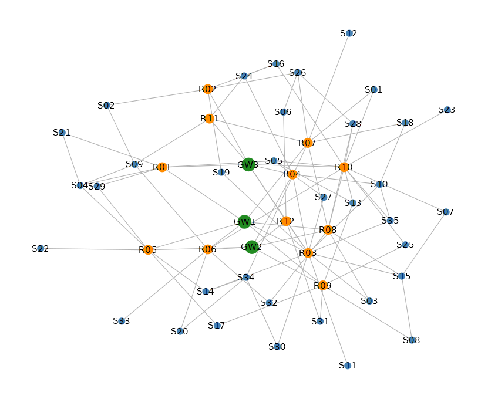

*Fig. 1 — 50 nodos: azul=sensor de caudal, naranja=repetidor intermedio, verde=gateway. Cada arista tiene peso en mAh (consumo de transmisión).*

| Parámetro | Valor |
| --- | --- |
| Nodos totales | 50 |
| Sensores de caudal | 35 |
| Repetidores intermedios | 12 |
| Gateways (sumideros) | 3 |
| Aristas totales | 96 |

**Topología:** Árbol con redundancias (mesh parcial). Los sensores conectan a 1–2 repetidores; los repetidores conectan upstream hacia los gateways. Se añaden aristas sensor–sensor y repetidor–repetidor para crear rutas alternativas realistas.

**Peso de aristas:** Consumo en mAh estimado para transmitir un paquete:

```
peso(u -> v) = base_tx * (100 / bateria_v) * ruido
```

Donde `bateria_v` es el nivel de batería del nodo destino (%). Nodos con poca batería tienen mayor costo de enrutamiento — actuar como relay cuando la batería es baja acelera su agotamiento.

---

## 3. BFS — Camino Mínimo en Saltos

### Cómo funciona BFS

BFS (Breadth-First Search / Búsqueda en Anchura) explora el grafo **nivel a nivel**, visitando primero todos los vecinos directos del nodo origen, luego los vecinos de esos vecinos, y así sucesivamente. Garantiza que el primer camino encontrado a un destino es el de **mínimo número de saltos**.

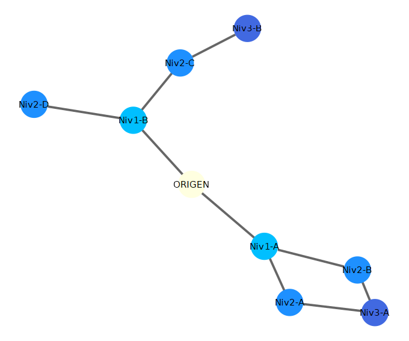

*Fig. 2 — BFS en grafo pequeño. Amarillo=nodo origen (Nivel 0), celeste=Nivel 1 (vecinos directos), azul=Nivel 2, azul oscuro=Nivel 3. BFS visita todos los nodos de un nivel antes de bajar al siguiente.*

**Cola FIFO:** BFS usa una cola donde se encolan los vecinos de cada nodo visitado. Esto garantiza el orden por niveles.

```
Cola inicial: [ORIGEN]
Paso 1 -> visita ORIGEN  -> encola vecinos Nivel1: [Niv1-A, Niv1-B]
Paso 2 -> visita Niv1-A  -> encola vecinos Nivel2: [Niv1-B, Niv2-A, Niv2-B]
Paso 3 -> visita Niv1-B  -> encola vecinos Nivel2: [Niv2-A, Niv2-B, Niv2-C, Niv2-D]
...hasta llegar al gateway
```

### BFS aplicado a la red hídrica

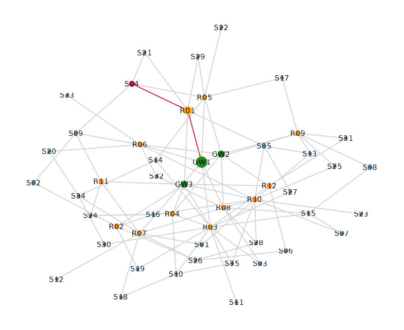

*Fig. 3 — Ruta BFS desde S-04 al gateway (aristas rojas). Rojo=origen, naranja=nodos del camino, verde=gateway destino. BFS encuentra la ruta directa S-04 -> R-01 -> GW-1 en solo 2 saltos.*

### Resultados

Todos los 35 sensores alcanzan un gateway en **2 saltos** (sensor -> repetidor -> gateway). La topología árbol está bien dimensionada — ningún sensor queda aislado.

```
Sensor    Saltos  Bat.Med%  Gateway
S-01           2      75.0  GW-1
S-02           2      75.0  GW-3
S-03           2      71.7  GW-1
...
Promedio de saltos en la red: 2.00
```

En una red real con topología irregular, BFS identificaría sensores con 3–5 saltos que requerirían repetidores adicionales.

---

## 4. DFS — Exploración Completa de Rutas

### Cómo funciona DFS

DFS (Depth-First Search / Búsqueda en Profundidad) explora cada rama hasta el **máximo fondo posible** antes de retroceder (backtrack). No garantiza el camino más corto, pero mapea **todo el espacio de rutas posibles**.

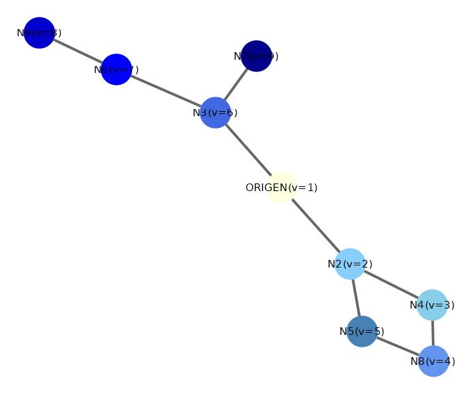

*Fig. 4 — DFS en grafo pequeño. v=N indica el orden de visita. Color más oscuro = visitado más tarde. DFS baja por la primera rama hasta el final antes de explorar la segunda rama.*

**Pila LIFO:** DFS usa una pila (o recursión) donde cada nodo empuja sus vecinos. Esto produce el orden en profundidad.

```
Pila inicial: [ORIGEN]
Paso 1 -> visita ORIGEN -> empuja vecinos: [N2, N3]
Paso 2 -> visita N2     -> empuja vecinos: [N3, N4, N5]   <- baja por rama izquierda
Paso 3 -> visita N4     -> empuja vecinos: [N3, N5, N8]   <- sigue bajando
Paso 4 -> visita N8     -> sin vecinos no visitados -> backtrack
...explora todas las ramas antes de terminar
```

### DFS aplicado a la red hídrica

Se ejecutó DFS desde **S-04** (sensor con mayor grado de conectividad — 4 conexiones), buscando todas las rutas posibles al gateway con límite de 200 rutas.

Se encontraron **200 rutas** (límite alcanzado — la red tiene aún más rutas posibles).

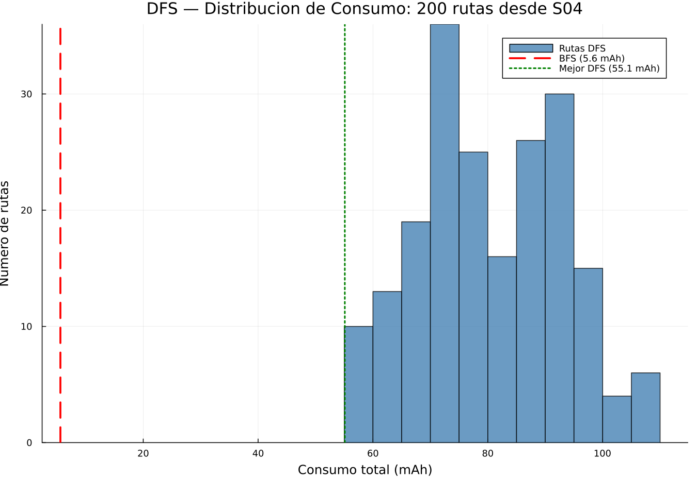

*Fig. 5 — Distribución de consumo de batería en las 200 rutas encontradas por DFS. La línea roja marca la ruta BFS (mínimos saltos). La línea verde marca la mejor ruta DFS por consumo. DFS explora desde 55 hasta 107 mAh.*

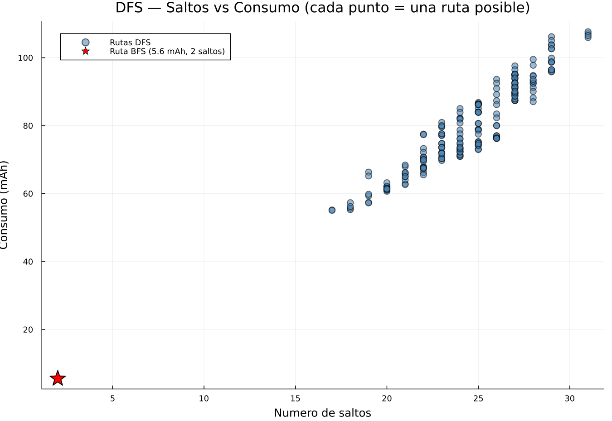

*Fig. 6 — Cada punto es una ruta DFS. La estrella roja es la ruta BFS. Rutas con pocos saltos tienden a menor consumo, pero hay dispersión — algunas rutas cortas son más caras que rutas largas dependiendo de la batería de los nodos intermedios.*

### Resultados numéricos

| Métrica | Valor |
| --- | --- |
| Rutas encontradas | 200 |
| Costo mínimo | 55.102 mAh |
| Costo máximo | 107.664 mAh |
| Costo promedio | 80.444 mAh |
| Saltos mínimos (DFS) | 17 |
| Saltos máximos (DFS) | 31 |

**Mejor ruta por batería:**

```
S-04 -> S-09 -> S-02 -> R-02 -> S-16 -> S-24 -> R-04 -> S-10 -> S-18 ->
R-07 -> S-01 -> R-10 -> S-05 -> S-13 -> R-09 -> S-17 -> R-05 -> GW-2
(17 saltos, 55.102 mAh)
```

---

## 5. Análisis Comparativo BFS vs DFS

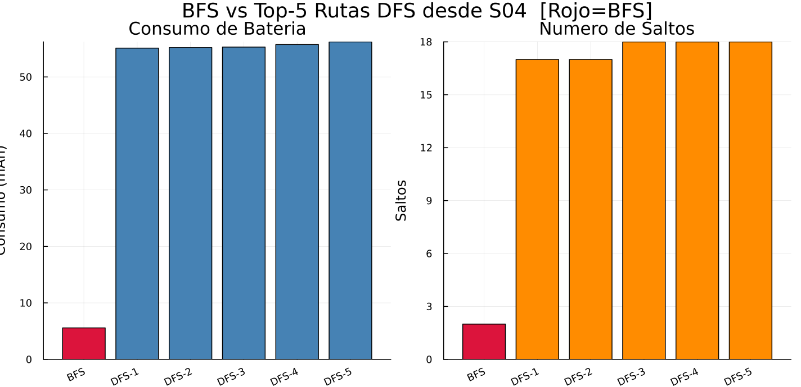

*Fig. 7 — Izquierda: consumo de batería. Derecha: número de saltos. Rojo=BFS, azul/naranja=mejores rutas DFS. BFS gana en saltos (2 vs 17+), DFS puede encontrar rutas alternativas útiles cuando nodos intermedios se degradan.*

| Criterio | BFS | DFS (mejor ruta) |
| --- | --- | --- |
| Saltos | **2** | 17 |
| Costo batería | **5.575 mAh** | 55.102 mAh |
| Ruta | S-04 -> R-01 -> GW-1 | S-04 -> S-09 -> ... -> GW-2 |

**BFS resultó 89.9% más eficiente en consumo de batería en este caso.**

### Explicación del resultado

- **BFS no optimiza por batería** — optimiza por saltos. La ruta directa de 2 saltos tiene aristas baratas porque R-01 tiene buena batería.
- **DFS no garantiza mínimo de saltos** — explora rutas largas que acumulan costo aunque cada arista sea relativamente barata.
- El trade-off real aparece cuando **el repetidor más cercano tiene batería crítica**: BFS lo elegiría de todas formas (mínimos saltos), mientras que DFS encontraría una ruta alternativa con más saltos pero menor costo total.

**Conclusión de diseño:** BFS para routing normal, DFS periódico para identificar rutas de respaldo cuando nodos se degradan.

---

## 6. Estado Crítico de la Red

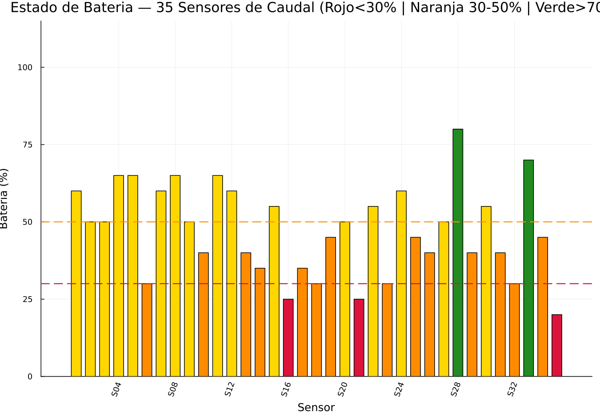

*Fig. 8 — Nivel de batería de los 35 sensores. Rojo (<30%) = crítico, naranja (30–50%) = bajo, amarillo (50–70%) = aceptable, verde (>70%) = bueno. Líneas punteadas marcan umbrales 30% y 50%.*

### Sensores con batería crítica (< 30%)

| Sensor | Batería | Saltos al GW |
| --- | --- | --- |
| S-35 | 20.0% | 2 |
| S-16 | 25.0% | 2 |
| S-21 | 25.0% | 2 |

Estos 3 sensores deben priorizarse para reemplazo o recarga. Su bajo nivel los convierte en cuellos de botella si otros sensores los usan como relay.

### Distribución general de batería

| Estadística | Valor |
| --- | --- |
| Media | 47.4% |
| Mínima | 20.0% |
| Máxima | 80.0% |
| Sensores en zona baja (30–50%) | 14 (40%) |


## 7. ESP-NOW Broadcast Flood vs Enrutamiento Dirigido

### Concepto: dos modos opuestos de propagación

En redes ESP-NOW los nodos pueden operar en dos modos radicalmente distintos:

| Modo | Mecanismo | Analogía |
| --- | --- | --- |
| **Broadcast Flood** | Cada nodo reenvía el paquete a **todos** sus vecinos sin importar el destino | Ola de agua — se expande en todas direcciones |
| **Enrutamiento dirigido (BFS/DFS)** | El paquete sigue **una sola ruta** calculada hacia el gateway | Canal — flujo controlado por un camino definido |

**Broadcast Flood** no requiere ninguna tabla de rutas: el sensor emite y cualquier nodo que recibe reenvía inmediatamente. El gateway recibirá el paquete por múltiples caminos. La desventaja: **tormenta de broadcasts** — la misma transmisión se duplica en cada salto.

### Modelo de simulación

Para cada sensor se simulan ambos modos y se miden:

- **Transmisiones totales**: cuántos envíos ocurren en toda la red para entregar un paquete al gateway
- **Nodos participantes**: cuántos nodos retransmiten
- **Consumo total (mAh)**: suma de todas las aristas activadas

En enrutamiento BFS: solo los nodos del camino transmiten (2 nodos = 2 transmisiones). En flood: **cada nodo que recibe el paquete lo envía a todos sus vecinos**, acumulando 192 transmisiones sobre 96 aristas para la misma red.

### Métricas de flood vs enrutamiento

| Métrica | BFS Dirigido | Flood ESP-NOW |
| --- | --- | --- |
| Saltos al gateway (promedio) | **2.00** | 2.00 |
| Transmisiones por paquete | **2** | 192 |
| Nodos participantes | **3** | 49 / 50 |
| Consumo total (mAh) | **5.024** | 574.314 |
| Overhead de transmisiones | — | **+9 500%** |
| Overhead de consumo mAh | — | **+11 331%** |

**Interpretación:** Flood llega al gateway en los mismos 2 saltos que BFS — pero activa 96 veces más transmisiones y consume 114 veces más batería. En una red de 50 nodos con baterías limitadas, una sesión de flood equivale a ~113 sesiones BFS en gasto energético.

### Visualizaciones

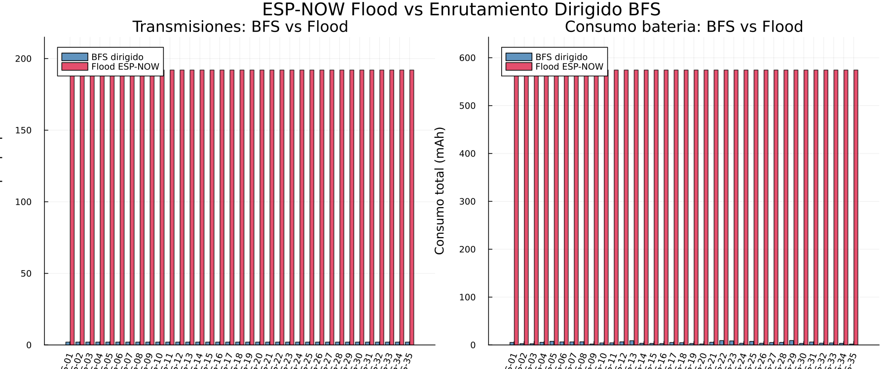

*Fig. 12 — Azul = BFS dirigido, rojo = Flood ESP-NOW. Izquierda: transmisiones por paquete (BFS = 2, Flood = 192 en todos los sensores). Derecha: consumo mAh (BFS varía por topología, Flood siempre 574 mAh — activa toda la red).*

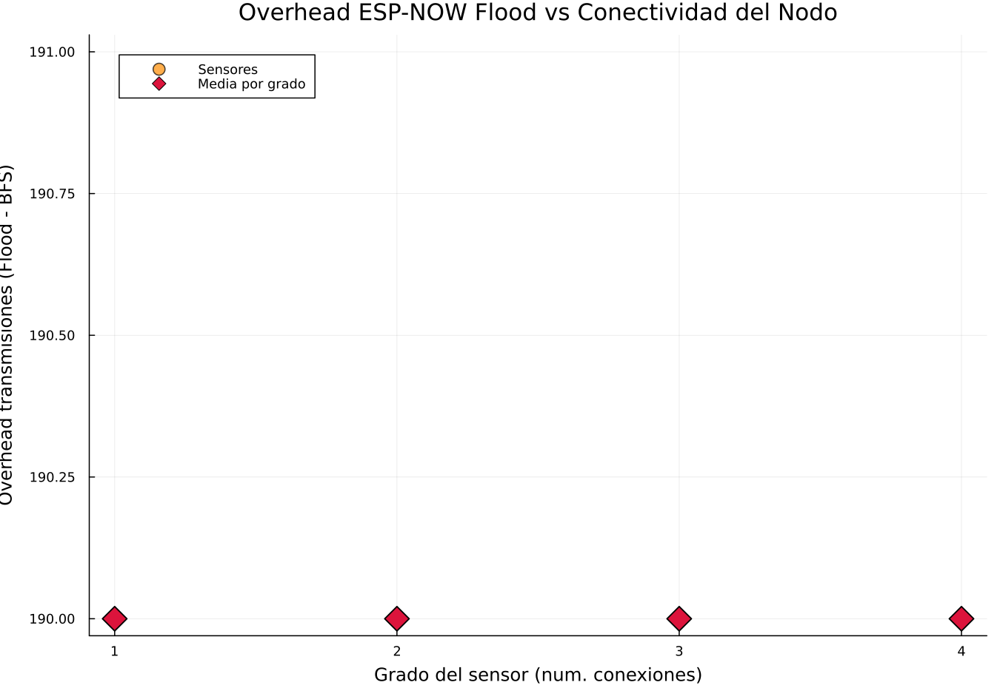

*Fig. 13 — El overhead de flood no depende del grado del sensor de origen: siempre activa toda la red (192 transmisiones). El diamante rojo marca la media por grado. Sensores con grado 1 o con grado 4 generan el mismo flood — el tamaño del paquete de broadcast no escala con la conectividad local sino con la topología global.*

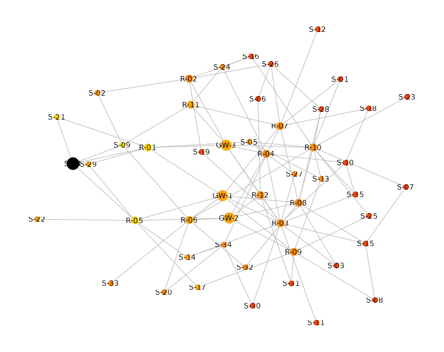

*Fig. 14 — Propagación del broadcast flood desde S-04 (negro). Dorado = nivel 1 (vecinos directos), naranja = nivel 2, rojo = nivel 3+. Nodos grises = sin camino desde S-04. El flood alcanza los 3 gateways en 2–3 saltos, pero activa los 49 nodos restantes en el proceso.*

### Cuándo usar cada modo

| Situación | Modo recomendado | Razón |
| --- | --- | --- |
| Transmisión periódica de datos de caudal | **BFS dirigido** | Bajo consumo, ruta estable |
| Descubrimiento inicial de red (setup) | Flood | No hay tabla de rutas aún |
| Alerta de emergencia (crecida crítica) | Flood | Entrega garantizada aunque muera la ruta BFS |
| Auditoría de rutas alternativas | **DFS** | Mapea todo el espacio de caminos posibles |
| Red con baterías críticas (< 30%) | **BFS dirigido** | Flood agostaría sensores en pocas sesiones |

**Regla práctica para WSN hídrica:** Flood solo en bootstrap y alertas. BFS para operación normal. DFS periódico (cada 24 h) para auditar resiliencia.

### Comparación de los tres métodos

| Criterio | BFS | DFS (mejor ruta) | Flood ESP-NOW |
| --- | --- | --- | --- |
| Saltos al GW | **2** | 17 | 2 |
| Costo mAh | **5.024** | 55.102 | 574.314 |
| Transmisiones | **2** | 17 | 192 |
| Requiere tabla de rutas | Sí | Sí | **No** |
| Garantiza mínimos saltos | **Sí** | No | Sí (primer paquete) |
| Explora rutas alternativas | No | **Sí (todas)** | No |
| Resiliencia ante fallo | Recalcula | Recalcula | **Automática** |
| Escalabilidad | **Alta** | Media | Baja |

---

## 8. Simulación Temporal de Agotamiento de Batería

### Pregunta central

¿Cuál estrategia de routing preserva la red más tiempo? Si todos los sensores transmiten cada ronda durante 120 rondas consecutivas, ¿BFS o DFS agota primero los nodos?

### Modelo de simulación temporal

Cada ronda simula una sesión de transmisión completa:

1. Cada sensor activo (batería > 0) ejecuta su algoritmo de routing
2. Se descuenta mAh de **todos los nodos en la ruta** (incluyendo relays)
3. Los pesos de aristas se recalculan según la batería actualizada
4. Un nodo con batería = 0 queda **permanentemente fuera de servicio**

El costo por ruta se distribuye entre todos los nodos intermedios — esto es realista: un repetidor que sirve de relay a múltiples sensores se desgasta más rápido.

**BFS:** elige ruta de mínimos saltos → rutas cortas → pocos nodos intermedios desgastados por transmisión.

**DFS:** elige ruta de menor costo mAh total → rutas a veces más largas → más nodos participan → mayor desgaste distribuido pero más lento por arista.

### Resultados tras 120 rondas

| Métrica | BFS | DFS |
| --- | --- | --- |
| Sensores vivos al final | **23 / 35** | 20 / 35 |
| Batería media final (vivos) | **33.6%** | 28.5% |
| Nodos agotados (sensores + repetidores) | 23 | **25** |
| Consumo total de red (mAh) | **2 269.8** | 2 846.4 |
| Ronda del 1er nodo muerto | 4 | **1** |

**BFS pierde el primer nodo en ronda 4; DFS ya en ronda 1.** Esto ocurre porque DFS puede elegir rutas largas que pasan por nodos con batería ya baja, acelerando su agotamiento desde el inicio.

### Visualizaciones de agotamiento

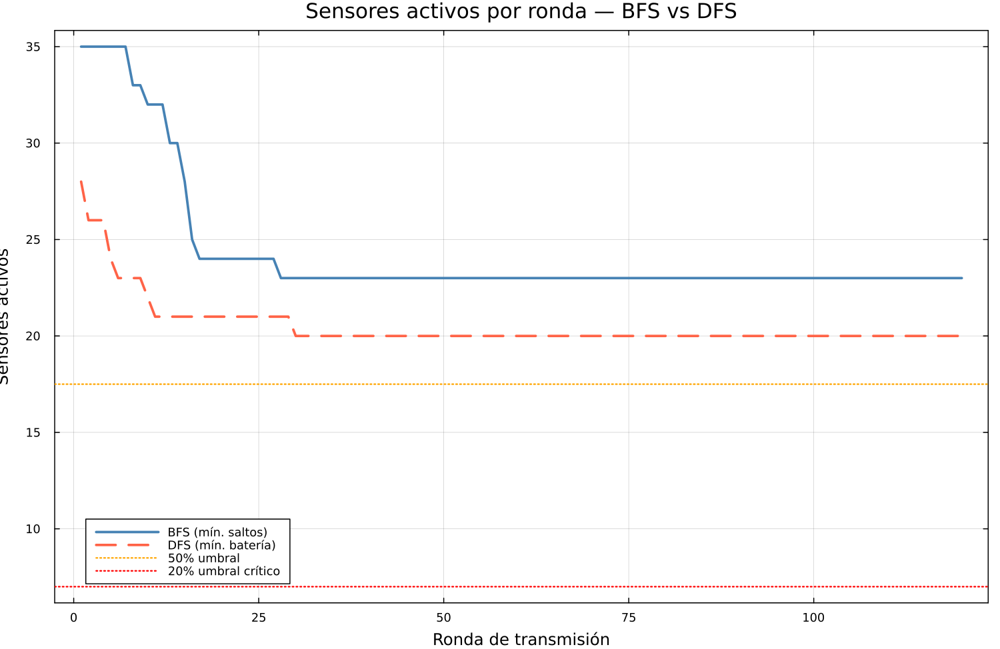

*Fig. 15 — Azul=BFS, rojo=DFS. BFS mantiene más sensores activos a lo largo de toda la simulación. Las líneas punteadas marcan los umbrales del 50% y 20% de cobertura.*

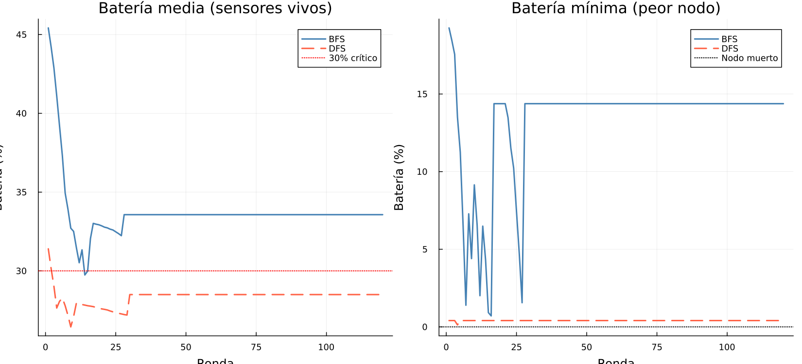

*Fig. 16 — Izquierda: batería media de los sensores vivos. Derecha: batería del peor nodo. BFS mantiene consistentemente mayor margen energético en ambas métricas.*

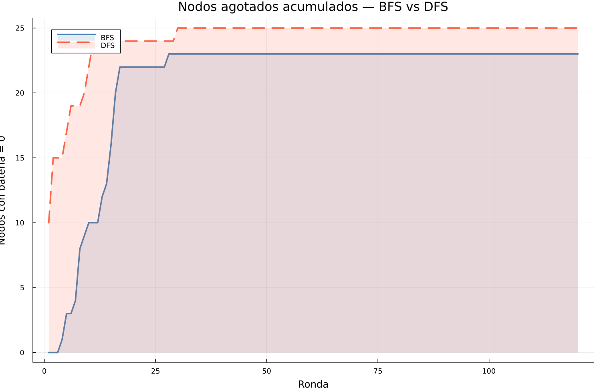

*Fig. 17 — Nodos con batería = 0 acumulados. DFS acumula más nodos muertos más rápido — sus rutas de bajo costo mAh por arista acaban siendo más largas y desgastan más nodos intermedios.*

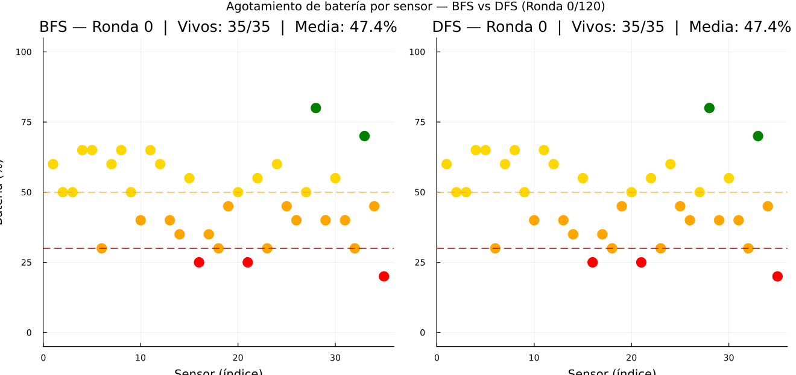

*Fig. 18 — Animación. Cada punto = un sensor. Color: verde (>70%) → amarillo (50–70%) → naranja (30–50%) → rojo (<30%) → negro (muerto). Panel izquierdo=BFS, derecho=DFS. Notar que DFS acumula negros antes.*

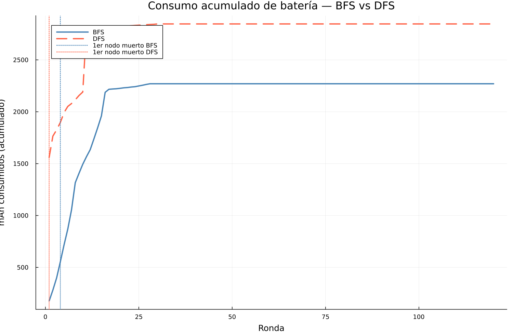

*Fig. 19 — mAh consumidos en toda la red de forma acumulada. Las líneas punteadas marcan la ronda donde muere el primer nodo en cada modo.*

### Interpretación

**¿Por qué BFS preserva mejor la red?**

- BFS usa rutas de 2 saltos (sensor → repetidor → gateway). Solo 2 nodos consumen batería por transmisión.
- DFS puede elegir rutas de 10–20 saltos aunque cada arista sea barata. Más nodos desgastados por paquete.
- El beneficio de BFS se amplifica: cuando un repetidor central muere, BFS recalcula automáticamente hacia otro gateway. DFS pierde su ruta larga de bajo costo y debe recalcular desde cero con menos opciones.

**¿Cuándo DFS sería mejor?**

Si los repetidores centrales ya tienen batería crítica desde el inicio, BFS los sobrecargaría (siempre los elige por mínimos saltos). DFS distribuiría el tráfico hacia nodos alternativos. En ese escenario puntual, DFS extend la vida útil de los nodos clave al precio de mayor consumo total.

**Conclusión de diseño:**

- **Operación normal:** BFS. Rutas cortas = menor desgaste acumulado de la red.
- **Cuando repetidores caen en zona crítica (<30%):** cambiar temporalmente a DFS para redistribuir carga.
- **Mantenimiento predictivo:** monitorear ronda de primer nodo muerto — en esta red, la alerta debe dispararse antes de la ronda 4 (BFS) o ronda 1 (DFS).

---

## 9. Visualización de Propagación de Rutas en Topología

Esta sección presenta animaciones GIF sobre la topología real de la red, mostrando cómo los paquetes avanzan salto a salto y cómo el estado de batería de cada nodo evoluciona con el tiempo.

### Layout de la red

Los 50 nodos se distribuyen en tres capas concéntricas:

- **Sensores (S01–S35):** Anillo exterior, azul/verde según batería.
- **Repetidores (R01–R12):** Anillo medio, sirven de relay.
- **Gateways (GW1–GW3):** Centro, siempre activos.

Las aristas grises representan enlaces disponibles. Las aristas coloreadas (**cian para BFS, rojo para DFS**) muestran las rutas activas en esa ronda.

### Codificación de color (nodos)

| Color | Batería restante |
| --- | --- |
| Verde | > 70% |
| Amarillo | 50 – 70% |
| Naranja | 30 – 50% |
| Rojo | < 30% (zona crítica) |
| Negro | 0% — nodo muerto |
| Estrella amarilla ★ | Sensor origen de la transmisión |

### GIF BFS — rutas sobre topología

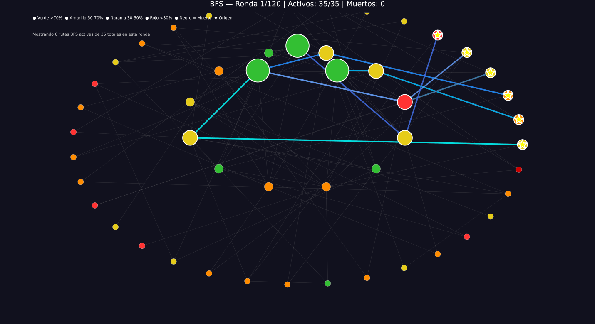

*Fig. 20 — Rondas clave (1, 10, 30, 60, 90, 110): las rutas BFS (cian) son cortas y directas — 2 saltos sensor→repetidor→gateway. Los nodos envejecen lentamente y de forma distribuida.*

### GIF DFS — rutas sobre topología

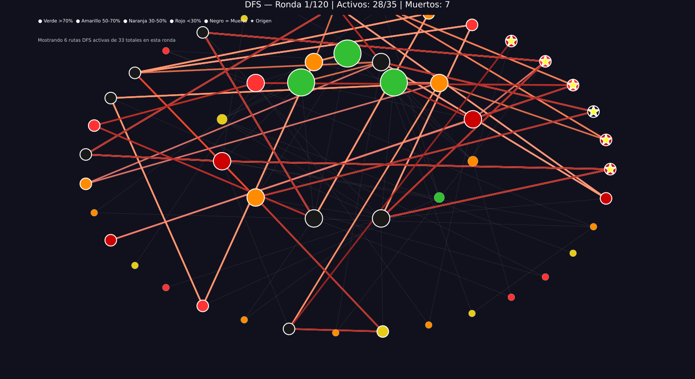

*Fig. 21 — Las rutas DFS (rojo/naranja) son más largas y sinuosas — minimizan mAh por arista pero atraviesan más nodos. Esto acelera el agotamiento de repetidores intermedios.*

### GIF comparativo — BFS vs DFS lado a lado

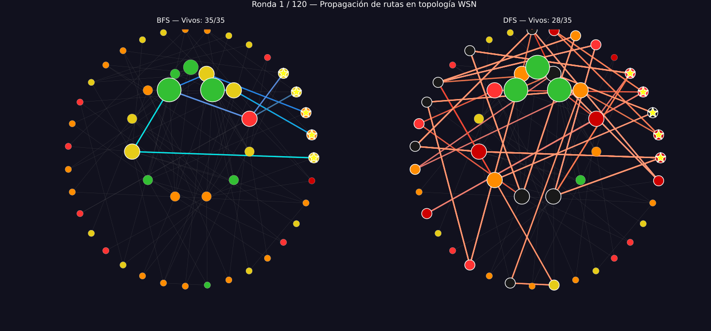

*Fig. 22 — Panel izquierdo BFS (cian), panel derecho DFS (rojo). Se observa visualmente cómo BFS mantiene más nodos verdes al avanzar las rondas, mientras DFS oscurece (agota) repetidores intermedios antes.*

### Interpretación visual

En la ronda 1, ambos algoritmos parten con la red completamente verde. Hacia la ronda 30, los repetidores que DFS usa como relay frecuente ya muestran color naranja/rojo, mientras BFS los mantiene verdes. En la ronda 90–110, DFS tiene varios nodos negros (muertos) visibles en el anillo medio, confirmando que las rutas largas de DFS concentran el desgaste en los repetidores más conectados.

---

## 10. Archivos del Proyecto

| Archivo | Contenido |
| --- | --- |
| `red_sensores_hidricos.jl` | Script principal — red, BFS, DFS, análisis, CSVs |
| `generar_figuras.jl` | Generador de las 8 figuras base (fig1–fig8) |
| `simular_inundacion.jl` | Simulación de nodos inundados/caídos — fig9–fig11 |
| `simular_espnow_flood.jl` | Broadcast flood vs enrutamiento dirigido — fig12–fig14 |
| `simular_agotamiento.jl` | Simulación temporal 120 rondas BFS vs DFS — fig15–fig19 |
| `generar_gif_topologia.jl` | GIFs de propagación de rutas en topología — fig20–fig22 |
| `aristas_red.csv` | 96 aristas con pesos en mAh |
| `nodos_red.csv` | 50 nodos con tipo, batería, grado, saltos al GW |
| `resultados_bfs.csv` | Rutas BFS de los 35 sensores |
| `imgs/` | 22 figuras: 8 base + 3 inundación + 3 flood + 5 agotamiento + 3 GIF topología |

---

## 9. Conclusiones

1. **BFS es el algoritmo natural para routing en WSN** cuando la topología es estable. Explora nivel a nivel, garantiza mínima latencia y menor consumo en redes bien diseñadas.

2. **DFS como herramienta de auditoría** mapea todo el espacio de rutas alternativas. Es valioso para planificar redundancia y analizar resiliencia ante fallos de nodos.

3. **El peso por batería expone nodos críticos:** S-35, S-16 y S-21 deben atenderse primero. Aunque están a 2 saltos del gateway, su batería baja los hace costosos como nodos de tránsito.

4. **En escenario de nodos inundados/caídos:** BFS re-enruta automáticamente el 20% de sensores afectados. El 4% que queda aislado (S-33) requiere repetidor de emergencia o relay móvil.

5. **ESP-NOW Broadcast Flood consume 11 331% más batería** que BFS para el mismo resultado (mismos 2 saltos al gateway). Flood es viable solo en bootstrap y alertas críticas — nunca para transmisión periódica en red con baterías limitadas.

6. **Diseño óptimo para WSN hídrica:** BFS en operación normal + DFS periódico para auditar resiliencia + Flood solo en emergencias donde la ruta BFS haya fallado completamente.
