# Informe de centralidad en la red de Facebook

## Resumen de la red

- Nodos: 4039
- Aristas: 88234
- Componentes conectados: 1
- Grado promedio: 43.691
- Densidad: 0.01081996

## Interpretacion

- Degree centrality destaca usuarios con muchas conexiones directas.
- Betweenness centrality resalta usuarios puente entre comunidades.
- Closeness centrality favorece usuarios con acceso rapido al resto de la red.

## Comunidades detectadas con Louvain

- Comunidades detectadas: 112
- Modularidad (Louvain): 0.673421
- Tamano de la comunidad mas grande: 654

### Top comunidades por tamano

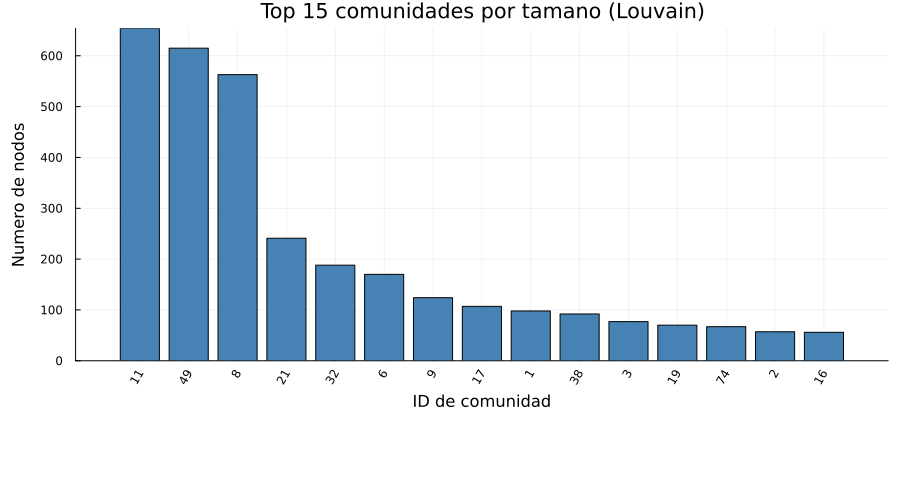

Las 15 comunidades mas grandes detectadas por el algoritmo Louvain, ordenadas por numero de nodos.

### Distribucion del tamano de comunidades

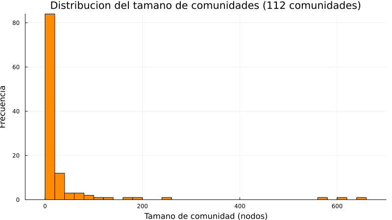

Histograma que muestra cuantas comunidades tienen cada rango de tamano. Una distribucion sesgada indica la presencia de unas pocas comunidades grandes y muchas pequeñas.

### Asignacion de comunidad por nodo (primeros 10 nodos)

| Vertice interno | Nodo original | Comunidad |
| ---: | ---: | ---: |
| 1 | 0 | 3 |
| 2 | 1 | 41 |
| 3 | 2 | 3 |
| 4 | 3 | 53 |
| 5 | 4 | 40 |
| 6 | 5 | 100 |
| 7 | 6 | 5 |
| 8 | 7 | 3 |
| 9 | 8 | 108 |
| 10 | 9 | 9 |

## Graficos explicativos

### Top 10 por degree centrality

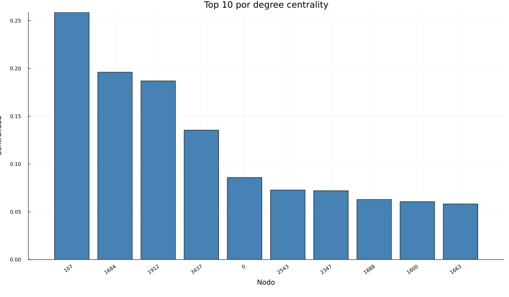

Muestra los usuarios con mayor numero de conexiones directas dentro de la red.

### Top 10 por betweenness centrality

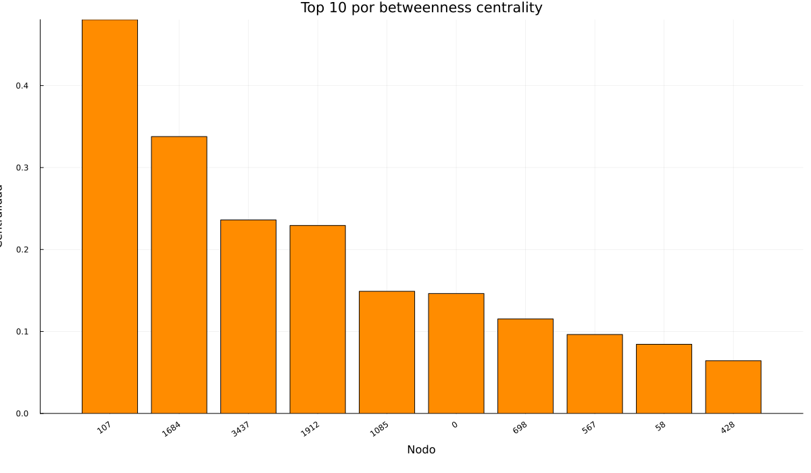

Destaca los nodos que actuan como puentes entre regiones de la red social.

### Top 10 por closeness centrality

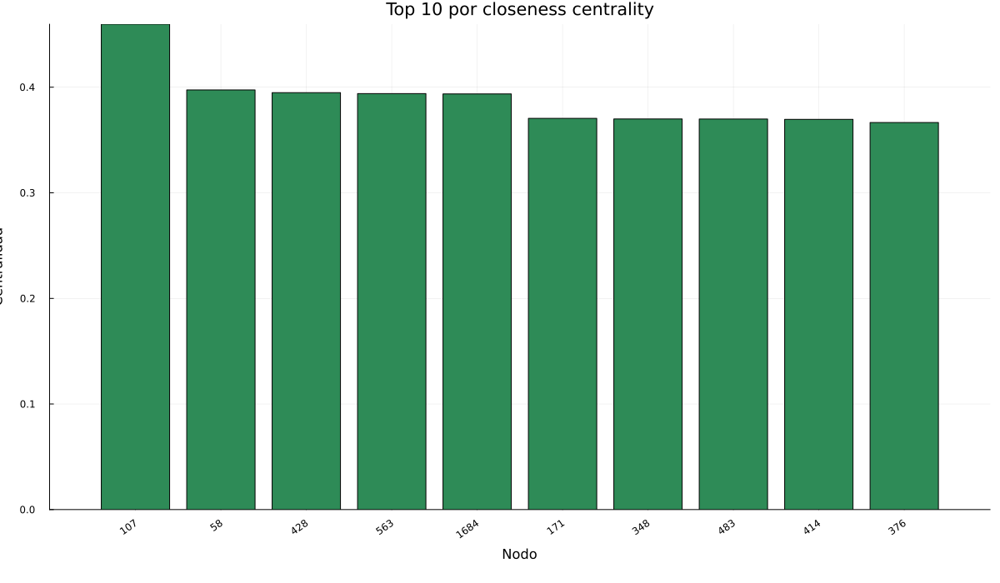

Resume los nodos con acceso mas rapido al resto de usuarios de la red.

### Relacion entre centralidades

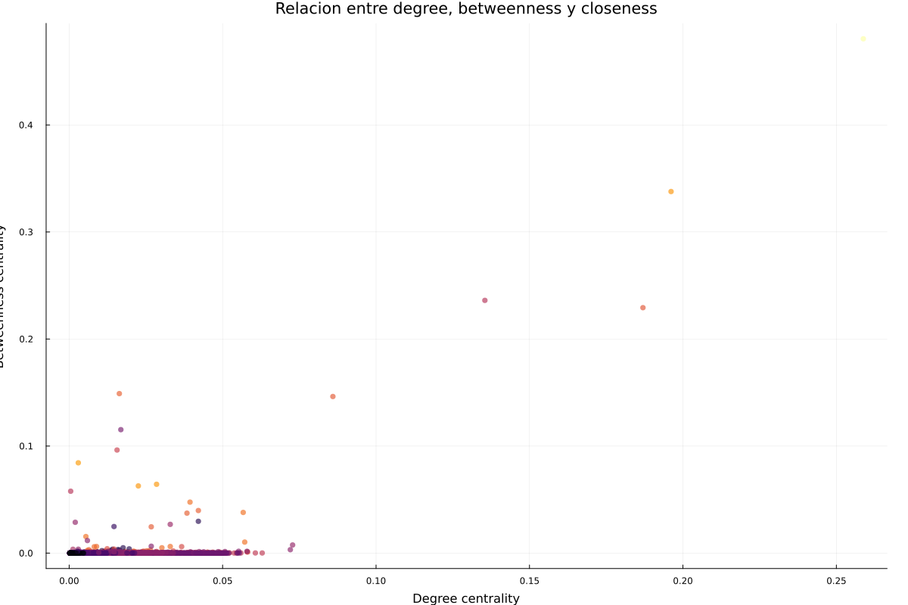

Cada punto representa un usuario. El color corresponde a closeness centrality y permite comparar tres metricas a la vez.

### Vista global de toda la red con Cairo

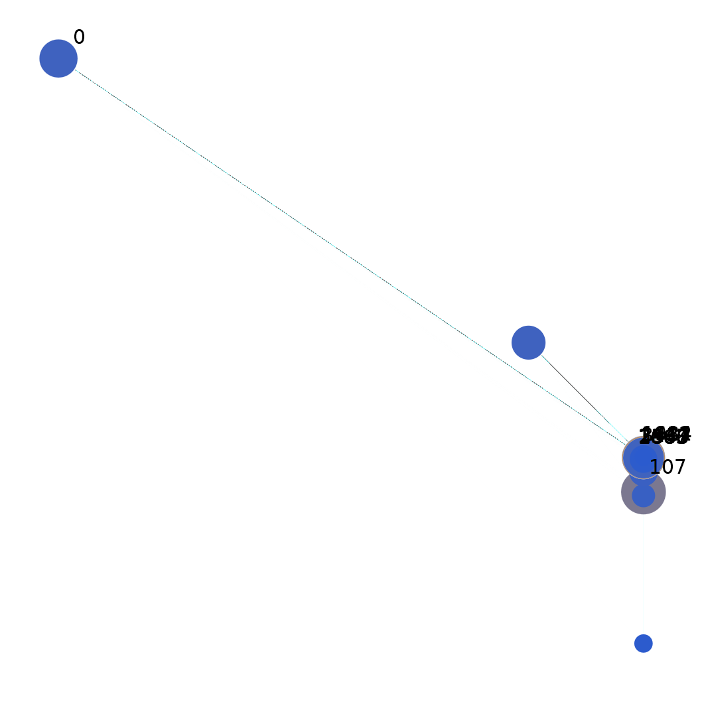

Vista general de la red completa renderizada con Cairo. El tamano del nodo refleja su grado, el color resume su nivel de insercion en el nucleo de la red y solo se etiquetan los 10 nodos mas populares para mantener legibilidad.

## Patrones estructurales de la red

| Indicador | Valor |
| --- | ---: |
| Componentes conectados | 1 |
| Tamano del componente gigante | 4039 |
| Porcentaje del componente gigante | 100.0% |
| Densidad | 0.01081996 |
| Grado promedio | 43.691 |
| Grado mediano | 25.0 |
| Percentil 90 del grado | 113.0 |
| Grado maximo | 1045 |
| Clustering global | 0.519174 |
| Clustering local promedio | 0.605547 |
| Assortativity | 0.063577 |
| Diametro | 8 |
| Radio | 4 |
| Maximo k-core | 115 |
| Promedio de k-core | 26.8797 |
| Participacion de los 10 nodos mas conectados | 2.72% |

## Patrones observados en la red social

- La red esta dominada por un componente gigante, lo que indica alta conectividad global entre usuarios.
- La combinacion de baja densidad con diametro corto es consistente con un patron small-world.
- El clustering es mucho mayor que la densidad, una senal tipica de triadas y comunidades locales en redes sociales.
- La assortativity positiva sugiere que nodos con grado parecido tienden a conectarse entre si.

## Interpretacion desde la perspectiva de red social

- Desde el punto de vista de una red social, la presencia de un componente gigante del 100.0% indica que la mayoria de los usuarios pertenece a una misma conversacion amplia y potencialmente interconectada.
- La distribucion de grados y el grado maximo de 1045 sugieren una estructura con hubs: pocos usuarios concentran muchas conexiones y actuan como focos de atencion, visibilidad o influencia.
- El diametro de 8 y el radio de 4 muestran que la informacion puede viajar en pocos pasos, lo que es coherente con dinamicas de difusion rapida, viralidad y alcance transversal.
- El clustering global de 0.5192 y el clustering local promedio de 0.6055 refuerzan la idea de microcomunidades o circulos sociales densos, donde amigos de amigos tambien tienden a estar conectados.
- La existencia de un maximo k-core de 115 apunta a un nucleo central muy cohesionado. En terminos sociales, ese nucleo suele representar usuarios muy integrados en la red, con alta capacidad de mantener conversaciones persistentes o amplificar contenido.
- La assortativity positiva de 0.0636 sugiere una ligera tendencia a que usuarios con niveles similares de conectividad se relacionen entre si, lo que favorece la formacion de estratos o capas sociales relativamente homogeneas.
- La participacion del 2.72% de las conexiones en solo los 10 nodos mas conectados apunta a una concentracion moderada de la atencion. Esto es relevante para marketing, difusion de mensajes y riesgos de sobredependencia de unos pocos actores.

## Lectura a la luz de tendencias recientes

- Las redes sociales actuales suelen combinar fragmentacion en comunidades pequenas con una capa de hubs muy visibles. El contraste entre alto clustering y baja densidad observado aqui es compatible con esa tendencia.
- La logica de creadores, cuentas puente e intermediarios sigue siendo clave: los nodos con alta betweenness pueden conectar comunidades que de otro modo permanecerian separadas, influyendo en que contenidos cruzan fronteras tematicas.
- Las plataformas recientes muestran fuerte competencia por la atencion. En este contexto, los hubs identificados por degree centrality y los nodos cercanos al nucleo por k-core son candidatos naturales a concentrar alcance organico y acelerar cascadas de difusion.
- El patron small-world observado implica beneficios y riesgos: facilita descubrimiento de contenido y coordinacion social, pero tambien hace mas probable la propagacion rapida de desinformacion, rumores o comportamientos imitativos.
- El peso del componente gigante sugiere que la plataforma mantiene una base relacional comun. Eso suele favorecer recomendaciones, visibilidad cruzada y expansion de conversaciones, aunque tambien puede aumentar polarizacion cuando los puentes entre grupos son pocos y muy concentrados.

### Distribucion de grados

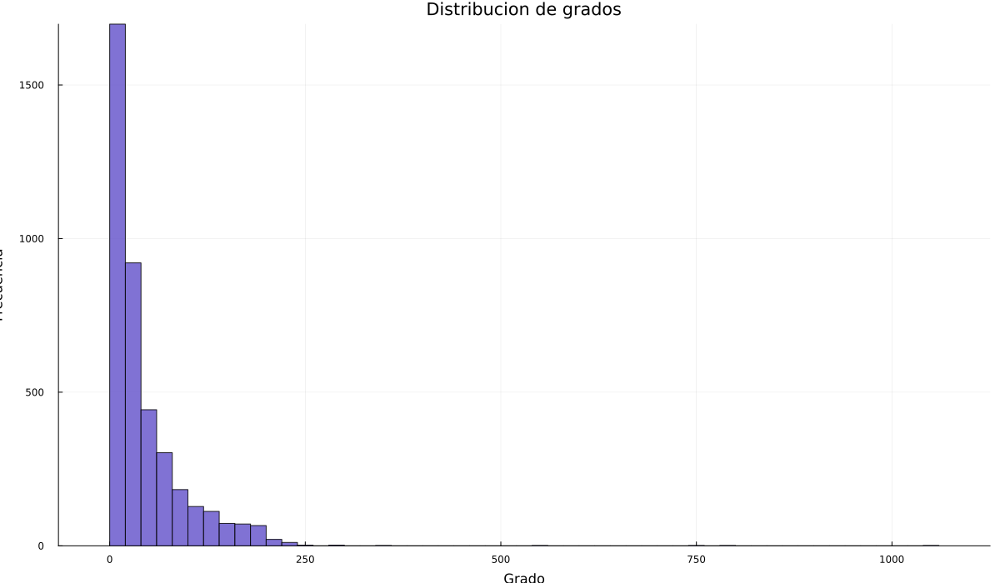

La forma de la distribucion ayuda a detectar hubs y desigualdad en el numero de conexiones.

### Distribucion de grados (escala log-log)

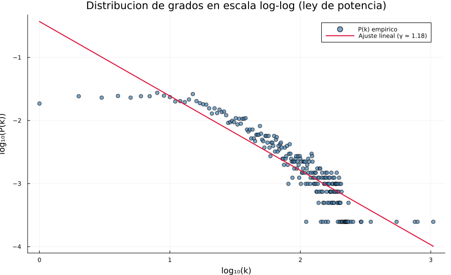

La escala log-log permite verificar si la red sigue una ley de potencia P(k) ~ k^(-gamma). El exponente ajustado es gamma ~= 1.18. Valores tipicos en redes sociales reales: 2 < gamma < 3. Una linea recta en log-log confirma estructura libre de escala (scale-free).

### Distribucion de k-core

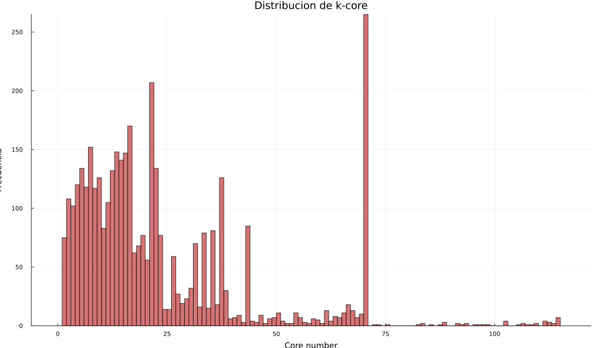

Resume que tan profundamente insertados estan los nodos dentro de nucleos densos de la red.

## Subgrafo de los 10 nodos mas populares

| Indicador | Valor |
| --- | ---: |
| Nodos en el subgrafo | 10 |
| Aristas entre los 10 mas populares | 11 |
| Densidad del subgrafo | 0.244444 |

### Conexiones entre los 10 nodos mas populares

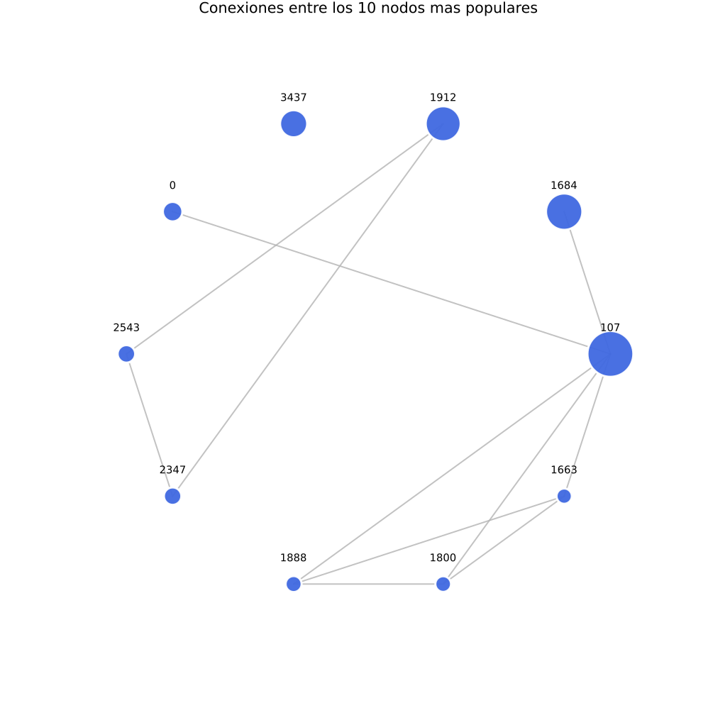

Este subgrafo muestra solo los usuarios con mayor degree centrality y las conexiones que existen entre ellos. Permite ver si los hubs tambien estan conectados entre si o si concentran enlaces hacia la periferia.

### Mapa de calor de conexiones del top 10

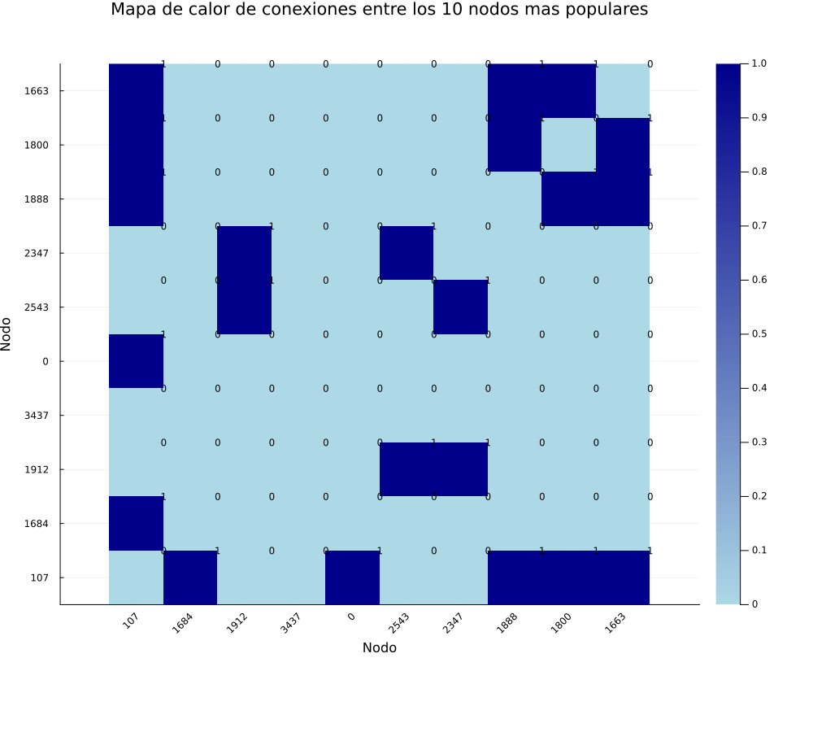

El mapa de calor resume la matriz de adyacencia del top 10. Las celdas con valor 1 indican conexion directa entre dos nodos populares y facilitan detectar bloques conectados sin la maraña visual del grafo completo.

## Top 10 por degree centrality

| Rank | Nodo | Valor |
| --- | --- | ---: |
| 1 | 107 | 0.258791 |
| 2 | 1684 | 0.196137 |
| 3 | 1912 | 0.186974 |
| 4 | 3437 | 0.135463 |
| 5 | 0 | 0.085934 |
| 6 | 2543 | 0.072808 |
| 7 | 2347 | 0.072065 |
| 8 | 1888 | 0.062902 |
| 9 | 1800 | 0.060674 |
| 10 | 1663 | 0.058197 |

## Top 10 por betweenness centrality

| Rank | Nodo | Valor |
| --- | --- | ---: |
| 1 | 107 | 0.480518 |
| 2 | 1684 | 0.337797 |
| 3 | 3437 | 0.236115 |
| 4 | 1912 | 0.229295 |
| 5 | 1085 | 0.149015 |
| 6 | 0 | 0.146306 |
| 7 | 698 | 0.11533 |
| 8 | 567 | 0.09631 |
| 9 | 58 | 0.08436 |
| 10 | 428 | 0.064309 |

## Top 10 por closeness centrality

| Rank | Nodo | Valor |
| --- | --- | ---: |
| 1 | 107 | 0.459699 |
| 2 | 58 | 0.397402 |
| 3 | 428 | 0.394837 |
| 4 | 563 | 0.393913 |
| 5 | 1684 | 0.393606 |
| 6 | 171 | 0.370493 |
| 7 | 348 | 0.369916 |
| 8 | 483 | 0.369848 |
| 9 | 414 | 0.369543 |
| 10 | 376 | 0.366558 |

## Conclusiones

- Los nodos que se repiten en varios rankings suelen ser los actores mas influyentes de la red.
- Degree centrality es util para detectar popularidad local.
- Betweenness centrality es mas util para detectar intermediarios clave y posibles cuellos de botella.
- Closeness centrality ayuda a encontrar nodos eficaces para difusion rapida de informacion.
- Para visualizacion interactiva en Gephi, usa el archivo facebook_network.gexf generado por este script.
