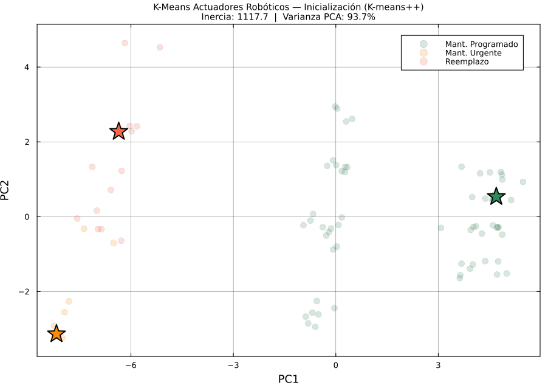
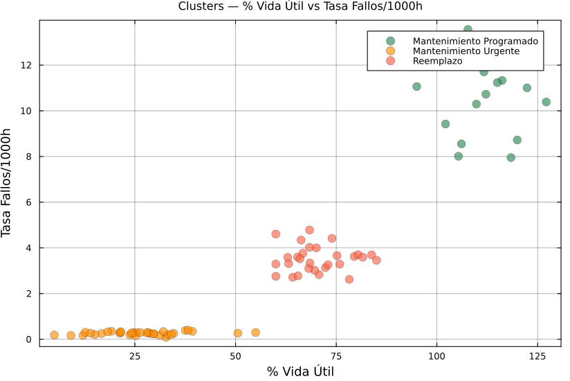

# Reporte: Clustering de Actuadores Robóticos

> **Generado:** 2026-06-03  |  **Modo:** Simulación sintética

---

## 1. Descripción del Problema

Se aplica **K-Means no supervisado** sobre un inventario de actuadores robóticos
para clasificar automáticamente cada pieza en uno de tres estados de mantenimiento:

| Cluster | Estado | Acción Recomendada |
|---------|--------|--------------------|
| 🟢 C1 | **Mantenimiento Programado** | Seguir calendario normal |
| 🟡 C2 | **Mantenimiento Urgente** | Intervención en ≤2 semanas |
| 🔴 C3 | **Reemplazo** | Retirar y reemplazar de inmediato |

---

## 2. Dataset Sintético

| Parámetro | Valor |
|-----------|-------|
| Total de piezas | 120 |
| Set de entrenamiento | 84 |
| Set de prueba | 36 |
| Tipos de actuadores | Servo Industrial, Motor Brushless, Actuador Hidráulico, Motor Paso a Paso, Actuador Neumático |

### Features utilizadas (10 variables)

| Feature | Peso | Descripción |
|---------|------|-------------|
| `pct_vida_util` | 2.5 | Porcentaje de vida útil consumida |
| `tasa_fallo_por_1000h` | 2.0 | Fallos acumulados por 1000 horas |
| `drift_posicional_mm` | 2.0 | Desviación de posición respecto a nominal |
| `dias_desde_mantenimiento` | 1.5 | Días desde último mantenimiento |
| `vibracion_rms` | 1.5 | Vibración RMS (mm/s) |
| `temperatura_operacion_c` | 1.2 | Temperatura promedio en operación (°C) |
| `eficiencia_energetica` | 1.2 | Eficiencia relativa (invertida: baja = degradada) |
| `corriente_promedio_a` | 1.0 | Corriente promedio (A) |
| `tiempo_uso_horas` | 1.0 | Horas acumuladas de operación |
| `ciclos_completados` | 1.0 | Ciclos de movimiento completados |

---

## 3. Selección Automática de K

Se evaluaron K ∈ [2, 6] usando silhouette maximization + elbow tiebreaker.

| K | Inercia | Silhouette | Elbow Score | Seleccionado |
|---|---------|------------|-------------|:---:|
| 2 | 714.6 | 0.6811 | 0.0000 |  |
| 3 | 365.1 | 0.6718 | 253.2959 | ✅ |
| 4 | 268.8 | 0.6599 | 29.2758 |  |
| 5 | 201.9 | 0.6383 | 31.1956 |  |
| 6 | 166.1 | 0.6546 | 0.0000 |  |

**K óptimo seleccionado: K = 3** (silhouette = 0.6718)

### Animaciones de selección de K


---

## 4. Resultados de Clustering

### 4.1 Resumen por Cluster

| Cluster | Nombre | Piezas | Vida Útil Media | Tiempo Uso (h) | Fallos/1000h | Vibración | Temp (°C) | Días sin Mant. | Eficiencia | Drift (mm) | Pureza |
|---------|--------|--------|-----------------|----------------|--------------|-----------|-----------|----------------|------------|------------|--------|
| 🟢 C1 | Mantenimiento Programado | 21 | 110.8% | 24585.4 | 10.981 | 3.468 | 98.41 | 483.8 | 0.4421 | 1.4977 | 1.000 |
| 🟡 C2 | Mantenimiento Urgente | 34 | 26.4% | 5116.2 | 0.263 | 0.752 | 52.63 | 84.5 | 0.9099 | 0.0406 | 1.000 |
| 🔴 C3 | Reemplazo | 29 | 70.4% | 14103.5 | 3.512 | 1.914 | 74.36 | 249.6 | 0.7067 | 0.4540 | 1.000 |

### 4.2 Animación de Convergencia K-Means



#### ¿Qué son PC1 y PC2? — Cálculo PCA

K-Means opera en **10 dimensiones** (una por feature). Para visualizar en 2D se aplica
**Análisis de Componentes Principales (PCA)**, que proyecta al plano de mayor varianza.

**Pasos del cálculo** (implementados en `src/animation.jl → pca2d()`):

**1. Centrar la matriz de datos**

```
Xc = X - μ

donde μ = mean(X, dims=1)   # media de cada feature (1×10)
      X  es la matriz normalizada (n×10), n = número de piezas
```

**2. Calcular la matriz de covarianza**

```
C = (Xc' * Xc) / (n - 1)   # matriz 10×10
```

C[i,j] mide cuánto varían conjuntamente las features i y j entre todas las piezas.

**3. Descomposición en valores propios (eigendecomposition)**

```
C = V · Λ · V'

donde Λ = diag(λ₁, λ₂, …, λ₁₀)  # valores propios (varianza explicada por cada eje)
      V = [v₁ | v₂ | … | v₁₀]    # vectores propios (direcciones principales), 10×10
```

Los valores propios se ordenan de menor a mayor; se toman los **2 últimos** (mayor varianza).

**4. Proyectar a 2D**

```
V2 = [v₁₀ | v₉]          # las 2 columnas de mayor λ  →  matriz 10×2
Z  = Xc · V2              # proyección final            →  matriz n×2

PC1 = Z[:, 1]  ← coordenada de cada pieza en la 1ª componente principal
PC2 = Z[:, 2]  ← coordenada de cada pieza en la 2ª componente principal
```

**5. Varianza explicada**

```
varianza_explicada = (λ₁₀ + λ₉) / Σλᵢ    # reportada en el título del GIF
```

| Componente | Significado | Captura principalmente |
|------------|-------------|------------------------|
| **PC1** | Dirección de **máxima varianza** global | Combinación de `pct_vida_util` (peso 2.5), `tasa_fallo` (2.0), `drift_posicional` (2.0) |
| **PC2** | Dirección **ortogonal** a PC1 con 2ª mayor varianza | Señal residual de `vibracion_rms` (1.5), `temperatura` (1.2), `eficiencia` (1.2) |

> ⚠️ **PC1 y PC2 no son features individuales** — son combinaciones lineales de las 10.
> El clustering real ocurre en el espacio completo de 10D; PCA es **solo para visualización**.

### 4.3 Scatter por Features Clave



> Estos scatters muestran las features **originales** (sin reducción dimensional),
> coloreadas por el cluster asignado. Permiten interpretar directamente qué valores
> de cada sensor/métrica corresponden a cada estado de mantenimiento.

---

## 5. Evaluación en Set de Prueba

Estabilidad: fracción de piezas que caen en el mismo cluster en train y test.

| Cluster | Nombre | Piezas Train | Piezas Test | Estables | Estabilidad |
|---------|--------|:---:|:---:|:---:|:---:|
| C1 | Mantenimiento Programado | 21 | 9 | 2 | 0.095 `█░░░░░░░░░` |
| C2 | Mantenimiento Urgente | 34 | 14 | 6 | 0.176 `██░░░░░░░░` |
| C3 | Reemplazo | 29 | 13 | 3 | 0.103 `█░░░░░░░░░` |

---

## 6. Muestra de Piezas por Cluster

### 🟢 Cluster 1: Mantenimiento Programado (top 5 piezas)

| ID | Tipo | Adquisición | Vida (%) | Días sin Mant. | Fallos/1kh | Vibración | Drift (mm) |
|----|------|-------------|----------|----------------|------------|-----------|------------|
| 109 | Motor Brushless DC | 2014-01-28 | 109.8 | 854 | 10.294 | 2.168 | 1.5253 |
| 117 | Servo Motor Industrial | 2017-10-17 | 95.0 | 362 | 11.062 | 4.273 | 1.6938 |
| 110 | Actuador Hidráulico | 2020-12-23 | 101.8 | 255 | 12.428 | 4.597 | 1.4659 |
| 106 | Actuador Hidráulico | 2019-06-15 | 106.1 | 276 | 8.552 | 4.249 | 1.8795 |
| 94 | Motor Paso a Paso | 2015-06-19 | 111.7 | 483 | 11.702 | 3.019 | 1.5013 |

### 🟡 Cluster 2: Mantenimiento Urgente (top 5 piezas)

| ID | Tipo | Adquisición | Vida (%) | Días sin Mant. | Fallos/1kh | Vibración | Drift (mm) |
|----|------|-------------|----------|----------------|------------|-----------|------------|
| 14 | Actuador Neumático | 2023-07-23 | 21.2 | 47 | 0.263 | 1.285 | 0.0380 |
| 33 | Motor Brushless DC | 2020-06-29 | 32.7 | 213 | 0.087 | 0.271 | 0.0391 |
| 9 | Servo Motor Industrial | 2022-12-16 | 21.4 | 72 | 0.322 | 0.693 | 0.0364 |
| 13 | Servo Motor Industrial | 2022-09-06 | 34.6 | 66 | 0.259 | 0.587 | 0.0512 |
| 1 | Motor Paso a Paso | 2022-11-03 | 19.2 | 108 | 0.351 | 0.421 | 0.0496 |

### 🔴 Cluster 3: Reemplazo (top 5 piezas)

| ID | Tipo | Adquisición | Vida (%) | Días sin Mant. | Fallos/1kh | Vibración | Drift (mm) |
|----|------|-------------|----------|----------------|------------|-----------|------------|
| 72 | Motor Paso a Paso | 2018-01-06 | 70.7 | 300 | 2.830 | 1.268 | 0.3312 |
| 79 | Servo Motor Industrial | 2018-09-30 | 65.4 | 210 | 3.601 | 1.592 | 0.4676 |
| 68 | Actuador Hidráulico | 2021-10-11 | 69.6 | 135 | 3.021 | 2.691 | 0.4394 |
| 70 | Servo Motor Industrial | 2017-09-03 | 79.5 | 218 | 3.625 | 2.015 | 0.4832 |
| 75 | Servo Motor Industrial | 2017-06-11 | 83.8 | 215 | 3.696 | 1.623 | 0.5154 |

---

## Archivos Generados

```
results/
├── reporte.md                     ← este archivo
├── animations/
│   ├── kmeans_convergencia.gif    ← convergencia K-means
│   ├── k_selection.gif            ← selección de K
│   └── feature_scatter.gif        ← scatter features clave
└── report/
    ├── tabla_clusters.csv         ← resumen por cluster
    ├── mapa_piezas.csv            ← pieza → cluster asignado
    ├── k_selection_stats.csv      ← métricas K-selection
    └── test_evaluacion.csv        ← estabilidad train→test
```

---
*Generado automáticamente por el pipeline Julia de clustering robótico.*
