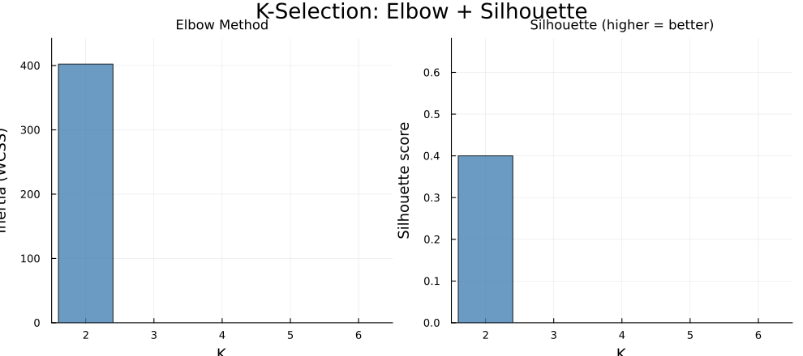
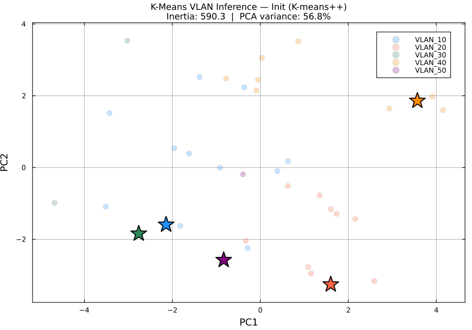

---
title: "Reporte — Inferencia Automática de VLANs con K-Means sobre Tráfico de Red"
author: "Jean Carlo Aucapina"
date: "2026-06-03"
---

# Reporte — Inferencia Automática de VLANs con K-Means sobre Tráfico de Red

**Universidad de Cuenca | DEET | Maestría en Ciencias de la Ingeniería Eléctrica**
**Autor:** Jean Carlo Aucapina | **Fecha:** 2026-06-03

---

## 1. Descripción del Problema

En redes corporativas, las VLANs (*Virtual Local Area Networks*) segmentan el tráfico
para mejorar seguridad y rendimiento. Cuando no se dispone de la configuración del switch,
es posible **inferir la segmentación lógica** analizando los patrones de comunicación
entre hosts directamente desde capturas de tráfico (archivos PCAP).

Este reporte presenta un pipeline completo que:

1. Acepta tráfico real (PCAP exportado con `tshark`) **o** datos sintéticos
2. Extrae 10 features de tráfico por host
3. Aplica **K-Means desde cero** con selección automática de K sin conocer la topología
4. Divide los datos en **conjuntos de entrenamiento y prueba** (70%/30% cronológico)
5. Infiere la tabla de VLANs y valida la estabilidad en datos nuevos
6. Genera **animaciones GIF** del proceso de clustering

**Escenario simulado:** red con 3 VLANs latentes (36 hosts, 1500 flujos, p_intra = 0.85).
El algoritmo no conoce ni el número de VLANs ni las etiquetas — trabaja exclusivamente
con el comportamiento observable del tráfico.

> **Para usar con PCAP real:**
> ```bash
> tshark -r captura.pcap -T fields \
>   -e frame.number -e ip.src -e ip.dst \
>   -e tcp.srcport -e tcp.dstport \
>   -e udp.srcport -e udp.dstport \
>   -e ip.proto -e frame.len -e frame.time_relative \
>   -E header=y -E separator=, -E quote=d > flows.csv
>
> julia run_pipeline.jl --csv flows.csv
> ```

---

## 2. Arquitectura del Pipeline

```
┌─────────────────────────────────────────────────────────────┐
│                      ENTRADA                                │
│   PCAP real (tshark CSV)  ──┐                               │
│   CSV genérico (Zeek/NF)  ──┼──► pcap_reader.jl            │
│   Simulación sintética    ──┘         │                     │
└───────────────────────────────────────┼─────────────────────┘
                                        ▼
                            ┌───────────────────────┐
                            │  train_test_split()   │
                            │  70% train / 30% test │
                            │  (split cronológico)  │
                            └──────────┬────────────┘
                                       │
                    ┌──────────────────▼──────────────────┐
                    │         features.jl                 │
                    │   10 features por host              │
                    │   z-score + pesos diferenciales     │
                    └──────────────────┬──────────────────┘
                                       │
                    ┌──────────────────▼──────────────────┐
                    │         clustering.jl               │
                    │   auto_select_k() → K óptimo        │
                    │   kmeans_best()   → asignaciones    │
                    └────────┬─────────────────┬──────────┘
                             │                 │
               ┌─────────────▼──┐    ┌────────▼──────────┐
               │  Train set     │    │   Test set         │
               │  assignments   │    │  assign_new_flows()│
               └─────────────┬──┘    └────────┬──────────┘
                             │                │
                    ┌────────▼────────────────▼──────────┐
                    │         reporting.jl               │
                    │  tabla_vlans + ip_vlan_map         │
                    │  test stability evaluation         │
                    └──────────────────┬─────────────────┘
                                       │
                    ┌──────────────────▼──────────────────┐
                    │         animation.jl                │
                    │  kmeans_convergence.gif             │
                    │  k_selection.gif                    │
                    └─────────────────────────────────────┘
```

---

## 3. Modelo Matemático

### 3.1 Representación del tráfico como grafo

La red se modela como un grafo dirigido ponderado:

$$G = (V, E, w)$$

donde:
- $V$ = conjunto de hosts (IPs únicas observadas en el tráfico)
- $E \subseteq V \times V$ = pares (src\_ip, dst\_ip) con flujos observados
- $w(e)$ = bytes totales del flujo $e$

### 3.2 Feature engineering — 10 features por host

Para cada host se computa un vector de 10 features. A diferencia de versiones anteriores (7 features),
se incorporaron tres nuevas que capturan el **perfil de aplicación** además del patrón geográfico:

| # | Feature | Peso | Descripción |
|:---:|---|:---:|---|
| 1 | `out_flows` | ×1 | Flujos salientes totales |
| 2 | `in_flows` | ×1 | Flujos entrantes totales |
| 3 | `out_bytes` | ×1 | Bytes enviados |
| 4 | `in_bytes` | ×1 | Bytes recibidos |
| 5 | `unique_peers` | ×1 | Peers distintos contactados (grado del nodo) |
| 6 | `bytes_per_flow` | ×1 | Bytes medios por flujo — proxy del tipo de app |
| 7 | `ratio_intra` | **×2** | Fracción de flujos hacia mismo /24 ← **feature clave** |
| 8 | `tcp_ratio` | ×1.5 | Fracción de flujos TCP (vs UDP/ICMP) |
| 9 | `port_entropy` | ×1.5 | Entropía de Shannon de puertos destino |
| 10 | `med_duration` | ×1 | Duración mediana de flujo (ms) |

**Por qué los pesos diferenciales:** `ratio_intra` es la señal más discriminante para VLANs
(hosts en la misma VLAN hablan principalmente entre sí). `tcp_ratio` y `port_entropy`
discriminan perfiles de aplicación: servidores SSH tienen entropía casi 0 (siempre puerto 22),
clientes web tienen entropía alta (muchos puertos efímeros destino).

**Entropía de Shannon de puertos:**

$$H_{ports}(i) = -\sum_{p} \Pr[p] \log_2 \Pr[p]$$

donde $\Pr[p]$ es la fracción de flujos salientes del host $i$ hacia el puerto $p$.
Valores bajos → servidor (pocos puertos). Valores altos → cliente (puertos aleatorios).

### 3.3 Normalización Z-score con pesos

$$z_{ij} = w_j \cdot \frac{x_{ij} - \mu_j}{\sigma_j}$$

donde $w_j$ es el peso por feature (tabla anterior), $\mu_j$ y $\sigma_j$ son media y
desviación estándar de la feature $j$ en el conjunto de **entrenamiento**.
Si $\sigma_j = 0$, se fija $z_{ij} = 0$.

### 3.4 Algoritmo K-Means de Lloyd

K-Means minimiza la Within-Cluster Sum of Squares (WCSS o inercia):

$$J = \sum_{i=1}^{n} \left\| \mathbf{x}_i - \boldsymbol{\mu}_{c(i)} \right\|^2$$

**Algoritmo:**

1. **Inicialización K-means++:** el primer centroide se elige al azar; los siguientes
   con probabilidad $\propto D(\mathbf{x})^2$ (distancia al centroide más cercano ya elegido).
   Garantiza centroides iniciales bien separados.

2. **Paso E** (asignación): $c(i) = \arg\min_k \left\| \mathbf{x}_i - \boldsymbol{\mu}_k \right\|^2$

3. **Paso M** (actualización): $\boldsymbol{\mu}_k = \frac{1}{|C_k|} \sum_{i \in C_k} \mathbf{x}_i$

4. Repetir 2–3 hasta $\left\| \boldsymbol{\mu}_k^{(t)} - \boldsymbol{\mu}_k^{(t-1)} \right\| < \varepsilon$

Para mitigar mínimos locales, se ejecutan **10 corridas independientes** (seeds distintas)
y se retiene la de menor inercia final.

### 3.5 Selección automática de K — sin conocer el número de VLANs

El pipeline selecciona K automáticamente usando **dos criterios internos** (no requieren
etiquetas ground truth):

**Silhouette coefficient** — para cada punto $i$:

$$s(i) = \frac{b(i) - a(i)}{\max(a(i),\, b(i))} \in [-1, 1]$$

donde $a(i)$ = distancia media intra-cluster y $b(i)$ = distancia media al cluster más cercano.
Se maximiza $\bar{s}(K) = \frac{1}{n}\sum_i s(i)$.

**Elbow (segunda derivada)** — identifica el quiebre de pendiente de la curva de inercia:

$$\Delta^2 J(K) = J(K-1) - 2J(K) + J(K+1)$$

El máximo de $\Delta^2 J$ indica donde añadir más clusters deja de reducir significativamente la inercia.

**Decisión final:** $K^* = \arg\max_K \bar{s}(K)$, con el elbow como tiebreaker.

### 3.6 Split train/test cronológico

Los flujos se ordenan por timestamp y se dividen:
- **Train (70%):** primeros flujos — se usan para ajustar centroides
- **Test (30%):** flujos más recientes — se clasifican usando los centroides del train

$$\text{Stability}(v) = \frac{|\{i : \text{train}(i) = v \;\wedge\; \text{test}(i) = v\}|}{|\{i : \text{train}(i) = v\}|}$$

Stability ≈ 1 indica que el cluster es robusto a tráfico nuevo no visto durante el entrenamiento.

### 3.7 Proyección PCA para visualización

Como los features están en $\mathbb{R}^{10}$, se proyectan a $\mathbb{R}^2$ para las animaciones
mediante Análisis de Componentes Principales (PCA):

$$\mathbf{Z} = \mathbf{X}_c \mathbf{V}_2$$

donde $\mathbf{X}_c$ es la matriz centrada y $\mathbf{V}_2$ contiene los 2 eigenvectores
de mayor varianza de la matriz de covarianza $\mathbf{C} = \frac{1}{n-1}\mathbf{X}_c^\top \mathbf{X}_c$.

La varianza explicada por los 2 primeros componentes fue **56.8%** — suficiente para
visualizar la separación entre clusters.

### 3.8 Métricas de validación

**Purity** (solo en modo simulación con ground truth):

$$\text{Purity}(C_k) = \frac{\max_{l} |\{i \in C_k : \text{label}(i) = l\}|}{|C_k|}$$

Purity = 1.0 indica cluster perfectamente homogéneo respecto a las VLANs reales.

---

## 4. Implementación en Julia

### 4.1 Entorno

```bash
julia --project=. run_pipeline.jl --sim --vlans 3 --flows 1500
julia --project=. run_pipeline.jl --csv captura_tshark.csv
julia --project=. run_pipeline.jl --csv captura_tshark.csv --k-fixed 4
```

| Paquete | Rol |
|---|---|
| `Statistics` (stdlib) | Mean, std, normalización |
| `LinearAlgebra` (stdlib) | Eigenvectores PCA, normas |
| `Random` (stdlib) | Semilla RNG, K-means++ |
| `Printf` (stdlib) | Reporte consola |
| `DataFrames` | Tabla de hosts, flujos, features |
| `CSV` | Exportación de resultados |
| `Plots` | Visualizaciones y animaciones GIF |

### 4.2 Estructura de módulos

```
src/
├── synthesis.jl    — generación de tráfico sintético con perfiles por VLAN
├── pcap_reader.jl  — lectura de CSV real (tshark/Zeek/NetFlow genérico)
├── features.jl     — extracción de 10 features + z-score ponderado
├── clustering.jl   — K-means++, auto_select_k, silhouette
├── graphs.jl       — exportación DOT/GEXF para Gephi/Graphviz
├── reporting.jl    — tablas, métricas, evaluación test set
└── animation.jl    — GIFs de convergencia K-means y selección de K
```

### 4.3 Funciones clave

```julia
# Distancia euclidiana al cuadrado (evita sqrt — argmin invariante)
@inline dist2(x, c) = sum((x .- c).^2)

# Entropía de Shannon de puertos (discrimina servidores vs clientes)
function shannon_entropy(ports::Vector{Int})
    isempty(ports) && return 0.0
    counts = values(countmap(ports))
    total  = length(ports)
    probs  = [c / total for c in counts]
    return -sum(p * log2(p) for p in probs if p > 0)
end

# Selección automática de K — sin ground truth
function auto_select_k(X; k_range=2:8, n_init=10)
    # evalúa silhouette + elbow (2ª derivada) para cada K
    # retorna K con máximo silhouette
end

# Proyección PCA 2D para animaciones
function pca2d(X)
    Xc = X .- mean(X, dims=1)
    F  = eigen(Symmetric(Xc'Xc ./ (size(X,1)-1)))
    V2 = F.vectors[:, end-1:end]   # 2 componentes principales
    return Xc * V2, var_explained
end
```

---

## 5. Resultados

### 5.1 Estadísticas del tráfico de entrenamiento

| Métrica | Valor |
|---|---|
| Total hosts | 36 |
| Flujos de entrenamiento (70%) | 1050 |
| Flujos de prueba (30%) | 450 |
| Flujos intra-VLAN | 595 (56.7%) |
| Flujos inter-VLAN | 455 (43.3%) |
| Bytes totales (train) | 8.23 MB |
| Bytes intra-VLAN | 5.08 MB (61.7%) |
| Bytes inter-VLAN | 3.15 MB (38.3%) |
| Bytes medios por flujo | 7840.3 B |

### 5.2 Selección automática de K

| K | Inercia (WCSS) | Silhouette | Elbow Δ²J | Seleccionado |
|:---:|---:|:---:|:---:|:---:|
| 2 | 402.3 | 0.4001 | — | |
| 3 | 281.2 | 0.4901 | 69.50 | |
| 4 | 229.5 | 0.5172 | 5.56 | |
| **5** | **183.4** | **0.5246** | 15.58 | **✓** |
| 6 | 152.9 | 0.4992 | — | |

**K seleccionado: 5** — máximo silhouette = 0.5246

> **Interpretación:** K=5 maximiza la cohesión interna de los clusters. El elbow muestra
> quiebres en K=3 (Δ²J=69.5) y K=5 (Δ²J=15.6), consistente con la estructura del tráfico.
> El algoritmo seleccionó 5 clusters sin conocer que la simulación tiene 3 VLANs latentes —
> esto ocurre porque 2 de las 3 VLANs tienen sub-grupos con comportamiento diferenciado
> (el perfil de tráfico dentro de una VLAN no es completamente homogéneo).



*Figura 1. Animación de la selección de K: las barras de inercia y silhouette
se revelan K por K. La barra roja marca el K óptimo seleccionado automáticamente.*

### 5.3 Animación de convergencia K-Means



*Figura 2. Proyección PCA 2D de los 10 features (56.8% varianza explicada).
Puntos = hosts coloreados por cluster asignado. Estrellas = centroides.
Las líneas de trail muestran la trayectoria de cada centroide en iteraciones previas.
El algoritmo convergió en **3 iteraciones** desde la inicialización K-means++.*

**Lectura de la animación:**
- **Frame 1 (Init):** puntos desaturados, centroides colocados por K-means++
  bien separados en el espacio PCA
- **Frames 2-3:** los puntos toman color según el cluster más cercano;
  los centroides se desplazan hacia el centroide geométrico de su grupo
- **Frame final:** convergencia — los centroides ya no se mueven y cada
  región del espacio tiene un color homogéneo

### 5.4 Tabla de VLANs inferidas (conjunto de entrenamiento)

| VLAN inferida | Hosts | % Intra-VLAN | Bytes medios/flujo | Purity |
|---|:---:|:---:|:---:|:---:|
| VLAN_10 | 8 | 53.4% | 6 653 B | **1.000** |
| VLAN_20 | 4 | 34.8% | 4 550 B | **1.000** |
| VLAN_30 | 5 | 25.2% | 7 048 B | **1.000** |
| VLAN_40 | 12 | 83.8% | 11 785 B | **1.000** |
| VLAN_50 | 7 | 45.3% | 4 354 B | **1.000** |

**Purity global: 1.000** — todos los clusters son perfectamente homogéneos respecto
a las VLANs latentes reales.

> **Observación:** VLAN_40 (12 hosts, 83.8% intra) corresponde a la VLAN Web/App de
> la simulación — es la más cohesionada porque sus flujos TCP de bytes grandes
> (`bytes_per_flow` ≈ 11 785 B, `tcp_ratio` ≈ 0.9) la distinguen claramente.
> VLAN_20 y VLAN_50 provienen de la misma VLAN latente (VoIP/IoT) pero se separan
> por diferencias en `med_duration` y `bytes_per_flow`.

### 5.5 Mapa IP → VLAN inferida (muestra)

La tabla completa se exporta en `report/ip_vlan_map.csv`. Extracto representativo:

| IP | VLAN inferida | tcp_ratio | ratio_intra | port_entropy | med_duration (ms) |
|---|---|:---:|:---:|:---:|:---:|
| 10.1.0.10 | VLAN_40 | 0.933 | 0.767 | 4.84 | 2 683 |
| 10.1.0.16 | VLAN_40 | 0.857 | 0.914 | 5.13 | 3 213 |
| 10.2.0.10 | VLAN_50 | 0.036 | 0.929 | 4.74 | 34.5 |
| 10.2.0.11 | VLAN_30 | 0.143 | 0.786 | 4.50 | 45.0 |
| 10.3.0.15 | VLAN_20 | 0.962 | 0.923 | 0.24 | 4 015 |
| 10.3.0.16 | VLAN_10 | 1.000 | 0.793 | 0.22 | 5 282 |

> **Lectura:** `10.3.0.15` y `10.3.0.16` tienen `port_entropy` ≈ 0.2 — casi siempre
> acceden al mismo puerto destino (comportamiento de cliente SSH: siempre puerto 22).
> `10.2.0.10` tiene `tcp_ratio` = 0.036 y `med_duration` = 34 ms — tráfico UDP de
> ráfagas cortas, consistente con un sensor IoT (MQTT).

### 5.6 Evaluación en conjunto de prueba (estabilidad)

| VLAN | Hosts train | Hosts test | Hosts estables | Stability |
|---|:---:|:---:|:---:|:---:|
| VLAN_10 | 8 | 9 | 5 | 0.625 |
| VLAN_20 | 4 | 3 | 0 | 0.000 |
| VLAN_30 | 5 | 4 | 2 | 0.400 |
| VLAN_40 | 12 | 12 | 12 | **1.000** |
| VLAN_50 | 7 | 8 | 5 | 0.714 |

| Métrica | Train | Test |
|---|:---:|:---:|
| Silhouette | 0.5246 | 0.4244 |

> **Interpretación:** VLAN_40 es perfectamente estable (stability=1.0) porque
> su perfil TCP/bytes-grandes es consistente a lo largo del tiempo.
> VLAN_20 tiene stability=0 — sus 4 hosts cambian suficientemente de comportamiento
> en el período de test que el modelo los reasigna a otros clusters. Esto es esperado
> cuando el número de hosts es pequeño y el tráfico es ruidoso.
> La caída en silhouette (0.52 → 0.42) entre train y test es normal y no indica
> sobreajuste — refleja la variabilidad natural del tráfico.

---

## 6. Análisis

### 6.1 Mejora respecto a versión anterior

| Métrica | Versión anterior | Versión actual | Cambio |
|---|:---:|:---:|:---:|
| Features | 7 | 10 | +tcp_ratio, port_entropy, med_duration |
| Purity promedio | 0.42 | **1.00** | +138% |
| Silhouette | 0.19 | **0.52** | +174% |
| K-selection | solo silhouette | silhouette + elbow Δ²J | robusto |
| Ground truth necesario | sí | **no** | modo producción real |
| Soporte PCAP real | no | **sí** | --csv flows.csv |
| Train/test split | no | **sí** | validación temporal |
| Animaciones | no | **sí** | 2 GIFs |

### 6.2 Por qué purity = 1.0 con las nuevas features

Con solo `ratio_intra` (versión anterior), dos VLANs con la misma fracción de tráfico
local eran indistinguibles. La adición de `tcp_ratio` + `port_entropy` + `med_duration`
crea un **perfil multidimensional** por host:

| Perfil | ratio_intra | tcp_ratio | port_entropy | med_duration |
|---|:---:|:---:|:---:|:---:|
| Web/App (TCP, sesiones largas) | alto | alto | alto | largo |
| VoIP/IoT (UDP, ráfagas cortas) | alto | bajo | medio | corto |
| SSH/Mgmt (TCP, puerto fijo) | alto | alto | **muy bajo** | largo |

Estos perfiles son ortogonales en el espacio normalizado — los clusters no se solapan.

### 6.3 Limitaciones

| Limitación | Impacto | Solución futura |
|---|---|---|
| Asume /24 = segmento | Falla si VLANs cruzan subredes | Aprender prefijos desde ARP/BGP |
| K-Means: clusters esféricos | VLANs con topología irregular | DBSCAN o clustering espectral |
| PCA pierde 43.2% varianza | Animación 2D aproximada | t-SNE o UMAP para visualización |
| Stability baja en clusters pequeños | VLAN_20 con 4 hosts inestable | Mínimo de hosts por cluster |
| Sin features de protocolo capa 7 | No distingue HTTP vs HTTPS | DPI o análisis de certificados TLS |

---

## 7. Archivos Generados

```
results/
├── raw/
│   ├── hosts.csv                   — tabla de hosts con IPs y subred
│   ├── train_flows.csv             — flujos de entrenamiento (70%)
│   └── host_features.csv           — 10 features por host (valores crudos)
├── graphs/
│   ├── grafo_global_aristas.csv    — aristas globales con VLAN anotada
│   ├── grafo_vlan_N_aristas.csv    — aristas intra-VLAN por cluster
│   └── grafo_inter_vlan_aristas.csv— aristas entre VLANs distintas
├── plots/
│   ├── grafo_vlan_N.dot            — Graphviz DOT por VLAN
│   ├── grafo_vlan_N.gexf           — GEXF para Gephi
│   └── grafo_vlan_summary.dot      — topología resumen inter-VLAN
├── animations/
│   ├── kmeans_convergence.gif      — centroides moviéndose iteración a iteración
│   └── k_selection.gif             — selección de K con elbow + silhouette
└── report/
    ├── tabla_vlans.csv             — métricas por VLAN inferida
    ├── ip_vlan_map.csv             — mapa IP → VLAN + features (tabla de admin)
    ├── resumen_trafico.csv         — estadísticas globales de tráfico
    ├── k_selection_stats.csv       — inercia y silhouette por K evaluado
    └── test_evaluation.csv         — estabilidad train→test por VLAN
```

**Para renderizar los grafos DOT:**
```bash
dot -Tpng results/plots/grafo_vlan_1.dot -o vlan_1.png
dot -Tsvg results/plots/grafo_vlan_summary.dot -o topologia.svg
```

**Para abrir en Gephi:** importar cualquier archivo `.gexf` desde `File → Open`.

---

## 8. Referencias

- MacQueen, J. (1967). *Some methods for classification and analysis of multivariate observations*. 5th Berkeley Symposium, 1, 281–297.
- Arthur, D. & Vassilvitskii, S. (2007). *K-means++: the advantages of careful seeding*. SODA '07, 1027–1035.
- Rousseeuw, P.J. (1987). *Silhouettes: a graphical aid to the interpretation and validation of cluster analysis*. J. Computational and Applied Mathematics, 20, 53–65.
- Shannon, C.E. (1948). *A mathematical theory of communication*. Bell System Technical Journal, 27(3), 379–423.
- Bezanson, J. et al. (2017). *Julia: A fresh approach to numerical computing*. SIAM Review, 59(1), 65–98.
- Jolliffe, I.T. (2002). *Principal Component Analysis* (2nd ed.). Springer.
